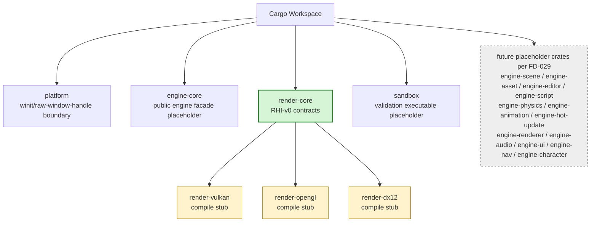

# Gate 1 Code Architecture

## Purpose

This diagram shows the whole engine structure at the end of Gate 1. Gate 1 does not implement gameplay systems yet; it creates the workspace, crate boundaries, feature flags, and the first `RHI-v0` contract that every later rendering backend consumes.

## Whole-System Architecture At Gate Exit



## External Contracts Consumed

None. Gate 1 is the contract origin point — it **produces** `RHI-v0` for consumption by Gate 2 and all later renderer-touching gates. There are no upstream gate dependencies.

Cross-cutting documents this gate must comply with:

- [design/data-schema-contracts.md](../data-schema-contracts.md) — `RHI-v0` section is the authoritative field-level contract.
- [design/compatibility-error-handling.md](../compatibility-error-handling.md) — freeze semantics and the `Diagnostic` envelope `RhiError` maps into.
- [design/performance-budgets.md](../performance-budgets.md) — Gate 1 row of the per-gate budget table.
- [design/foundation-decisions.md](../foundation-decisions.md) — engineering governance decisions (`FD-###`).

## Cross-Cutting Decisions Applied

Gate 1 implements the following frozen decisions:

| Decision | Applied as |
|---|---|
| `FD-002` Engine threading model | Workspace defines the four-thread topology (main / render / audio / IO pool) and ownership rules; even though Gate 1 only stands up the workspace, the thread roles are documented here so later gates can target them. |
| `FD-003` iOS graphics backend | `BackendCapabilities` must enumerate MoltenVK's feature subset for iOS; no separate `MetalRHI`. |
| `FD-008` IO and async runtime model | Root `Cargo.toml` forbids `tokio`, `async-std`, `smol`; CI grep enforces this from Gate 1 onward. |
| `FD-010` Cargo feature flag taxonomy | All workspace features use the `backend-*` / `subsystem-*` / `tooling-*` / `target-*` scheme. Backend stubs are gated by `backend-vulkan`, `backend-opengl`, `backend-dx12`. |
| `FD-012` Determinism policy | Workspace-wide lint or CI grep bans `std::collections::HashMap`/`HashSet` outside whitelisted module paths; replace with `IndexMap` / `FxHashMap` + explicit sort. |
| `FD-013` Platform layer scope | `platform` crate ships winit-only in Gate 1; the `PlatformAdapter` trait is added later in Gate 7. |
| `FD-014` Logging and tracing | Workspace adopts `tracing` + `tracing-subscriber`; no `log` crate or `println!` for diagnostics. |
| `FD-024` Rust edition and MSRV | Every `Cargo.toml` carries `edition = "2021"` and `rust-version = "<latest-stable -2>"`. |
| `FD-025` Source license | Every `Cargo.toml` carries `license = "MIT OR Apache-2.0"`; CI runs `cargo-about` to produce `NOTICES.txt` per FD-025 enforcement clause. |
| `FD-029` Workspace crate layout | Gate 1 creates **all 20 crates** named by FD-029 (implementation-active + placeholder); no ad hoc workspace members are introduced this gate or later. |
| `FD-030` Math library | Workspace `Cargo.toml` pins `glam` as a `workspace = true` dependency; placeholder math (perspective helper, identity transform) uses `glam::{Vec3, Mat4, Quat}`. |
| `FD-031` Coordinate system, units, NDC | RHI projection helpers (perspective / orthographic) target `[0, 1]` reverse-Z; Vulkan backend stub records the viewport Y-flip requirement so Gate 2 can implement it without re-deciding. |
| `FD-032` Error handling crate split | `render-core` defines `RhiError` via `thiserror`; `sandbox` may use `anyhow` for top-level wiring. Each error variant maps 1:1 to a `Diagnostic.code` string. |
| `FD-033` Cross-thread channel crate | Workspace pins `crossbeam-channel`; even though Gate 1 has no live channels, the dependency is declared so later gates do not re-decide. |

## Gate 1 Additions

- Workspace skeleton and root ownership rules.
- Placeholder crates for known long-term systems.
- `render-core` with `Backend`, `Adapter`, `Device`, `Queue`, `Surface`, `Swapchain`, `CommandEncoder`, `RenderPass`, `ShaderModule`, `Pipeline`, `Buffer`, `Texture`, descriptors, capabilities, and errors.
- Backend compile stubs for Vulkan, OpenGL, and DirectX 12.

## Frozen Contracts

- `RHI-v0` naming, crate ownership, and backend feature flags.
- Root workspace files are integration-owner only.

## Architectural Notes

- Later systems must not depend on Vulkan/OpenGL/DX12 directly.
- Backend crates consume `render-core`; they do not evolve it independently.
- Future crates are created early to avoid later multi-session root `Cargo.toml` conflicts.

## Open Design Questions

Each question below has an **owner**, a **decision deadline**, an **option list**, and the **downstream impact**. Sessions must not silently invent an answer — they must escalate to the owner if they need a decision before the deadline.

### Q1: RHI handle style

- **Owner:** Gate 1 RHI Contract Owner (Session 1B).
- **Decision deadline:** Before Session 1B writes `render-core` public types (during Gate 1 itself).
- **Options:**
  - (a) **Generational typed handle** — `ResourceHandle<KindMarker> { index: u32, generation: u32 }`. Recommended starting point.
  - (b) **Typed newtype wrapper** over backend-specific handles. Couples public API to one backend's allocator.
  - (c) **`Arc<dyn ResourceTrait>`** — heap-allocated trait objects per resource. Costly and harder to make `Copy`.
- **Downstream impact:** Every later renderer gate (2, 3, 6, 9, 17) and any subsystem that holds GPU resources.
- **Status:** RESOLVED at Gate 1 implementation. Option (a), **generational typed handles**, is frozen in `render-core` as `ResourceHandle<KindMarker> { index, generation }`.

### Q2: Backend feature flag naming

- **Owner:** Gate 1 Workspace Integration Owner (Session 1A).
- **Decision deadline:** Before root `Cargo.toml` is committed.
- **Status:** RESOLVED by `FD-010`. Backend features are `backend-vulkan`, `backend-opengl`, `backend-dx12` (kebab-case, `backend-*` prefix). Subsystem/tooling/target features follow the same three-segment taxonomy.

### Q3: `engine-core` re-export policy for RHI types

- **Owner:** Gate 1 Workspace Integration Owner + RHI Contract Owner (joint).
- **Decision deadline:** Before Gate 2 starts.
- **Options:**
  - (a) `engine-core` re-exports `render_core::{Backend, Device, RhiError, ...}` so downstream crates depend only on `engine-core`.
  - (b) `engine-core` exposes only higher-level renderer APIs; renderer-touching crates depend on `render-core` directly.
- **Downstream impact:** Affects dependency graph of `engine-scene`, `engine-editor`, `engine-asset`, `engine-hot-update`, and `sandbox` (canonical crate names per `FD-029`).
- **Status:** RESOLVED at Gate 1 implementation. Option (b) is frozen: `engine-core` exposes higher-level runtime/renderer flow, while renderer-touching crates depend on `render-core` directly.

## Detailed Design Proposal

### Crate Layout

Gate 1 creates the **full 20-crate workspace shell** defined by `FD-029` in [foundation-decisions.md](../foundation-decisions.md#fd-029-workspace-crate-layout), so later sessions can work without touching root workspace files. Implementation-active in Gate 1:

- `platform`: window and raw-handle boundary (winit-only per `FD-013`; `PlatformAdapter` added in Gate 7).
- `engine-core`: public engine facade placeholder, no heavy subsystem logic yet.
- `render-core`: backend-neutral RHI contracts.
- `render-vulkan`, `render-opengl`, `render-dx12`: backend crates that compile as stubs.
- `engine-serialize`: deterministic-serialization placeholder.
- `sandbox`: validation executable that links the above.

All other `engine-*` crates listed in `FD-029` — `engine-scene`, `engine-renderer`, `engine-asset`, `engine-script`, `engine-editor`, `engine-hot-update`, `engine-physics`, `engine-animation`, `engine-audio`, `engine-ui`, `engine-nav`, `engine-character` — are created as compile-only placeholders (a single `pub fn placeholder() {}`) for future gates per `FD-029`. Gate 1 may **not** introduce any crate name outside the `FD-029` list, and later gates may **not** rename or add workspace members ad hoc.

Root workspace ownership stays with the integration session. Later workstreams add implementation inside their crates; they do not add workspace members ad hoc.

### Initial RHI Surface

`render-core` should provide typed descriptors and opaque handles, not backend structs. The authoritative field-level contract lives in [design/data-schema-contracts.md, section `RHI-v0`](../data-schema-contracts.md). The Rust skeleton below mirrors that contract in concrete syntax so Sessions 1B/1C and all later renderer gates can compile-check against a stable shape.

> **Status of this skeleton:** representative public surface. Internal field layouts may evolve, but public type names, descriptor field names, and trait method signatures are frozen as `RHI-v0` once Gate 1 exits. Any change must follow the contract-change workflow in `compatibility-error-handling.md`.

```rust
//! crates/render-core/src/lib.rs  (representative skeleton)
//! Source of truth for serialized/logical fields: design/data-schema-contracts.md

use core::marker::PhantomData;

// ---------- Backend identity ----------

#[derive(Clone, Copy, Debug, PartialEq, Eq, Hash)]
pub enum BackendKind { Vulkan, OpenGl, DirectX12 }

#[derive(Clone, Debug)]
pub struct AdapterInfo {
    pub backend: BackendKind,
    pub name: String,
    pub vendor_id: Option<u32>,
    pub device_id: Option<u32>,
    pub driver_version: Option<String>,
    pub capabilities: BackendCapabilities,
}

#[derive(Clone, Debug, Default)]
pub struct BackendCapabilities {
    pub max_texture_dimension_2d: u32,
    pub max_color_attachments: u8,
    pub supports_swapchain: bool,
    pub supports_timestamps: bool,
    pub supports_debug_markers: bool,
    pub supported_shader_formats: Vec<ShaderFormat>,
    pub supported_surface_formats: Vec<TextureFormat>,
    pub limits: ResourceLimits,
}

#[derive(Clone, Debug, Default)]
pub struct ResourceLimits {
    pub max_buffer_bytes: u64,
    pub max_texture_array_layers: u32,
    pub max_bind_groups: u8,
    pub max_vertex_attributes: u8,
    pub max_color_attachments: u8,
    pub max_sample_count: u8,
}

// ---------- Handles ----------
// DECISION (Q1): handle style. Skeleton assumes (a) generational typed handle.

#[derive(Clone, Copy, Debug, PartialEq, Eq, Hash)]
pub struct ResourceHandle<KIND> {
    pub index: u32,
    pub generation: u32,
    _marker: PhantomData<fn() -> KIND>,
}

pub enum BufferKind {}
pub enum TextureKind {}
pub enum ShaderModuleKind {}
pub enum PipelineKind {}
pub enum BindGroupKind {}
pub enum RenderPassKind {}
pub enum SurfaceKind {}

pub type BufferHandle       = ResourceHandle<BufferKind>;
pub type TextureHandle      = ResourceHandle<TextureKind>;
pub type ShaderModuleHandle = ResourceHandle<ShaderModuleKind>;
pub type PipelineHandle     = ResourceHandle<PipelineKind>;
pub type BindGroupHandle    = ResourceHandle<BindGroupKind>;
pub type RenderPassHandle   = ResourceHandle<RenderPassKind>;
pub type SurfaceHandle      = ResourceHandle<SurfaceKind>;

// ---------- Errors ----------

#[non_exhaustive]
#[derive(Clone, Debug)]
pub enum RhiError {
    UnsupportedBackend,
    UnsupportedFeature  { feature: String },
    UnsupportedLimit    { limit: String, requested: u64, available: u64 },
    InvalidDescriptor   { field: &'static str, reason: String },
    InvalidHandle,
    DeviceLost,
    SurfaceLost,
    OutOfMemory,
    AllocationFailed    { bytes: u64 },
    ValidationFailed    { detail: String },
    IncompatibleBindLayout { reason: String }, // pipeline descriptor's bind layout violates the FD-041 four-set convention
    Backend             { detail: String },
}

// `RhiError` maps into the `Diagnostic` envelope from compatibility-error-handling.md
// using `code = "rhi.<variant>"`, `system = "render-core"`, `contract = Some("RHI-v0")`.

// ---------- Formats ----------

#[derive(Clone, Copy, Debug, PartialEq, Eq, Hash)]
#[non_exhaustive]
pub enum ShaderFormat {
    // Active variants (cook emits, backends consume) per FD-039:
    SpirV,     // canonical runtime IR; FD-004 / FD-037 / FD-039
    Glsl,      // emitted by cook only when `backend-opengl` is enabled; consumed by `render-opengl`
    Dxil,      // emitted by cook only when `backend-dx12` is enabled; consumed by `render-dx12`

    // Reserved variants per FD-039 (carried for capability reporting; producers must not submit in v0):
    Wgsl,      // reserved for future WebGPU; not produced by cook in v0
    Hlsl,      // reserved; DX12 backend's HLSL is a `naga` intermediate, never surfaced through ShaderFormat
    MslSource, // reserved; MoltenVK owns SPIR-V → MSL at runtime; engine never produces MSL source
}

#[derive(Clone, Copy, Debug, PartialEq, Eq, Hash)]
#[non_exhaustive]
pub enum TextureFormat { /* enumerated by Gate 2 */ Rgba8Unorm, Bgra8Unorm, Depth32Float /* ... */ }

#[derive(Clone, Copy, Debug, PartialEq, Eq)]
pub enum ValidationMode { Disabled, Standard, Strict }

#[derive(Clone, Copy, Debug, PartialEq, Eq)]
pub enum PresentMode { Fifo, Mailbox, Immediate }

#[derive(Clone, Copy, Debug, PartialEq, Eq)]
pub enum MemoryHint { GpuOnly, CpuToGpu, GpuToCpu, CpuOnly }

// ---------- Descriptors (required fields mirror data-schema-contracts.md) ----------

#[derive(Clone, Debug)]
pub struct DeviceDescriptor<'a> {
    pub adapter: &'a AdapterInfo,
    pub required_features: Vec<&'static str>,
    pub required_limits: ResourceLimits,
    pub debug_label: Option<String>,
    pub validation_mode: ValidationMode,
}

#[derive(Clone, Debug)]
pub struct SurfaceDescriptor {
    pub window_handle: raw_window_handle::RawWindowHandle,
    pub width: u32,
    pub height: u32,
    pub preferred_format: TextureFormat,
    pub present_mode: PresentMode,
}

#[derive(Clone, Debug)]
pub struct BufferDescriptor {
    pub size_bytes: u64,
    pub usage_flags: BufferUsage,
    pub memory_hint: MemoryHint,
    pub debug_label: Option<String>,
}

bitflags::bitflags! {
    pub struct BufferUsage: u32 {
        const VERTEX   = 1 << 0;
        const INDEX    = 1 << 1;
        const UNIFORM  = 1 << 2;
        const STORAGE  = 1 << 3;
        const COPY_SRC = 1 << 4;
        const COPY_DST = 1 << 5;
        const INDIRECT = 1 << 6;
    }
    pub struct TextureUsage: u32 {
        const SAMPLED          = 1 << 0;
        const STORAGE          = 1 << 1;
        const COLOR_ATTACHMENT = 1 << 2;
        const DEPTH_ATTACHMENT = 1 << 3;
        const COPY_SRC         = 1 << 4;
        const COPY_DST         = 1 << 5;
    }
}

#[derive(Clone, Debug)]
pub struct TextureDescriptor {
    pub width: u32,
    pub height: u32,
    pub depth_or_layers: u32,
    pub mip_levels: u32,
    pub format: TextureFormat,
    pub usage_flags: TextureUsage,
    pub sample_count: u8,
    pub debug_label: Option<String>,
}

#[derive(Clone, Debug)]
pub struct ShaderModuleDescriptor {
    pub format: ShaderFormat,
    pub entry_points: Vec<String>,
    pub source_hash: [u8; 32],     // sha256 of canonical bytes
    pub bytes: Vec<u8>,
    pub debug_label: Option<String>,
}

#[derive(Clone, Debug)]
pub struct PipelineDescriptor {
    pub shader_modules: Vec<ShaderModuleHandle>,
    pub vertex_layout: VertexLayout,
    pub bind_layouts: Vec<BindGroupLayout>,
    pub raster_state: RasterState,
    pub depth_state: Option<DepthState>,
    pub blend_state: BlendState,
    pub render_targets: Vec<RenderTargetState>,
    pub debug_label: Option<String>,
}

// Sub-structures (VertexLayout, BindGroupLayout, RasterState, DepthState,
// BlendState, RenderTargetState) are introduced as opaque named structs at
// Gate 1 and detailed by Gate 2. Their public field set is the contract.

// ---------- Trait surface ----------

pub trait Backend: Send + Sync {
    fn kind(&self) -> BackendKind;
    fn enumerate_adapters(&self) -> Result<Vec<AdapterInfo>, RhiError>;
    fn create_device(&self, desc: &DeviceDescriptor<'_>) -> Result<Box<dyn Device>, RhiError>;
}

pub trait Device: Send + Sync {
    fn capabilities(&self) -> &BackendCapabilities;

    fn create_buffer(&self, desc: &BufferDescriptor)             -> Result<BufferHandle, RhiError>;
    fn create_texture(&self, desc: &TextureDescriptor)           -> Result<TextureHandle, RhiError>;
    fn create_shader_module(&self, desc: &ShaderModuleDescriptor)-> Result<ShaderModuleHandle, RhiError>;
    fn create_pipeline(&self, desc: &PipelineDescriptor)         -> Result<PipelineHandle, RhiError>;

    // Destruction is idempotent for handles owned by this device; stale handles
    // (already destroyed or from another device) return `RhiError::InvalidHandle`.
    fn destroy_buffer(&self, handle: BufferHandle)               -> Result<(), RhiError>;
    fn destroy_texture(&self, handle: TextureHandle)             -> Result<(), RhiError>;
    fn destroy_shader_module(&self, handle: ShaderModuleHandle)  -> Result<(), RhiError>;
    fn destroy_pipeline(&self, handle: PipelineHandle)           -> Result<(), RhiError>;

    fn create_surface(&self, desc: &SurfaceDescriptor)           -> Result<SurfaceHandle, RhiError>;
    fn resize_surface(&self, handle: SurfaceHandle, w: u32, h: u32) -> Result<(), RhiError>;
}
```

Resource handles are opaque and typed. The recommended first form is the small typed handle above with an index/generation owned by the backend implementation. Avoid trait objects for every resource until object lifetime and destruction rules are clearer (see Q1).

### Backend Stub Contract

Backend stubs must implement enough of the public surface to compile and return `Unsupported` or `Unimplemented` errors. This keeps OpenGL and DirectX 12 useful as contract validators without blocking Vulkan work.

### Error Model

Use the common `RhiError` enum shown in the skeleton above. Variants are exhaustively named so backend authors do not need to invent new categories. Each variant maps deterministically into the `Diagnostic` envelope from [compatibility-error-handling.md](../compatibility-error-handling.md):

| `RhiError` variant     | `Diagnostic.code`           | Severity |
|---|---|---|
| `UnsupportedBackend`   | `rhi.unsupported_backend`   | fatal |
| `UnsupportedFeature`   | `rhi.unsupported_feature`   | fatal |
| `UnsupportedLimit`     | `rhi.unsupported_limit`     | fatal |
| `InvalidDescriptor`    | `rhi.invalid_descriptor`    | error |
| `InvalidHandle`        | `rhi.invalid_handle`        | error |
| `DeviceLost`           | `rhi.device_lost`           | fatal |
| `SurfaceLost`          | `rhi.surface_lost`          | error (recoverable) |
| `OutOfMemory`          | `rhi.out_of_memory`         | fatal |
| `AllocationFailed`     | `rhi.allocation_failed`     | error |
| `ValidationFailed`     | `rhi.validation_failed`     | error |
| `IncompatibleBindLayout` | `rhi.incompatible_bind_layout` | error |
| `Backend`              | `rhi.backend`               | error |

Backend-specific detail can be attached as strings in `Backend { detail }`, but must not leak backend types into the public API.

### Implementation Order

1. Create workspace and placeholder crates.
2. Add feature flags and platform cfg rules.
3. Define `render-core` descriptors, handles, capability structs, and errors.
4. Add compile stubs for Vulkan/OpenGL/DX12.
5. Add a sandbox placeholder that can later select a backend.
6. Run all feature-gated checks.

### Design Risks

- Too much abstraction before Vulkan exists can produce unusable APIs.
- Too little abstraction forces Vulkan concepts into every future gate.
- Cargo features must remain additive; mutually exclusive assumptions will break when multiple backends are enabled.
