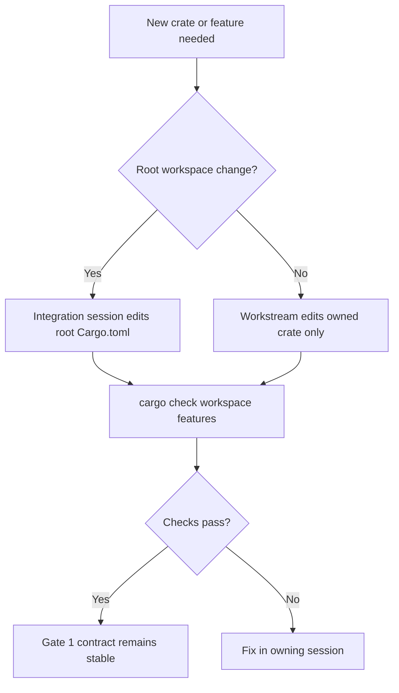
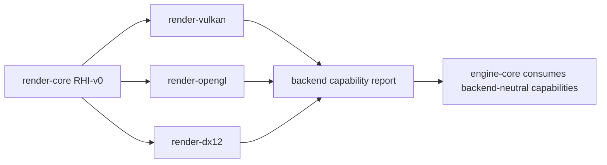

# Gate 1 Common Implementations And Best Practices

## Research Scope

Gate 1 covers workspace layout, crate ownership, feature flags, and the first rendering hardware interface contract.

## Global Shader Strategy

> **Status:** FROZEN by `FD-004`, `FD-037`, `FD-038`, `FD-039`, `FD-040`, `FD-041`, `FD-042` in [foundation-decisions.md](../foundation-decisions.md). The `ShaderFormat` enum in `RHI-v0` keeps its full variant set, but `FD-039` pins which variants are Active vs Reserved.

| Slot | Decision | Source |
|---|---|---|
| Authoring language | `GLSL` (`#version 450 core`, Vulkan SPIR-V environment). HLSL / WGSL banned as authoring source. | `FD-004`, `FD-037` |
| Compiler toolchain | `shaderc` (which wraps `glslang`); reflection via `spirv-reflect`. `naga` is **not** used for reflection. | `FD-004` |
| Canonical runtime format | `SPIR-V` binary (Vulkan 1.2 environment, SPV 1.5). Every backend either consumes it directly or has a cook-time translator. | `FD-004`, `FD-039` |
| Reflection / binding strategy | `spirv-reflect` runs over the SPIR-V to derive `set=0..3` descriptor layouts and `ParamBlock.layout_hash` per the four-set convention in `FD-041`. | `FD-041` |
| Stages active at Gate 2 | Vertex + Fragment. Compute deferred to `OFQ-013`. Geometry / tessellation / mesh / RT banned in v0 (`FD-037`, `OFQ-014`). Geometry shaders are banned in **all** versions. | `FD-037`, `OFQ-013`, `OFQ-014` |
| Shader source hashing | `sha256` of LF-normalized source bytes; recorded as `ShaderStageBlob.source_hash`. Include dependencies are hashed separately and listed in `CookedShader-v0.include_hashes`. | `FD-038`, `FD-042` |
| Where cooked shader artifacts live | One `CookedShader-v0` per `(pipeline, variant_key, platform)` under `AssetRegistry-v0.CookedArtifact`. Wrapped by the standard `CookedAssetHeader` (`asset_kind = CookedShader`). | `FD-042` |
| Backend translation | `render-vulkan` consumes SPIR-V directly. `render-opengl` uses `naga` (SPIR-V → GLSL 450 core) at cook time. `render-dx12` uses `naga` (SPIR-V → HLSL) + DXC (HLSL → DXIL) via `hassle-rs` at cook time. iOS / MoltenVK consumes SPIR-V; MoltenVK owns SPIR-V → MSL at runtime. The engine never produces MSL source itself. | `FD-039` |
| Variant / permutation model | Material-declared static `VariantKey`s; cooker emits one artifact per combination. Bit-packed `variant_key: u64` (max 64 bits across all keys per pipeline). | `FD-040` |
| PSO cache | Per-`(backend, adapter)` `vkPipelineCache` / `ID3D12PipelineLibrary` blob persisted under the user cache dir; invalidated when adapter / driver capabilities hash changes. | `FD-042` |

**Rationale for SPIR-V as canonical runtime format:** Vulkan consumes SPIR-V natively; the engine's native target. `naga` provides Rust-friendly translation to GLSL / HLSL for the OpenGL and DX12 backends without dragging in SPIRV-Cross. MoltenVK already owns SPIR-V → MSL inside the iOS Vulkan runtime, so the engine does not maintain an MSL backend.

**Rationale against per-backend native sources:** Forces the asset pipeline to compile each shader N times from N different source files for N backends; conflicts with `FD-037` single-source convention and with `AssetRegistry-v0`'s `import_settings_hash` model.

## Mainstream Implementations

1. Engine-owned RHI layer
   - Large engines commonly isolate graphics APIs behind an RHI or hardware abstraction layer.
   - Public layer usually owns device, queue, command buffer, resource, pipeline, swapchain, descriptor, capability, and error contracts.
2. Backend adapter model
   - bgfx, wgpu-hal, and gfx-rs-style designs keep backend implementation crates behind a common interface.
3. Rust workspace modularization
   - Cargo workspaces with small crates are the normal Rust way to enforce ownership and parallel development boundaries.
4. Feature-gated backend selection
   - Optional graphics backends should compile behind explicit features to avoid forcing all SDKs on every developer.

## Recommended Direction

- Use a custom Rust RHI in `render-core`.
- Keep Vulkan as the first complete backend.
- Keep OpenGL and DirectX 12 as compile-time contract validators.
- Create placeholder crates early to prevent root `Cargo.toml` conflicts across sessions.

## Best Practices

- Keep RHI handles opaque and backend-independent.
- Prefer typed descriptors over backend structs in public APIs.
- Add capability queries early.
- Map backend errors into common engine errors.
- Document ownership for root workspace files and `render-core`.

## Anti-Patterns

- Exposing `ash::vk::*`, OpenGL object IDs, or D3D12 COM types above backend crates.
- Letting backend sessions independently evolve `render-core`.
- Packing all future systems into `engine-core`.
- Creating workspace members lazily from multiple sessions.

## Fetched Reference Summaries

- Cargo workspaces: Cargo workspaces share a lockfile, output directory, dependency declarations, package metadata, and lints across multiple crates. For this engine, that means all planned crates should be registered early, and shared dependency versions should live at the workspace level.
- Cargo features: Cargo features are additive and unified across dependency resolution. Backend flags should therefore be explicit and mostly additive; avoid designing mutually exclusive behavior that breaks when multiple features are enabled together.
- Rust API Guidelines: Public Rust APIs should use predictable names, explicit ownership, fallible paths instead of panics, and semver-aware stability. `render-core` should be small, typed, documented, and hard to misuse.
- ash: Ash is a low-level Vulkan binding and expects explicit loader, instance/device, extension, and unsafe-call management. This supports the decision to keep Vulkan-specific code inside `render-vulkan`, not above the RHI.
- wgpu-hal and bgfx: Both demonstrate backend abstraction where a common API routes to multiple backend implementations. They reinforce keeping capability reporting and backend object ownership below the public renderer contract.
- Unreal RHI: Unreal separates renderer logic from graphics API implementations through an RHI layer. This validates the plan to put stable engine contracts above Vulkan/OpenGL/DX12.
- Vulkan Guide: The Vulkan Guide is a practical companion to the spec and should be used when defining backend requirements around queues, memory, synchronization, validation, and extensions.

## Design Reference Notes

### Workspace Shape

Cargo workspace references imply that this engine should not let every subsystem invent its own dependency versions, target directories, lint settings, or feature naming. Gate 1 should create the complete workspace skeleton, even for crates that remain empty until later gates. This keeps future sessions from repeatedly touching root `Cargo.toml`.

Recommended root responsibilities:

- Declare all workspace members up front.
- Centralize shared dependency versions with workspace dependencies where practical.
- Keep backend feature flags additive because Cargo feature unification can enable multiple features at once.
- Keep default features minimal; do not silently require Vulkan SDK, DirectX SDK, editor UI, C# runtime, or mobile toolchains for every check.

### RHI Contract Shape

The RHI should look closer to bgfx/wgpu-hal/Unreal RHI than to Vulkan samples. The public contract should describe what the engine needs, not what Vulkan names objects. A useful first split is:

- `Backend` or `Instance`: creates adapters/devices and reports capabilities.
- `Adapter`: physical GPU or backend device candidate.
- `Device`: resource and pipeline creation.
- `Queue`: submission and presentation ownership.
- `Surface` and `Swapchain`: platform presentation boundary.
- `CommandEncoder` or `CommandBuffer`: command recording abstraction.
- `Buffer`, `Texture`, `Sampler`, `ShaderModule`, `Pipeline`: opaque handles plus typed descriptors.
- `Capabilities`: backend feature/limit reporting.
- `RenderError`: common error type with backend-specific details captured below the abstraction.

### API Design Implications

Rust API guideline references imply that `render-core` should be difficult to misuse. Prefer explicit descriptors such as `BufferDesc`, `TextureDesc`, `PipelineDesc`, and `SwapchainDesc` instead of long positional constructors. Fallible creation paths should return `Result`, not panic. Avoid public trait methods that require callers to manage backend-specific unsafe handles.

### Session Boundary Implications

Backend references show that OpenGL, Vulkan, and DirectX 12 have different concepts. Therefore, Gate 1 should not attempt to model every advanced feature. Instead, freeze a small `RHI-v0` and use stubs to reveal obvious mismatches. Missing features should be added by an integration owner after review, not by backend branches directly.

### Design Checklist For Implementation

- Does every public RHI type have a backend-neutral name?
- Can `render-opengl` and `render-dx12` compile without `render-vulkan`?
- Can future systems depend on `render-core` without linking platform-specific SDKs?
- Are all feature flags additive and documented?
- Can unsupported backend features be represented as capability failures instead of compile-time surprises?

## Implementation Flowcharts

### Workspace Ownership Flow

### RHI Contract Consumption Flow

## References To Review

- Cargo workspaces: https://doc.rust-lang.org/cargo/reference/workspaces.html
- Cargo features: https://doc.rust-lang.org/cargo/reference/features.html
- Rust API Guidelines: https://rust-lang.github.io/api-guidelines/
- ash Vulkan bindings: https://github.com/ash-rs/ash
- wgpu-hal backend abstraction: https://github.com/gfx-rs/wgpu/tree/trunk/wgpu-hal
- bgfx renderer abstraction: https://github.com/bkaradzic/bgfx
- Unreal RHI overview: https://dev.epicgames.com/documentation/en-us/unreal-engine/rendering-hardware-interface-in-unreal-engine
- Vulkan Guide: https://github.com/KhronosGroup/Vulkan-Guide
