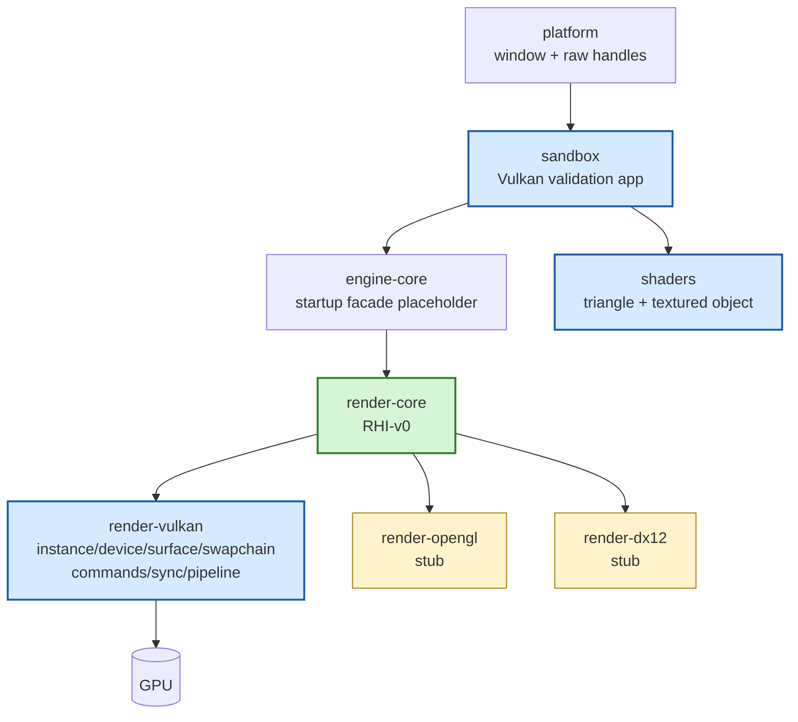

# Gate 2 Code Architecture

## Purpose

This diagram shows the whole engine structure at the end of Gate 2. Gate 2 turns the Vulkan backend from a stub into the first working implementation while OpenGL and DirectX 12 remain contract-validation stubs.

## Whole-System Architecture At Gate Exit

## Gate 2 Additions

- Vulkan instance, physical device, logical device, queues, surface, swapchain, command buffers, synchronization, shader module loading, and graphics pipeline creation.
- Triangle and textured object sandbox paths.
- Resize/shutdown validation path.
- OpenGL/DX12 stubs kept compiling against `RHI-v0`.

## Frozen Contracts

- `RHI-v0` remains the public backend contract.
- Vulkan implementation details remain private to `render-vulkan`.

## Cross-Cutting Decisions Applied

| Decision | Applied as |
|---|---|
| `FD-003` iOS graphics backend | iOS surface creation goes through MoltenVK (`VK_EXT_metal_surface`); `BackendCapabilities` enumerates MoltenVK's feature subset (no geometry shaders, limited descriptor indexing). |
| `FD-004` Shader toolchain | Shaders are GLSL compiled via shaderc (glslang) to SPIR-V; reflection uses spirv-reflect. CI must install the LunarG SDK or build shaderc/glslang from source. Full subsystem detail is split across `FD-037..042`. |
| `FD-037` Shader source file layout | Vulkan backend creates `vk::ShaderModule` from the SPIR-V blob inside `CookedShader-v0`; entry point is always `"main"`, one stage per shader module. Geometry / tessellation shaders are not enabled on the device features list in v0 (matches MoltenVK feature subset per `FD-003`). |
| `FD-039` Backend shader translation | `render-vulkan` is the **only** v0 backend that consumes SPIR-V directly (no translation). On iOS the same SPIR-V is fed to MoltenVK, which owns SPIR-V → MSL internally; the engine never invokes `naga` or `shaderc` at runtime. `ShaderFormat::SpirV` is the only variant the Vulkan backend reports in `BackendCapabilities.supported_shader_formats`. |
| `FD-041` Descriptor set / bind layout convention | `render-vulkan` pre-creates the four `vk::DescriptorSetLayout`s (`set=0` engine globals, `set=1` material, `set=2` per-instance, `set=3` reserved for Gate-9 subsystem extensions) at device init from `CookedShader-v0.reflected_layout`. `vk::PipelineLayout` is built from those four sets plus the 128-byte push-constant range. Pipeline creation rejects layouts that violate the convention with `RhiError::IncompatibleBindLayout`. |
| `FD-042` CookedShader-v0 and PSO cache | `render-vulkan` consumes `CookedShader-v0` blobs (per `(pipeline, variant_key, target_platform)`) and resolves the matching variant at PSO build time. Device init reads `<user_cache_dir>/<engine>/pso_cache/vulkan-<sha256(BackendCapabilities)>.bin` into `vk::PipelineCache`; clean shutdown writes back; long-running editor sessions debounce writes on a 60-second timer. Read / write failures are logged once and ignored — the backend must work with an empty cache. |
| `FD-015` Vulkan GPU memory allocator | All buffer/texture allocations go through the `gpu-allocator` crate (Embark). No raw `vkAllocateMemory` calls outside the resource wrapper. |
| `FD-014` Logging and tracing | Validation messenger output goes through `tracing` events, not `eprintln!`. |
| `FD-029` Workspace crate layout | Vulkan code lives in `render-vulkan`; high-level renderer is `engine-renderer`; `render-core` exposes RHI-v0 only. |
| `FD-030` Math library | Vulkan-side math (projection / view) uses `glam`; column-major uploads, no transpose. |
| `FD-031` Coordinate system, units, NDC | Projection matrices target Vulkan NDC depth `[0, 1]` (reverse-Z); a viewport Y-flip (`viewport.height < 0`) keeps `+Y` up consistent with FD-031. |

### Minimum Vulkan Version And Required Extensions

Frozen targets:

| Target | Vulkan API | Notes |
|---|---|---|
| Desktop (Windows / Linux) | **1.2 core** | 1.3 dynamic rendering is optional; promoted only if `BackendCapabilities.supports_dynamic_rendering` is true. |
| macOS / iOS via MoltenVK | **1.2 subset** | MoltenVK 1.2 covers the engine's feature subset; geometry shaders are unavailable (per `FD-003`). |
| Android | **1.1 minimum, 1.2 preferred** | Android Vulkan 1.1 is the realistic floor across mid-tier devices; 1.2 features are opted into via `BackendCapabilities`. |

Mandatory instance extensions: `VK_KHR_surface`, the per-platform `VK_KHR_*_surface` (`VK_KHR_win32_surface`, `VK_KHR_xlib_surface` or `VK_KHR_wayland_surface`, `VK_EXT_metal_surface`, `VK_KHR_android_surface`), `VK_EXT_debug_utils` (validation builds only).

Mandatory device extensions: `VK_KHR_swapchain`. Optional and probed via `BackendCapabilities`: `VK_KHR_dynamic_rendering` (Vulkan 1.3), `VK_EXT_descriptor_indexing` (1.2 core), `VK_KHR_timeline_semaphore` (1.2 core), `VK_KHR_synchronization2` (1.3 core).

Validation layer: `VK_LAYER_KHRONOS_validation` is loaded when `ValidationMode::Standard` or `Strict` is selected; it is **never** linked into release builds.

## Architectural Notes

- Sandbox may call engine/render startup code, but it should not become the engine API.
- Vulkan may request small RHI fixes, but changes require backend stub checks.
- No ECS, assets, editor, or script dependencies are introduced yet.

## Open Design Questions

- Dynamic rendering vs. classic render passes as the initial Vulkan path.

Resolved cross-cutting items (do not re-debate at this gate):

- **GPU allocator choice and lifetime model** is frozen by `FD-015` (`gpu-allocator` crate). Lifetime model is per-frame deferred destruction tied to the frame fence.
- **Shader source/cook path** is frozen by `FD-004` (GLSL + shaderc + spirv-reflect), elaborated by `FD-037..042`.
- **`vk::ShaderModule` source format** is frozen by `FD-039` (SPIR-V only; no runtime translation; MoltenVK owns SPIR-V → MSL inside the iOS Vulkan runtime).
- **`vk::PipelineLayout` shape** is frozen by `FD-041` (four descriptor sets, 128-byte push-constant range).
- **`vk::PipelineCache` persistence** is frozen by `FD-042` (per-`(backend, adapter)` file under user cache dir; invalidated when `sha256(BackendCapabilities)` changes).

## Detailed Design Proposal

### Vulkan Backend Modules

`render-vulkan` should be split by ownership and lifetime, not by tutorial chapter:

- `instance`: entry loading, instance creation, validation layers, debug messenger.
- `surface`: raw window handle integration and surface creation (desktop via `VK_KHR_*_surface`; iOS via MoltenVK `VK_EXT_metal_surface`, per `FD-003`).
- `adapter`: physical device selection and queue family discovery.
- `device`: logical device, queues, enabled features/extensions.
- `swapchain`: swapchain, image views, format/present mode/extents, recreation.
- `frame`: frames-in-flight, fences, semaphores, per-frame command buffers.
- `pipeline`: shader modules, pipeline layouts, graphics pipelines.
- `resource`: buffers, images, samplers, allocation wrapper.
- `error`: Vulkan result mapping into `RenderError`.

### Frame Lifecycle

Each frame follows a strict lifecycle:

1. Wait for this frame's fence.
2. Acquire swapchain image.
3. Reset command pool/buffer for the frame.
4. Record rendering commands.
5. Submit with image-available and render-finished semaphores.
6. Present.
7. If out-of-date/suboptimal/resized, trigger swapchain recreation.

This lifecycle becomes the future foundation for resource lifetime, hot reload, and render graph execution.

### Swapchain Recreation

Swapchain-dependent resources must be grouped explicitly. Gate 2 should define a `recreate_swapchain()` path that rebuilds:

- swapchain object;
- image views;
- depth/color attachments if already present;
- framebuffers if classic render passes are used;
- viewport/scissor dependent state if not dynamic.

Non-swapchain resources such as device, queues, descriptor pools, immutable shaders, and persistent buffers should not be rebuilt during normal resize.

### Memory And Resource Ownership

All device memory allocation flows through the `gpu-allocator` crate (per `FD-015`); do not let arbitrary Vulkan modules select memory types. The resource wrapper records enough metadata for debug naming, deferred destruction, and later memory reporting. Per-frame deferred destruction is the lifetime model: dropped resources are queued and freed only after the frame's fence signals.

### Validation And Debugging

- Enable validation layers in debug/development builds.
- Add debug object names for instance/device/swapchain/pipeline/resources.
- Make sandbox rendering capture-friendly in RenderDoc.
- Treat validation errors as gate blockers.

### Implementation Order

1. Window/surface boot.
2. Instance/device/queue selection.
3. Swapchain and frame resources.
4. Triangle pipeline.
5. Vertex/index/uniform/texture upload.
6. Textured object.
7. Resize/minimize/shutdown hardening.

### Design Risks

- Incorrect synchronization will appear later as hot reload or render graph bugs.
- Ad hoc sample code can become technical debt if not wrapped behind the backend implementation.
- Swapchain recreation must be tested early because every later renderer gate depends on it.
