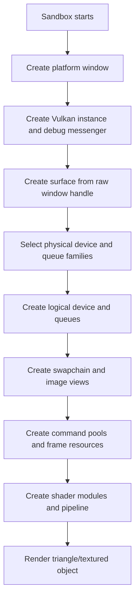
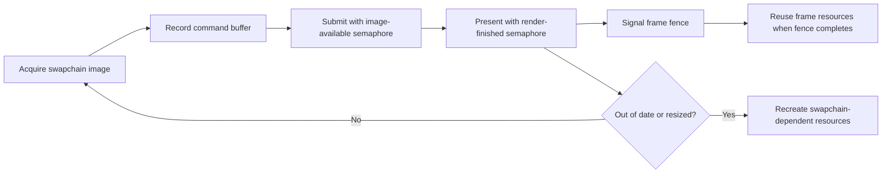

# Gate 2 Common Implementations And Best Practices

## Research Scope

Gate 2 covers the first real Vulkan backend: device setup, swapchain, command submission, synchronization, pipeline creation, and presentation.

## Mainstream Implementations

1. Vulkan bootstrap path
   - Instance, validation layers, surface, physical/logical device, queues, swapchain, command pools, command buffers, semaphores, fences, and pipeline.
2. Frames-in-flight renderer
   - Standard pattern for stable swapchain rendering and safe CPU/GPU overlap.
3. Dynamic rendering or classic render pass
   - Dynamic rendering simplifies early setup if the target baseline supports it.
   - Classic render passes have broader tutorial coverage and compatibility.
4. Dedicated allocator
   - Production Vulkan engines use VMA or a wrapper rather than spreading raw memory allocation everywhere.

## Recommended Direction

- Use `ash` for Vulkan bindings.
- Enable validation layers from the start.
- Use two or three frames in flight.
- Prefer dynamic rendering if supported, with a documented fallback decision.
- Keep OpenGL/DX12 as compile stubs for RHI validation.

## Best Practices

- Treat swapchain recreation as a normal path.
- Use explicit ownership for every Vulkan object.
- Delay GPU resource destruction until in-flight frames finish.
- Add debug names and validation-friendly lifetimes early.
- Keep shader module and pipeline creation below `render-vulkan`.

## Anti-Patterns

- Using `device_wait_idle` as routine frame synchronization.
- Ignoring minimized/zero-size swapchain states.
- Recreating pipelines every frame.
- Making sandbox rendering the long-term engine API.

## Fetched Reference Summaries

- Vulkan Specification: The spec is the authoritative source for object lifetime, synchronization, memory, descriptors, queues, and command behavior. Use it to resolve exact correctness questions rather than relying on tutorial assumptions.
- Vulkan Guide: The guide explains modern Vulkan concepts more practically than the raw spec. It is especially useful for extension usage, synchronization, memory model choices, and validation-layer-friendly setup.
- Vulkan Tutorial and vkguide.dev: Both provide step-by-step engine bring-up paths from instance/device/swapchain to buffers, descriptors, pipelines, and frame overlap. They are useful references for early implementation order, but the engine should still keep its own RHI boundaries.
- Khronos and Sascha Willems samples: These sample repositories show concrete API usage for many Vulkan features. Use them to verify patterns for descriptors, synchronization, swapchain handling, and more advanced rendering techniques.
- ash examples: Ash examples show how Vulkan setup looks in Rust, including loader usage, handles, unsafe calls, and cleanup. They are the most relevant code-style reference for the initial `render-vulkan` implementation.
- gpu-allocator and VMA: Both solve Vulkan memory allocation complexity. Use one behind a thin engine allocator boundary instead of scattering raw memory allocation logic throughout the backend.

## Design Reference Notes

### Vulkan Bring-Up Order

The Vulkan references converge on a practical bring-up order. Gate 2 should resist the urge to build a renderer framework before the core Vulkan lifecycle is stable. The implementation order should be:

1. Instance, extensions, validation layers, and debug messenger.
2. Platform surface creation through `platform`/raw window handles.
3. Physical device selection and logical device creation.
4. Queue family discovery and queue retrieval.
5. Swapchain creation with format/present mode/extents.
6. Command pool and per-frame command buffers.
7. Semaphores/fences and frames-in-flight.
8. Shader modules and graphics pipeline.
9. Triangle draw.
10. Buffer/texture upload and textured object draw.
11. Swapchain recreation and teardown validation.

### Synchronization And Lifetime

Vulkan Guide and sample code make it clear that synchronization and object lifetime are not optional details. Gate 2 should establish the ownership model used later by hot reload and renderer resources:

- Per-frame fences protect CPU reuse of frame resources.
- Image-available and render-finished semaphores coordinate acquire/render/present.
- Destroyed resources must not be referenced by in-flight command buffers.
- Swapchain-dependent resources are recreated together when the swapchain changes.
- Zero-sized/minimized windows are handled without busy-looping or crashing.

### Memory Allocation

VMA/gpu-allocator references imply that raw Vulkan memory allocation should be contained behind a small allocator wrapper. Even if the first implementation is minimal, callers above `render-vulkan` should not select memory types manually. Gate 2 should define where allocation metadata is stored, how resources are named, and how destruction is deferred.

### Debuggability

Validation layers, RenderDoc-compatible naming, and sample-driven validation should be considered part of the implementation. Every created Vulkan object should be traceable enough for debugging. The sandbox should have a validation mode that can be used repeatedly by later sessions.

### Design Checklist For Implementation

- Does every Vulkan object have a clear owner and destroy order?
- Are frames-in-flight explicit and bounded?
- Does resize recreate swapchain-dependent resources only?
- Are validation layers clean during startup, draw, resize, and shutdown?
- Can a future resource allocator or render graph reuse this frame model?

## Implementation Flowcharts

### Vulkan Initialization Flow

### Per-Frame Rendering Flow

## References To Review

- Vulkan Specification: https://registry.khronos.org/vulkan/specs/latest/html/vkspec.html
- Vulkan Guide: https://github.com/KhronosGroup/Vulkan-Guide
- Vulkan Tutorial: https://vulkan-tutorial.com/
- vkguide.dev: https://vkguide.dev/
- Khronos Vulkan Samples: https://github.com/KhronosGroup/Vulkan-Samples
- Sascha Willems Vulkan samples: https://github.com/SaschaWillems/Vulkan
- ash examples: https://github.com/ash-rs/ash/tree/master/ash-examples
- gpu-allocator: https://github.com/Traverse-Research/gpu-allocator
- Vulkan Memory Allocator: https://github.com/GPUOpen-LibrariesAndSDKs/VulkanMemoryAllocator
