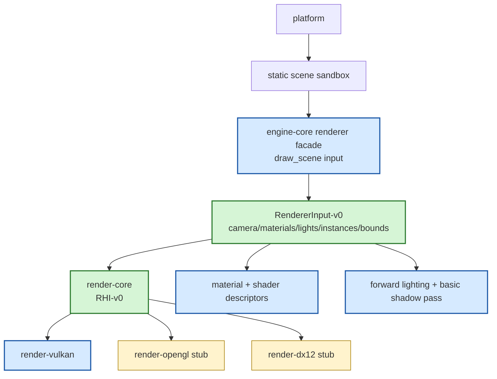

# Gate 3 Code Architecture

## Purpose

This diagram shows the whole engine structure at the end of Gate 3. The major change is that rendering is no longer a raw Vulkan sample; the engine now has a backend-independent renderer scene input contract that later ECS, editor, and scripting systems can feed.

## Whole-System Architecture At Gate Exit



## Gate 3 Additions

- `RendererInput-v0`: camera, lights, meshes, material references, renderable instances, bounds, culling output, and draw statistics.
- High-level `draw_scene`-style renderer entry.
- Basic material/lighting/shadow path.
- Static lit validation scene.

## Frozen Contracts

- Renderer scene input format.
- Material/light/camera parameter shapes.
- Renderer extraction target for future ECS.

## Cross-Cutting Decisions Applied

| Decision | Applied as |
|---|---|
| `FD-026` Shading model and color pipeline | The renderer ships PBR Metallic-Roughness only. The lighting pass writes into an HDR `R16G16B16A16_SFLOAT` offscreen target and ACES-tone-maps into the swapchain. `MaterialBinding` carries a per-texture `color_space` so sRGB color textures and linear data textures are unambiguous. Light intensity is in lux/lumens per `LightKind`. |
| `FD-027` Shading pipeline | Gate 3 implements **forward shading only** — single-pass forward with at most 1 directional + 4 point/spot per draw, no cluster build, no deferred path. Forward+ is reserved for Gate 10/11 behind `subsystem-lighting-cluster`. |
| `FD-028` Shadow algorithm | Gate 3 implements **one 2048×2048 directional shadow map** with 1×1 PCF. Any `ShadowMode` request for point/spot is downgraded to `Off` with a one-time diagnostic. CSM and per-light cube/perspective shadow maps land in Gate 10/11. |
| `FD-002` Engine threading model | Renderer input is double-buffered: extraction runs on the main thread, the render thread reads the previous frame's snapshot without locks. |
| `FD-014` Logging and tracing | Renderer emits `tracing` spans for `frame.extract`, `frame.cull`, `frame.shadow_pass`, `frame.lighting_pass`, `frame.tone_map`, `frame.present`. |
| `FD-034` Camera component minimum field set | `RenderView` carries the camera's `viewport_rect_normalized`, `render_layer_mask`, `clear_flags`, `clear_color`, `msaa_samples`, and (in v0) `render_target = None`. The render graph applies `clear_flags` per view at the start of its sub-graph and writes into the camera's sub-rect of the swapchain (or, post-`OFQ-011`, into its `render_target`). |
| `FD-035` Camera stack / multi-view composition | The render graph builds one sub-graph per `RenderView`, ordered as: all `Base` views first sorted by `(camera.priority, stack_order, view_id)`, then all `Overlay` views sorted by `(stack_order, view_id)` reading their `base_view_id` color attachment. Overlays are composited with the declared `blend_mode` and **never** clear color or depth. An overlay whose `base_view_id` is missing in the current frame is dropped with `RV0007 OverlayBaseMissing`; the frame continues. The render graph spans gain `frame.view.{view_id}` per-view scopes under `frame.extract` / `frame.cull` / `frame.lighting_pass`. |
| `FD-036` Frustum culling ownership | `RendererInput-v0.renderables` / `lights` arrive **already culled** per `RenderView`; the renderer does not re-cull. When `RenderView.frustum` is present, debug builds may run a consistency check (`RV0009 CulledItemSubmitted`). Renderer populates `FrameStats.{visible_drawables, culled_drawables, visible_lights, culled_lights, draw_calls, triangles, gpu_frame_ms}` and surfaces them through the `frame.cull` `tracing` span. |
| `FD-037` Shader source file layout and stage convention | Materials reference shaders by a `Pipeline` `AssetId`; the underlying `*.vert.glsl` / `*.frag.glsl` files live under `assets/shaders/`. Renderer only ever consumes the cooked SPIR-V from the matching `CookedShader-v0` artifact — it never reads `.glsl` source. |
| `FD-038` Shader include and preprocessor | Renderer does not see includes; they are resolved at cook time and recorded in `CookedShader-v0.include_hashes`. The renderer's only obligation is to pass the correct engine-define macros (`ENGINE_REVERSE_Z`, `ENGINE_VULKAN_NDC`, `ENGINE_MAX_LIGHTS_PER_DRAW=5`) to the cook step so the produced SPIR-V matches Gate 3's NDC / shading assumptions. |
| `FD-039` Backend shader translation pipeline | Gate 3 is backend-neutral; it consumes `CookedShader-v0` blobs and lets each backend pick `spirv` / `glsl` / `dxil` per `FD-039`. Renderer never invokes `naga` or `shaderc` at runtime. |
| `FD-040` Shader variant / permutation model | Extraction computes the runtime `variant_key` by OR-ing engine-reserved bits (`SKINNED` when the draw has a bone palette, `INSTANCED` when batched, `SHADOW_PASS` during the shadow sub-graph, `MAX_LIGHTS_<N>` based on the active light count) into the material's authored key. The lookup `(pipeline_id, variant_key)` resolves to a `CookedShader-v0`; missing variants fall back to `variant_key = 0` with a one-time `RV0011 ShaderVariantMissing` diagnostic. |
| `FD-041` Descriptor set / bind layout convention | `RenderView` populates `set=0` per-frame UBOs (`FrameUniforms`, `LightSSBO`, shadow-map sampler array, named engine samplers); `MaterialBinding` populates `set=1` (material UBO + textures); per-draw transforms / bone palette populate `set=2`. `set=3` is reserved for Gate-9 `SubsystemExtension-v0`. Push constants carry only the engine-reserved 16-byte prefix per `FD-041`. |
| `FD-042` CookedShader-v0 and PSO cache | `MaterialBinding.pipeline: AssetId` references a `Pipeline` authoring asset; the renderer resolves `(pipeline_id, variant_key, target_platform)` to a `CookedShader-v0` blob at PSO build time. The backend warms / writes the PSO cache; the render graph is unaware of it. |

See [lighting-system.md](../lighting-system.md) for the cross-gate evolution plan and mobile/desktop subset.

## Architectural Notes

- Later systems feed renderer input; they do not issue Vulkan commands.
- Renderer input is deliberately narrower than a full scene graph.
- Asset and ECS systems are still absent; sandbox supplies temporary data.
- The render graph contains, at minimum: `directional_shadow_pass -> opaque_pbr_forward_pass -> tone_map_pass -> present`. Adding new passes here requires a render-graph entry, not ad-hoc command insertion (per `FD-027`).

## Open Design Questions

- Minimum debug draw hooks needed before Gate 9.

Resolved cross-cutting items (do not re-debate at this gate):

- **Shading model / color space / tone-mapping** — frozen by `FD-026`.
- **Forward vs deferred shading** — frozen by `FD-027` (forward only in v0).
- **Shadow algorithm in Gate 3** — frozen by `FD-028` (single directional shadow map).
- **Camera component field set** — frozen by `FD-034`; no per-camera tone-mapping override, post-process volume, or virtual-camera field in v0 (deferred to `OFQ-011` / `OFQ-012`).
- **Multi-view / camera stack composition** — frozen by `FD-035`; `Base` + `Overlay` semantics with deterministic ordering; no implicit GPU composition tricks.
- **Frustum culling ownership** — frozen by `FD-036` (producer-owned, AABB-vs-frustum, renderer does not re-cull).
- **Material descriptor → backend mapping** — frozen by `FD-039` (per-backend translation at cook time, not runtime) and `FD-041` (frozen four-set descriptor layout); `MaterialBinding.pipeline` resolves through `CookedShader-v0` per `FD-042`.
- **Shader variant / permutation model** — frozen by `FD-040` (static bit-packed `variant_key: u64`).
- **Shader include and preprocessor** — frozen by `FD-038` (resolved at cook time; renderer never sees `#include`).

## Detailed Design Proposal

### Renderer Input Model

`RendererInput-v0` is a frame-local structure. It should be built before rendering begins and treated as immutable during rendering. Suggested fields:

```rust
pub struct RendererInput {
    pub views: Vec<RenderView>,            // per FD-035: Base + Overlay
    pub renderables: Vec<RenderableInstance>, // already culled per view (FD-036)
    pub lights: Vec<LightRenderData>,         // already culled per view (FD-036)
    pub materials: MaterialTableRef,
    pub render_options: RenderOptions,
    pub stats: FrameStats,                    // renderer-populated; visible/culled counters
}
```

`RenderView` (per `FD-034` / `FD-035`) carries `viewport_rect_normalized`, `render_layer_mask`, `clear_flags`, `clear_color`, `msaa_samples`, `compose: Base { clear, clear_color } | Overlay { base_view_id, blend_mode }`, `stack_order`, and optional `frustum: [Vec4; 6]`. The render graph runs one sub-graph per view; the per-view `viewport_rect_normalized` selects the sub-rect of the render target and `clear_flags` controls clearing.

`RenderableInstance` should contain transform, bounds, mesh reference, material reference, visibility data, and optional per-object constants. It must not contain ECS entity storage references or Vulkan handles.

### Material Descriptor Model

The first material descriptor should be simple but structured:

- `pipeline: AssetId` reference to a `Pipeline` authoring asset (per `FD-042`); the cooked `CookedShader-v0` artifact holds the SPIR-V plus reflected `set=0..3` layout.
- `variant_key: u64` bit-packed selector following `FD-040`; extraction ORs engine-reserved bits (`SKINNED`, `INSTANCED`, `SHADOW_PASS`, `MAX_LIGHTS_<N>`) into the authored key.
- `ParamBlock` (`set=1, binding=0` UBO per `FD-041`) carrying material parameters with `layout_hash` matched against `CookedShader-v0.reflected_layout.param_block_layout_hash`.
- texture / sampler bindings under `set=1, binding=1..15`, declaration order matches `TextureSlot.binding`.
- blend / depth / raster state declared on the `Pipeline` asset and validated at cook time (not authored per material).
- render queue or pass hint via `pass_mask: u32`.
- validation function: cook-time SPIR-V reflection ensures the declared `ParamBlock` layout matches the shader; runtime check enforces `layout_hash` equality and surfaces `RV0010 ParamBlockLayoutMismatch` on mismatch.

Material descriptors become the future bridge to asset cooking and editor inspection. Avoid key-value maps unless they are backed by typed schemas.

### Render Graph Minimum

The Gate 3 render graph contains the following passes in order (per `FD-027` / `FD-028`):

1. `directional_shadow_pass` — renders shadow casters into a 2048×2048 R32_SFLOAT depth target from the directional light's view; skipped if no directional light or no shadow casters exist.
2. `opaque_pbr_forward_pass` — single-pass forward shading into the HDR offscreen target; reads the shadow map via comparison sampler.
3. `tone_map_pass` — ACES tone-mapping from HDR offscreen to the swapchain sRGB attachment.
4. `present` — backend-specific swapchain present.

The render graph must:

- declare resource handles (no hardcoded image bindings);
- declare pass dependencies (so backends can insert barriers);
- expose pass names matching the list above for `tracing` span naming.

Do not implement transient resource aliasing, async compute, or complex scheduling here.

### Lighting And Shadow Pass Details

- The directional shadow pass uses a fixed orthographic frustum derived from the main camera's view frustum AABB; cascaded shadow maps land in Gate 10/11.
- Slope-scaled depth bias is applied; the constants are configurable per scene but defaulted at the gate level.
- The lighting pass evaluates GGX + Lambert per fragment, with at most 1 directional + up to 4 point/spot lights per draw. Materials with `cast_shadows: false` are still lit but do not contribute to the shadow pass.
- The tone-map pass uses ACES (Narkowicz) and reads exposure from `RenderView.camera`'s aperture/shutter/ISO + EV compensation (per `FD-026`).
- Constant ambient comes from `SceneSettings.ambient`; environment map is ignored in Gate 3 (consumed by Gate 10/11 IBL).

### Statistics And Diagnostics

Expose renderer statistics as data:

- visible renderable count;
- culled renderable count;
- submitted draw count;
- material/pipeline switch estimates;
- pass count;
- frame resource warnings.

These are consumed by editor diagnostics, performance reports, and Gate 19 profiling.

### Implementation Order

1. Define render data structs.
2. Move static sandbox scene into `RendererInput-v0`.
3. Route draw through `draw_scene`.
4. Add typed material descriptors (PBR-MR), declare HDR offscreen target and ACES tone-mapping pass.
5. Add `LightItem` (Directional/Point/Spot) and the directional shadow pass; downgrade unsupported `shadow_mode` requests with a diagnostic.
6. Add stats and validation.

### Design Risks

- If renderer input is too close to ECS, later editor/script work becomes coupled to ECS internals.
- If renderer input is too close to Vulkan, OpenGL/DX12 will be permanently disadvantaged.
- If material descriptors are not typed early, asset and editor gates will invent incompatible formats.
