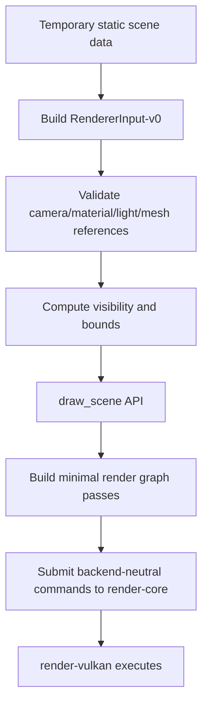
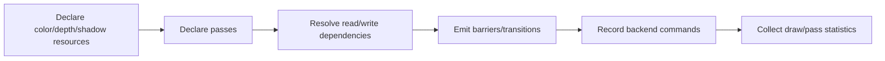

# Gate 3 Common Implementations And Best Practices

## Research Scope

Gate 3 defines the renderer-facing scene input contract between runtime/editor/game systems and backend rendering implementation.

## Mainstream Implementations

1. Renderer scene extraction
   - ECS/game data is transformed into renderer-owned frame data before rendering.
2. Rendering server/facade pattern
   - Scene/game logic talks to a renderer facade instead of backend APIs.
3. Render graph / frame graph
   - Passes declare resources and dependencies before backend command recording.
4. Typed material descriptors
   - Material/shader parameter layouts live above backend-specific descriptors.

## Recommended Direction

- Define `RendererInput-v0` as plain backend-neutral data.
- Use forward lighting and a minimal render graph.
- Include draw and culling statistics immediately.
- Keep ECS and asset registry out of this contract until later gates.

## Best Practices

- Separate extraction from render execution.
- Make renderer input immutable for one frame.
- Keep material data typed, validated, and backend-neutral.
- Add pass names and debug labels early.
- Keep renderer input narrower than a full scene graph.

## Anti-Patterns

- Renderer directly querying ECS storage.
- Exposing Vulkan descriptor sets or command buffers in material data.
- Overbuilding render graph scheduling before multiple passes exist.
- Making diagnostics depend on backend internals.

## Fetched Reference Summaries

- Bevy render architecture: Bevy separates app-world data from render-world/extracted data. This supports using a renderer input/extraction boundary instead of letting renderer code query gameplay ECS storage directly.
- Godot RenderingServer: Godot exposes rendering through a server/facade API, separating scene nodes from renderer implementation. This supports a renderer facade above Vulkan/OpenGL/DX12.
- Filament material docs: Filament treats materials as structured assets with declared parameters and shading models. This supports typed material descriptors rather than ad hoc shader strings or backend descriptors.
- Unreal RDG: Unreal's Render Dependency Graph declares passes and resources so lifetime, ordering, barriers, and debugging are centralized. This supports a minimal render graph that can grow as passes increase.
- Frostbite FrameGraph: The referenced page was not fetched successfully, but the known frame graph idea is still relevant: make passes declare resources/dependencies instead of manual global pass ordering.
- Granite and RenderDoc: Granite is a real Vulkan renderer reference, and RenderDoc is essential for frame capture. Together they reinforce making render passes/resources named and capture-friendly.

## Design Reference Notes

### Render Scene Boundary

Bevy's render extraction model and Godot's rendering server both point to the same rule: gameplay state and renderer execution should be separated. Gate 3 should define a renderer-owned frame input that is copied or built from higher-level state, then consumed by the renderer without reaching back into gameplay systems.

A useful `RendererInput-v0` should include:

- Active camera view/projection data.
- Renderable instances with transform, mesh reference, material reference, bounds, and visibility state.
- Light data with stable type-specific descriptors.
- Optional shadow pass requests.
- Material parameter references, not backend descriptor sets.
- Draw/culling statistics for tools.

### Material Model

Filament's material docs reinforce that material systems need structure. Even early materials should not be untyped blobs. Gate 3 should define the first material descriptor shape: shader reference, parameter block layout, texture bindings, render state, and supported shading path. The descriptor can be small, but it should be explicit.

### Render Graph Scope

Unreal RDG and Frostbite FrameGraph show why pass/resource declarations matter, but Gate 3 should keep this intentionally small. The first graph can simply describe color/depth passes and shadow pass dependencies. Avoid async compute, transient aliasing, or automatic scheduling until the engine has enough passes to justify them.

### Diagnostics

RenderDoc and Granite references show that renderer design should be debuggable. Gate 3 should name passes and resources, expose draw statistics, and keep captures understandable. If later editor/profiler tools need basic counters, those counters should not require backend-specific inspection.

### Design Checklist For Implementation

- Can a caller submit a scene without importing `render-vulkan`?
- Are material and light descriptors typed and validated?
- Does renderer input stay immutable while rendering one frame?
- Are pass/resource names available for debugging?
- Can culling and draw stats be tested without a GPU capture?

## Implementation Flowcharts

### Renderer Input Extraction Flow

### Minimal Render Graph Flow

## References To Review

- Bevy render crate and extract/prepare/queue architecture: https://github.com/bevyengine/bevy/tree/main/crates/bevy_render
- Godot RenderingServer: https://docs.godotengine.org/en/stable/classes/class_renderingserver.html
- Filament material system: https://google.github.io/filament/Materials.html
- Frostbite FrameGraph overview: https://www.ea.com/frostbite/news/framegraph-extensible-rendering-architecture-in-frostbite
- Unreal Render Dependency Graph: https://dev.epicgames.com/documentation/en-us/unreal-engine/render-dependency-graph-in-unreal-engine
- Granite Vulkan renderer: https://github.com/Themaister/Granite
- RenderDoc: https://renderdoc.org/
