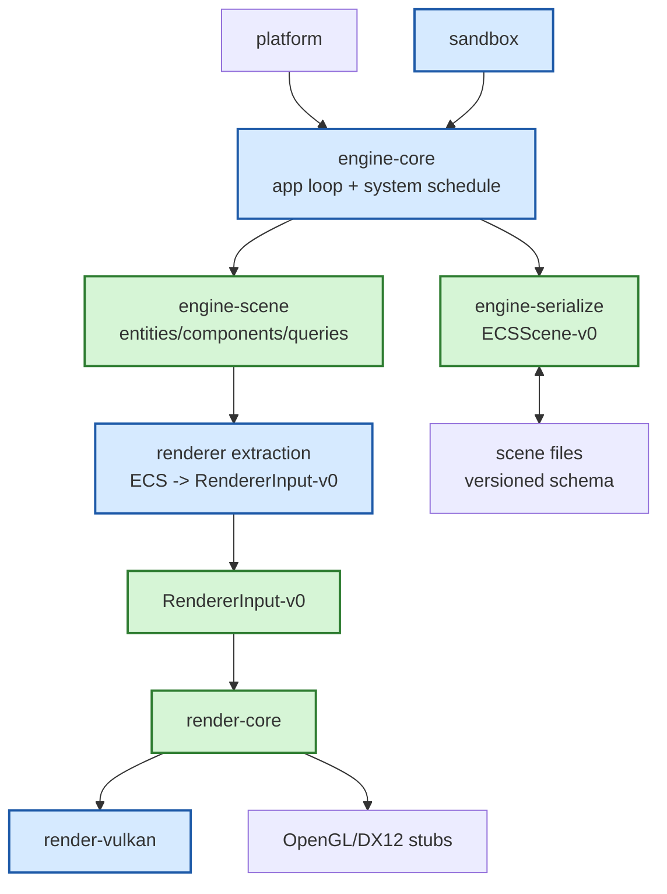

# Gate 4 Code Architecture

## Purpose

This diagram shows the whole engine structure at the end of Gate 4. The renderer now receives scene data from an ECS-backed runtime scene with save/load support instead of temporary sandbox structures.

## Whole-System Architecture At Gate Exit



## Gate 4 Additions

- `engine-scene` with entity IDs, component storage, queries, add/remove behavior, and basic system order (per `FD-029`).
- `ECSScene-v0` serialization with schema version, entity IDs, core components, asset references, active camera, and validation rules.
- ECS-to-renderer extraction into `RendererInput-v0`.

## Frozen Contracts

- Core components: `Name`, `Transform`, `Renderable`, `Camera`, `Light`, `Bounds`.
- Scene schema and renderer extraction contract.

## Cross-Cutting Decisions Applied

| Decision | Applied as |
|---|---|
| `FD-002` Engine threading model | ECS world mutation runs on the main thread; renderer extraction writes into a double-buffered `RendererInput-v0` snapshot that the render thread reads without locks. Extraction is the only cross-thread surface introduced at this gate. |
| `FD-012` Determinism policy | All ECS storage and iteration must produce a deterministic order. `std::collections::HashMap`/`HashSet` are banned in any path that participates in ECS iteration; use `IndexMap` or `FxHashMap` + explicit sort. A `deterministic_replay` integration test (load fixture, tick N frames, compare resulting scene + extracted RendererInput) is a Gate 4 exit requirement. |
| `FD-018` ECS implementation | The ECS is hand-written sparse-set storage inside `engine-scene` (canonical crate per `FD-029`). No external ECS crate (no `hecs`, no `bevy_ecs`, no `flecs`). Component types are registered through a static registry so future Gate 9 extensions can plug in without editing core code. |
| `FD-009` Schema migration mechanism | `ECSScene-v0` evolves via serde defaults / rename / Option fields only during v0; renaming or removing a required field requires bumping to v1 and re-freezing the migration story per `FD-009`. |
| `FD-026` Shading model and color pipeline | `engine.light` carries the `LightKind` / `ShadowMode` enums and physical units (lux/lumens). `engine.camera` carries physical exposure (aperture/shutter/ISO + EV compensation). `SceneSettings` gains `ambient`, `environment_map`, and `tone_mapping` fields; Gate 3 reads `ambient` and `tone_mapping` from here, Gate 10/11 reads `environment_map`. |
| `FD-034` Camera component minimum field set | `engine.camera` ships exactly the fields listed in `FD-034` (projection, near, far, fov/size, `viewport_rect`, `render_layer_mask`, `clear_flags`, `clear_color`, `priority`, `render_target` = `None` in v0, `msaa_samples`, `hdr_output`, `exposure`). Extraction validates `near > 0`, `far > near`, `viewport_rect` in `[0, 1]` with `min < max`, and `msaa_samples ∈ {1, 2, 4, 8}`; a non-`None` `render_target` is rejected with `SC0014 RenderTargetNotInV0`. The `engine.renderable.render_layer: String` is mapped one-to-one to a `RenderLayerId` bit index inside `engine-scene`. |
| `FD-035` Camera stack / multi-view composition | Extraction emits one `RenderView` per enabled `engine.camera`, populating `compose: Base { clear, clear_color } \| Overlay { base_view_id, blend_mode }` and `stack_order`. In v0 there is exactly one `Base` view = the camera referenced by `SceneSettings.active_camera`; additional enabled cameras default to `Overlay` referencing the active base view. A scene with two cameras at the same `priority` and both authored as `Base` emits diagnostic `RV0008 MultipleBaseCameras` and the lower `view_id` wins. |
| `FD-036` Frustum culling ownership | Extraction performs the per-view AABB-vs-frustum cull before populating `RendererInput-v0.renderables` / `lights`; it stamps `RenderView.frustum` with the six world-space plane equations so the renderer (in debug builds) can assert no culled item slipped through. The `deterministic_replay` exit test asserts `visible + culled == total_renderables` for every view. |

## Architectural Notes

- Future systems extend ECS through registered components instead of editing a monolithic parser.
- Renderer remains unaware of ECS storage internals.
- Asset references are still path-like placeholders until Gate 5.

## Open Design Questions

- Entity ID stability across save/load and later prefab instancing.
- Whether serialization lives in a separate crate or `engine-core` module.
- How system scheduling evolves before scripting and physics.

## Detailed Design Proposal

### ECS Runtime Shape

Gate 4 should implement the minimum ECS needed for stable scene persistence and renderer extraction. The ECS does not need full parallel scheduling yet. Storage layout is sparse-set (per `FD-018`); archetype reshuffles are explicitly out of scope. Required concepts:

- `EntityId` with generation or stable scene identity mapping.
- Component storage for core components (sparse-set; one storage per component type).
- Query API for read-only and mutable access; iteration order is deterministic (per `FD-012`).
- Entity creation/destruction with stale handle protection.
- Basic resources for active camera and scene-level settings.
- Component type registry that future Gate 9 `SubsystemExtension-v0` plugs into; the registry is the only place that knows about all component types.

### Core Components

The frozen component set is intentionally small:

- `Name`: human-readable identifier and editor label.
- `Transform`: local/world transform, parent relation only if hierarchy is included.
- `Renderable`: mesh/material asset references and render flags.
- `Camera`: projection, near/far, FOV (or orthographic half-height), `viewport_rect`, `render_layer_mask`, `clear_flags`, `clear_color`, `priority`, `render_target` (must be `None` in v0; see `OFQ-011`), `msaa_samples`, `hdr_output`, plus the physical-exposure fields (aperture / shutter / ISO / EV compensation) defined by `FD-026`. Full field set is frozen by `FD-034`; multi-camera composition rules (Base / Overlay) by `FD-035`; frustum culling responsibility by `FD-036`.
- `Light`: `kind` enum (`Directional | Point | Spot`), `color` (linear sRGB), `intensity` (lux for `Directional`, lumens for `Point`/`Spot`), `range`, `spot_angles` (required for `Spot`), `shadow_mode` enum (`Off | Hard | Soft`). See [lighting-system.md](../lighting-system.md) and `data-schema-contracts.md`.
- `Bounds`: local/world bounds for culling and selection.

The `Light` extraction pass writes into `RendererInput-v0.lights` and validates that `Directional` lights have a non-zero direction, `Spot` lights have valid `spot_angles`, and intensity units match the kind (per `FD-026`).

Each component must define serialization shape and validation rules.

### Scene Serialization Shape

Scene files should not mirror runtime memory. Recommended structure:

```text
Scene
    schema_version
    engine_version
    entities[]
        persistent_id
        components{}
    scene_settings
        active_camera
```

Persistent IDs allow editor, prefab, and script references to remain stable across save/load. Runtime IDs may be rebuilt when loading.

### Renderer Extraction

Extraction reads ECS and writes `RendererInput-v0`. It should be a one-way transformation:

```text
ECS components -> extraction validation -> RendererInput-v0 -> renderer
```

No backend code is allowed in extraction. Missing mesh/material references are reported as validation errors or placeholder renderables, depending on debug policy.

### Implementation Order

1. Entity/component storage.
2. Core components and queries.
3. Scene serialization/deserialization.
4. Scene validation.
5. Renderer extraction.
6. Visual parity test against Gate 3 scene.

### Design Risks

- If persistent identity is not solved now, prefabs, scripts, and editor references become fragile.
- If serialization stores runtime handles, later hot reload and asset registry work will be painful.
- If ECS exposes too much mutation without scheduling rules, physics and scripting will conflict later.
