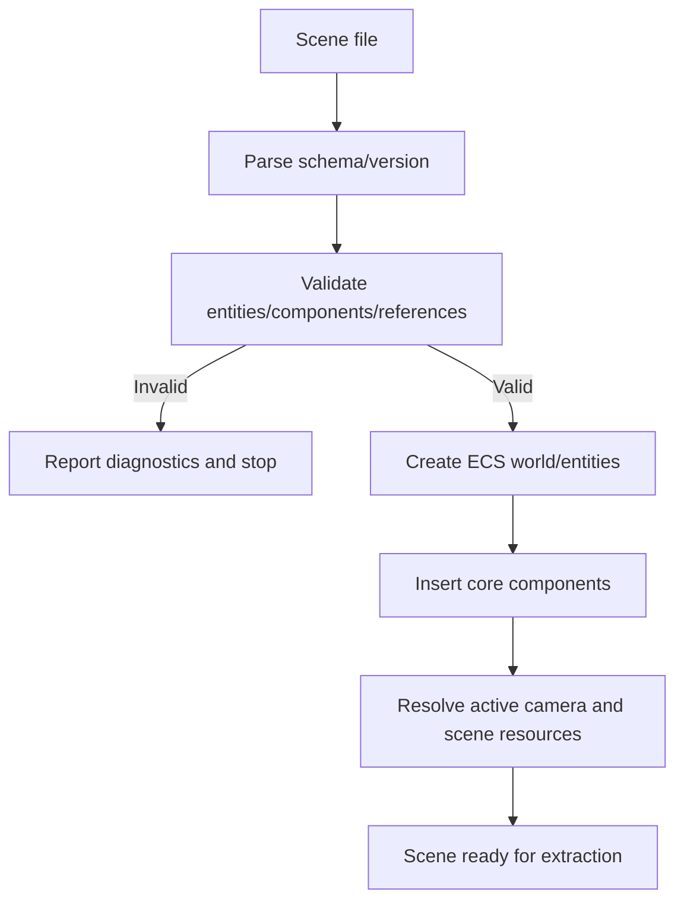
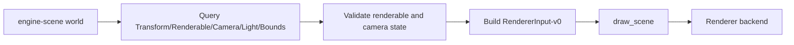

# Gate 4 Common Implementations And Best Practices

## Research Scope

Gate 4 introduces ECS scene runtime, scene serialization, validation, and renderer extraction.

## Mainstream Implementations

1. Sparse-set or archetype ECS
   - Sparse-set is simple and mutation-friendly.
   - Archetype ECS is faster for dense queries but more complex.
2. Entity IDs with generation counters
   - Common way to prevent stale handles after deletion.
3. Versioned scene serialization
   - Scene files need schema versions, stable references, and validation.
4. Renderer extraction
   - ECS data is translated into renderer input rather than rendered directly.

## Recommended Direction

- Start with the minimal ECS needed for scene rendering and save/load.
- Use stable entity IDs and schema versions.
- Keep the first scene format human-readable if possible.
- Keep renderer extraction backend-independent.

## Best Practices

- Validate scenes before runtime mutation.
- Separate runtime-only state from serialized data.
- Store asset references, not loaded resource pointers.
- Keep component schemas explicit and typed.
- Preserve deterministic system ordering for tests.

## Anti-Patterns

- Serializing raw pointers or runtime object handles.
- Renderer backend querying ECS storage directly.
- Changing scene schema without versioning.
- Adding many gameplay components before core scene persistence is stable.

## Fetched Reference Summaries

- EnTT and hecs: Both show compact ECS designs where entity/component storage and views/queries are the core primitive. They support starting with a small, composable ECS instead of building a broad gameplay framework immediately.
- Flecs: Flecs emphasizes queries, systems, relationships, and world-driven execution. It is useful when thinking about future scene hierarchy and relationship modeling, but the first gate should keep the model smaller.
- Bevy ECS: Bevy models world state, systems, resources, schedules, and events explicitly. This supports separating ECS data from renderer extraction and having deterministic system stages.
- Specs: Specs is a reference for parallel ECS access metadata. It reinforces planning component access rules early if systems may become parallel later.
- serde and RON: Serde provides explicit serialization/deserialization patterns, while RON is a readable Rust-friendly data format. Together they support a human-readable early scene format with typed component serialization.
- Godot text scene format: The linked page did not fetch cleanly, but Godot's text scene format remains a useful conceptual reference for versioned, inspectable scene data.

## Design Reference Notes

### ECS Storage Choice

The ECS references show a spectrum from minimal stores like hecs to richer worlds like Flecs and Bevy. Gate 4 should not prematurely optimize for all future gameplay systems. The immediate need is stable scene representation, renderer extraction, and serialization. A simple component store with clear query APIs is preferable to a complex scheduler that is hard to serialize.

Recommended first ECS properties:

- Stable entity identity with generation or scene-persistent ID mapping.
- Typed component storage for core components.
- Query APIs that are sufficient for renderer extraction.
- Basic system ordering, not a full job scheduler.
- Clear resource/event extension points for later gates.

### Scene Serialization

Serde/RON/Godot references all reinforce that scene files are an authoring and integration contract, not a dump of runtime memory. Components should serialize only durable data. Runtime-only handles, loaded GPU resources, physics body pointers, or C# object instances do not belong in scene files.

Scene files should contain:

- Schema version.
- Engine/content compatibility version.
- Entity records with stable IDs.
- Component records with type names or registry IDs.
- Asset references by stable ID/canonical path.
- Active camera and validation metadata.

### Renderer Extraction

Gate 4 should translate ECS data into `RendererInput-v0` in one direction. The renderer should not query ECS, and ECS should not know backend details. This extraction layer becomes the template for later physics, animation, UI, and editor integrations.

### Design Checklist For Implementation

- Can a scene round-trip without losing entity/component identity?
- Can invalid scenes fail before mutating runtime state?
- Can renderer extraction run without backend imports?
- Can future component types register serialization without editing one central parser?
- Is runtime-only state clearly separated from persisted scene data?

## Implementation Flowcharts

### Scene Load Flow

### ECS To Renderer Extraction Flow

## References To Review

- EnTT ECS: https://github.com/skypjack/entt
- Flecs ECS: https://github.com/SanderMertens/flecs
- Bevy ECS: https://github.com/bevyengine/bevy/tree/main/crates/bevy_ecs
- hecs ECS: https://github.com/Ralith/hecs
- Specs ECS: https://github.com/amethyst/specs
- serde: https://serde.rs/
- RON format: https://github.com/ron-rs/ron
- Godot text scene format: https://docs.godotengine.org/en/stable/contributing/development/file_formats/tscn.html
