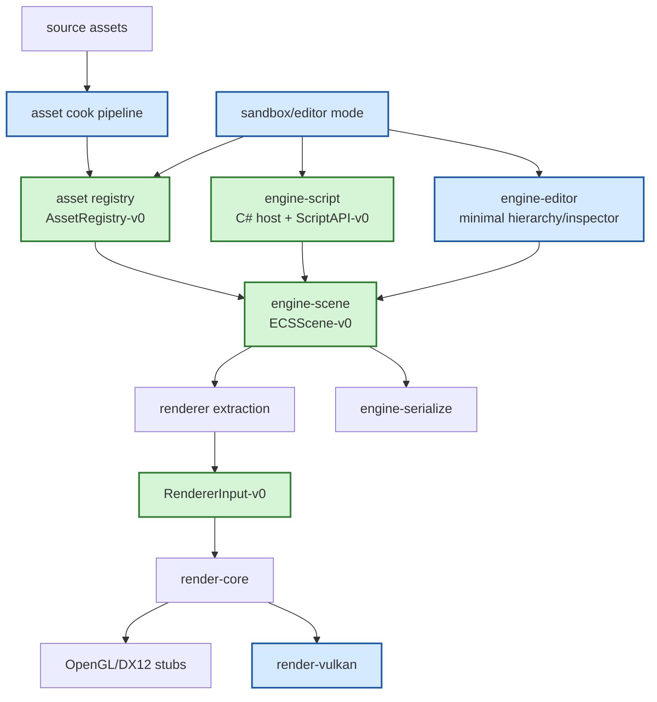

# Gate 5 Code Architecture

## Purpose

This diagram shows the whole engine structure at the end of Gate 5. The engine gains the first authoring layer: cooked assets, a minimal scene editor, and strong-typed C# script components, all consuming the ECS scene model.

## Whole-System Architecture At Gate Exit



## Gate 5 Additions

- Asset source manifest, cook rules, dependency graph, cooked manifest, runtime registry, cache/versioning, and validation commands.
- Minimal editor mode with hierarchy, selection, inspector, entity create/delete, save/load, and small undo/redo.
- C# script hosting facade, script component model, lifecycle callbacks, small engine API, serializable fields, and safe error handling.

## Frozen Contracts

- `AssetRegistry-v0`.
- `ScriptAPI-v0`.
- Editor consumes ECS/asset/script APIs rather than owning them.

## Cross-Cutting Decisions Applied

| Decision | Applied as |
|---|---|
| `FD-001` .NET hosting strategy | `engine-script` exposes a `ScriptHost` trait with two backends: CoreCLR on desktop, NativeAOT on iOS. Android uses CoreCLR for the editor flow and NativeAOT for shipped player builds. |
| `FD-004` Shader toolchain | Shader assets are cooked via shaderc (GLSL -> SPIR-V) with spirv-reflect; failures produce `Diagnostic` records with file/line. Full pipeline detail is split across `FD-037` (source layout), `FD-038` (includes), `FD-039` (per-backend translation), `FD-040` (variants), `FD-041` (bind layout), `FD-042` (cooked artifact + PSO cache). |
| `FD-037` Shader source file layout | Shader cook walks `assets/shaders/**/*.{vert,frag}.glsl`, paired by base name; `engine-renderer`'s built-in shaders are re-exported into `assets/shaders/engine/` via the crate's build step. Entry point is always `main`; the cook rejects deviations with `SH0001 NonMainEntryPoint`. Source bytes are LF-normalized before hashing. |
| `FD-038` Shader include and preprocessor | Cook enables `GL_GOOGLE_include_directive` in `shaderc`; resolver searches the including file's directory then `assets/shaders/common/`. Cooker injects engine defines (`ENGINE_REVERSE_Z`, `ENGINE_VULKAN_NDC`, `ENGINE_MAX_LIGHTS_PER_DRAW=5`) in frozen order and records the recursive include set into `CookedShader-v0.include_hashes`. Cycle detection emits `SH0003 IncludeCycle`. |
| `FD-039` Backend shader translation | Per-platform fan-out at cook time: SPIR-V always; GLSL 450 core via `naga` when `backend-opengl` is enabled; DXIL via `naga` (→ HLSL) + DXC (`hassle-rs`) when `backend-dx12` is enabled. iOS / MoltenVK consumes SPIR-V directly; the cook never emits MSL. Cook fails the shader (not the build) on `naga` unimplemented errors and writes a diagnostic with the unsupported construct. |
| `FD-040` Shader variant / permutation model | Materials declare static `VariantKey` lists (max 64 bits total); cook expands the Cartesian product with `exclude: [VariantMask]` pruning, calls `shaderc` per combination, and writes one `CookedShader-v0` per `(pipeline, variant_key, platform)`. Engine-reserved keys (`SKINNED`, `INSTANCED`, `SHADOW_PASS`, `MAX_LIGHTS_<N>`) are reserved namespace; cook rejects collisions with `SH0006 ReservedVariantKey`. The default `variant_key = 0` is always cooked. |
| `FD-041` Descriptor set / bind layout | Cook runs `spirv-reflect` over each compiled SPIR-V, validates the four-set layout (`set=0..3`) and the engine-reserved push-constant prefix, and computes `param_block_layout_hash = sha256(set_index \|\| binding_index \|\| std140_layout_bytes)` for `set=1, binding=0`. Violations produce diagnostics; the cook does not silently rewrite bindings. |
| `FD-042` CookedShader-v0 and PSO cache | Cook output is one `CookedShader-v0` artifact (wrapped by `CookedAssetHeader`, `asset_kind = CookedShader`) per `(pipeline, variant_key, platform)`. The artifact carries SPIR-V always plus optional GLSL / DXIL per `FD-039`. `cook_inputs_hash = sha256(source_hash \|\| include_hashes \|\| variant_key \|\| engine_defines)` is the equality key Gate 6 hot reload uses to decide whether to re-cook. PSO cache files are runtime-side (not produced by cook). |
| `FD-006` Cooked asset binary format | Every cooked artifact uses the `CookedAssetHeader` + bincode payload format defined in `data-schema-contracts.md`. The cook pipeline writes the header; the loader validates magic, header version, schema version, and content hash before invoking bincode. |
| `FD-011` Editor vs runtime crate split | The minimal editor lives in a separate `engine-editor` crate gated by the `tooling-editor` feature. Runtime crates (`engine-core`, `engine-scene`, `engine-renderer`, `engine-script`) must not compile any editor code without that feature; mobile and release builds drop the editor entirely. |
| `FD-022` Image and texture importer | Texture cook uses `image` for PNG/JPG/BMP/TGA, `ktx2` for KTX2 containers, and `basis-universal` FFI bindings for supercompressed textures. The cook dispatch chooses by extension. |
| `FD-023` 3D model import format | Model cook uses the `gltf` crate; glTF 2.0 is the only v0 source format. The importer emits `engine.renderable` plus `engine.animation.*` components into the cooked scene. |
| `FD-005` Mobile budget reporting timing | Gate 5 is the first gate that must dual-report desktop and mobile simulator numbers in its `04-performance-report.md`. The Gate 5 owner records the exact mobile simulator profile under `OFQ-002`. |
| `FD-009` Schema migration mechanism | `AssetRegistry-v0` and `ScriptAPI-v0` evolve via serde defaults during v0; renaming or removing required fields requires v1 and a re-freeze. |

## Architectural Notes

- Asset, editor, and scripting sessions can run in parallel because ECS scene format is frozen.
- C# cannot access renderer backend internals.
- Editor may use placeholder assets until registry flow is complete, but the gate exits only with registry-backed content.
- The editor crate (`engine-editor`) must not be referenced by `engine-core`, `engine-scene`, `engine-renderer`, or any subsystem crate (per `FD-011`); the sandbox/editor application is the only crate that depends on both runtime and editor.

## Open Design Questions

- Attribute model for C# serialized fields.
- Editor UI toolkit choice (egui vs iced vs custom) — tracked as `OFQ-003` in `foundation-decisions.md`.

Resolved cross-cutting items (do not re-debate at this gate):

- **.NET hosting strategy from Rust** is frozen by `FD-001` (CoreCLR desktop + NativeAOT iOS).
- **Cooked asset format details and cache key versioning** is frozen by `FD-006` (bincode payload + `CookedAssetHeader` carrying `schema_version` and `content_hash`).

## Detailed Design Proposal

### Asset Pipeline Design

`engine-asset` owns the source-to-runtime content lifecycle. Recommended modules:

- `manifest`: source asset entries, import settings, asset IDs.
- `cook`: cook rule dispatch and deterministic output generation.
- `dependency`: dependency graph and reverse lookup.
- `registry`: runtime handle lookup and load state.
- `validate`: missing asset, stale cook, broken dependency diagnostics.
- `types`: mesh, texture, material, shader, scene, script assembly metadata.

The registry returns stable handles; it does not expose raw file paths as primary runtime identity.

### Minimal Editor Design

The editor is a consumer of ECS, serialization, and asset registry APIs. Required modules:

- `editor_state`: selected entity, active scene, dirty flag.
- `hierarchy`: entity list/tree.
- `inspector`: component field editors for core components.
- `commands`: create/delete/edit/save/load operations and undo/redo history.
- `diagnostics`: scene/asset/script error display.

Every editor mutation should become a command. This is the seed for undo/redo and future collaborative validation.

### C# Scripting Design

`engine-script` owns managed runtime integration and script component execution. Initial modules:

- `host`: `ScriptHost` trait with two backends per `FD-001` — `CoreClrHost` (desktop) and `NativeAotHost` (iOS / mobile shipping). The build target selects the backend via `target-*` features.
- `assembly`: assembly load and type discovery (CoreCLR only; NativeAOT bundles assemblies at link time).
- `api`: Rust-to-C# engine API facade.
- `component`: script component storage and instance handles.
- `fields`: serializable field metadata and value conversion.
- `lifecycle`: callback scheduling and exception handling.

Scripts should receive facade types such as `Entity`, `Transform`, `World`, `Time`, `Input`, and `AssetRef`. They do not receive ECS internals or renderer objects.

### Cross-System Data Flow

```text
source assets -> cook -> asset registry -> ECS scene references
editor edits -> ECS commands -> scene serialization
C# assembly -> script host -> script components -> ECS systems
ECS scene -> renderer extraction -> renderer
```

### Implementation Order

1. Asset manifest and registry skeleton.
2. Cook/validate for scene's required mesh/material/texture/shader assets.
3. Minimal editor hierarchy and inspector.
4. C# host facade and sample script assembly.
5. Script component serialization.
6. Combined sandbox/editor validation.

### Design Risks

- Asset, editor, and scripting all want to define references; registry must be the single source of truth.
- C# hosting can become too broad; keep API intentionally small.
- Editor command model must be added before tools proliferate.
