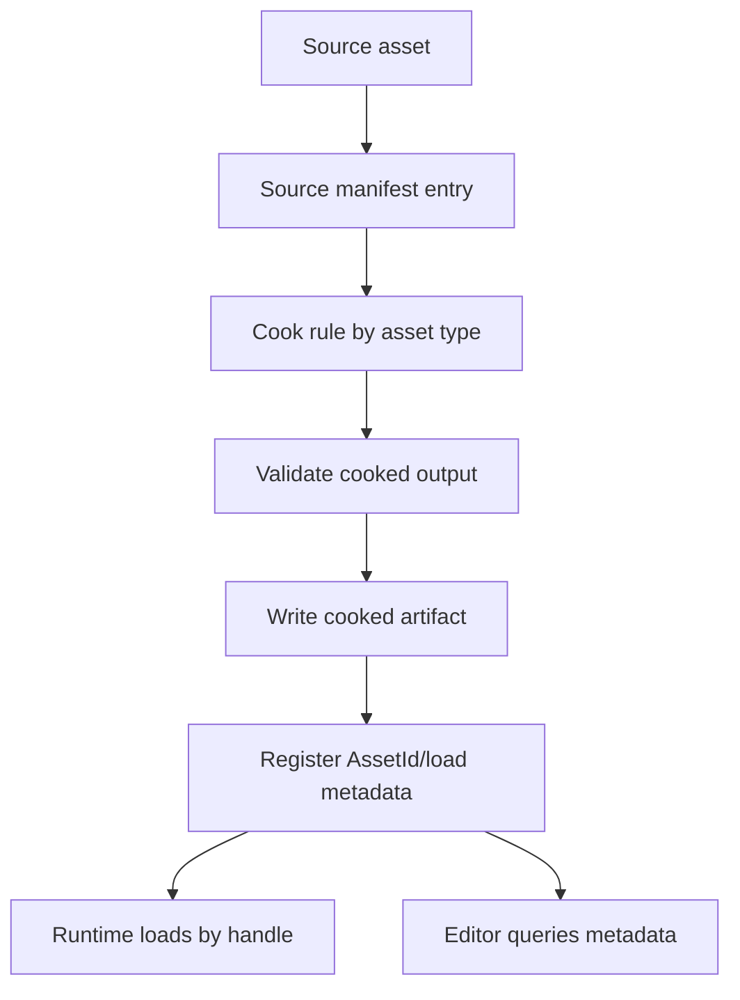
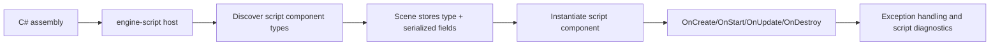

# Gate 5 Common Implementations And Best Practices

## Research Scope

Gate 5 introduces asset cooking, runtime registry loading, minimal editor workflow, and C# scripting foundation.

## Mainstream Implementations

1. Asset database and registry
   - Unity, Unreal, and Bevy use stable asset identity, dependency tracking, and imported/cooked artifacts.
2. Cooked asset pipeline
   - Source formats are converted into runtime-friendly data before loading.
3. Minimal editor first
   - Hierarchy, inspector, save/load, diagnostics, and small undo/redo come before advanced gizmos.
4. Strong-typed component scripting
   - C# component scripting is a proven gameplay workflow, but engine API exposure must be narrow.

## Recommended Direction

- Build `AssetRegistry-v0` before asset assignment, hot reload, or hot update.
- Keep the first editor minimal and ECS-focused.
- Use C# as the primary strong-typed scripting language.
- Require explicit metadata/attributes for serialized script fields.

## Best Practices

- Use stable asset IDs or canonical paths.
- Track dependencies from scenes to materials/textures/meshes/shaders/scripts.
- Keep cooked outputs deterministic where practical.
- Report script exceptions without crashing the engine.
- Keep editor operations command-based for undo/redo.

## Anti-Patterns

- Runtime loading arbitrary source assets after cook pipeline exists.
- Editor mutating backend resources directly.
- C# scripts accessing renderer backend internals.
- Serializing arbitrary managed object graphs into scenes.

## Fetched Reference Summaries

- Unity AssetDatabase: Unity's AssetDatabase manages asset discovery, import, load, refresh, and editor-facing lookup. This supports building a registry that maps source files to cooked artifacts and exposes safe editor queries.
- Unity script serialization: The page did not fetch cleanly in the batch, but Unity's model is relevant for editor-visible serialized fields and restrictions on what should be persisted.
- Unreal Asset Registry: Unreal separates searchable asset metadata from loaded runtime objects and supports filtering/metadata queries. This supports keeping asset metadata queryable without loading every asset.
- Bevy Asset system: Bevy uses handles, loaders, and asset events. This supports stable asset handles and decoupling runtime users from raw file/import state.
- glTF, KTX, and Basis Universal: glTF is a scene/mesh/material interchange format; KTX/KTX2 is a GPU texture container; Basis Universal provides transcodable compressed texture data. Together they guide the source-to-cooked asset boundary.
- .NET hosting and Mono embedding: Native hosting requires explicit runtime startup, assembly loading, method invocation, lifetime management, and careful managed/native boundary design. This supports isolating C# behind `engine-script` instead of exposing engine internals.

## Design Reference Notes

### Asset Registry Shape

Unity, Unreal, and Bevy references all point toward the same separation: source files, imported/cooked artifacts, metadata, and loaded runtime objects are different layers. Gate 5 should not use source files directly as runtime resources once the cook pipeline exists.

Minimum registry concepts:

- `AssetId` or canonical asset path.
- Source asset metadata.
- Cooked artifact path and cook-rule version.
- Dependency list and reverse dependency lookup.
- Load state: unloaded, loading, ready, failed.
- Asset type registry for mesh, texture, material, shader, scene, script assembly.

### Cook Pipeline

glTF/KTX/Basis references suggest using standard source/intermediate formats but cooking into engine-owned runtime data. The engine should treat glTF as an import format, not necessarily as the runtime scene format. KTX/Basis style texture workflows imply that texture metadata, mip levels, compression formats, and platform transcode decisions should be explicit.

### Editor Foundation

The minimal editor should be a consumer of ECS and asset registry APIs. It should not define asset identity, scene schema, or renderer backend state. Its first value is safe mutation: inspect, edit, create/delete, save/load, and undo/redo.

### C# Hosting

.NET hosting and Mono embedding references show that managed runtime embedding is a subsystem with its own lifetime. Gate 5 should hide runtime startup, assembly loading, method invocation, and exception translation behind `engine-script`. C# should see an engine API facade, not Rust ECS internals or graphics backends.

### Design Checklist For Implementation

- Can the same asset be referenced by scene, material, editor, and script without duplicate lookup logic?
- Does asset validation explain dependency chains?
- Can C# script field serialization survive scene save/load?
- Are script exceptions converted into diagnostics instead of panics?
- Can editor operations be represented as commands for undo/redo?

## Implementation Flowcharts

### Asset Cook And Registry Flow

### C# Script Component Flow

## References To Review

- Unity AssetDatabase: https://docs.unity3d.com/ScriptReference/AssetDatabase.html
- Unity serialization: https://docs.unity3d.com/Manual/script-Serialization.html
- Unreal Asset Registry: https://dev.epicgames.com/documentation/en-us/unreal-engine/asset-registry-in-unreal-engine
- Bevy Asset system: https://github.com/bevyengine/bevy/tree/main/crates/bevy_asset
- glTF 2.0 specification: https://registry.khronos.org/glTF/specs/2.0/glTF-2.0.html
- KTX/KTX2 specification: https://github.khronos.org/KTX-Specification/
- Basis Universal: https://github.com/BinomialLLC/basis_universal
- .NET native hosting: https://learn.microsoft.com/en-us/dotnet/core/tutorials/netcore-hosting
- Mono embedding: https://www.mono-project.com/docs/advanced/embedding/
