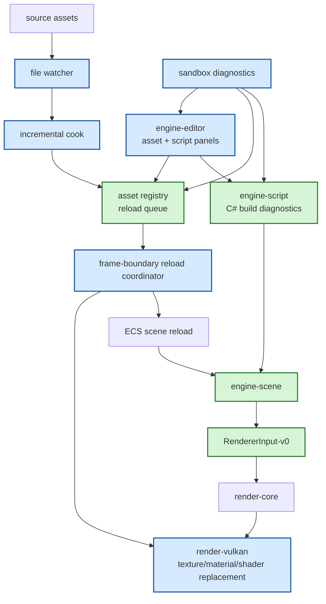

# Gate 6 Code Architecture

## Purpose

This diagram shows the whole engine structure at the end of Gate 6. The engine now supports a fast development loop: watched source assets recook incrementally, registry reload requests are applied at frame boundaries, and the editor can assign assets and scripts.

## Whole-System Architecture At Gate Exit



## Gate 6 Additions

- File watching and incremental recook.
- Reload queue and frame-boundary reload coordinator.
- Vulkan texture/material/shader replacement path.
- Editor asset assignment, script component inspector, C# build command integration, and diagnostics.
- Sandbox diagnostics for assets, reloads, scripts, draw calls, culling, and scene validation.

## Frozen Contracts

- `AssetRegistry-v0` and `ScriptAPI-v0` are consumed, not changed.
- Reload happens at safe frame boundaries.

## Cross-Cutting Decisions Applied

| Decision | Applied as |
|---|---|
| `FD-001` .NET hosting strategy | C# assembly hot reload is **desktop-only**, gated by the CoreCLR backend (mobile/iOS uses NativeAOT and cannot reload assemblies at runtime). On mobile the iteration loop reloads asset content only; script changes require a new build/cook cycle. |
| `FD-002` Engine threading model | The reload coordinator runs on the main thread; it consumes events from the file watcher running on the IO pool and from the C# build process running off-thread. GPU resource swaps execute on the render thread at frame boundaries. |
| `FD-008` IO and async runtime model | File watcher and incremental cook are dispatched on the std::thread IO pool; no `tokio` task spawn. Cross-thread events use std channels (or `crossbeam-channel`). |
| `FD-019` File watcher | Source asset and script file watching uses the `notify` crate; watcher events are debounced on the IO pool thread before being forwarded to the main-thread reload coordinator. |
| `FD-038` Shader include and preprocessor | Reload coordinator maintains a **reverse-dependency index** from header file path → set of consumer pipelines, built by inverting every `CookedShader-v0.include_hashes` at registry load. A `notify` event under `assets/shaders/common/**` triggers re-cook of exactly the affected pipelines (no global shader rebuild). |
| `FD-042` CookedShader-v0 and PSO cache | Shader / pipeline reload is **frame-boundary atomic**: the new `CookedShader-v0` is cooked, the new `vk::Pipeline` is built and seeded from the persisted PSO cache, then both the `vk::ShaderModule` and `vk::Pipeline` are swapped between frames. The previous pipeline is kept alive until in-flight frames complete (per `FD-002`). Equality on `cook_inputs_hash` short-circuits the re-cook — unchanged content does not trigger swaps. PSO cache files are touched only at shutdown and on a 60-second debounce timer; hot reload does not invalidate them. |

## Architectural Notes

- Failed reloads preserve last valid assets.
- Editor diagnostics and hot reload share registry state but should not duplicate registry logic.
- Reload paths are Vulkan-complete first; OpenGL/DX12 remain compatible stubs.
- Asset reload works on every platform; script assembly reload works only when the CoreCLR `ScriptHost` backend is selected (per `FD-001`).

## Open Design Questions

- Unsaved editor scene conflict policy during scene reload.
- File watcher debounce window default value (Gate 6 owner picks).

Resolved cross-cutting items (do not re-debate at this gate):

- **File watcher implementation** is frozen by `FD-019` (`notify` crate).
- **Threading model for reload** is frozen by `FD-002`.
- **Pipeline recreation strategy on shader reload** is frozen by `FD-042` (frame-boundary atomic swap; previous pipeline kept until in-flight frames complete; PSO cache persists across reloads).
- **Shader include-dependency tracking for hot reload** is frozen by `FD-038` (reverse-dependency index over `CookedShader-v0.include_hashes`).

## Detailed Design Proposal

### Hot Reload Modules

Gate 6 should extend existing systems rather than create a parallel reload system. Suggested modules:

- `asset::watch`: `notify`-based file watcher (per `FD-019`) running on the IO pool; events are debounced and forwarded into the main-thread reload coordinator via a std channel.
- `asset::recook`: incremental cook requests and reverse dependency selection.
- `asset::reload`: reload queue and state transitions.
- `asset::diagnostics`: visible status for editor/sandbox.
- `render-vulkan::reload`: GPU resource replacement and delayed destruction.
- `engine-core::scene_reload`: validated scene replacement policy.

### Reload State Machine

Each reload request should have a state:

```text
Detected -> Recooking -> Cooked -> Queued -> Applying -> Applied
                         \-> Failed -> KeepLastValid
```

The state machine should be queryable by editor and sandbox diagnostics.

### GPU Resource Replacement

Texture/material/shader reload can affect renderer state. Replacement rules:

- new resource is created and validated before old resource is released;
- old resource is kept alive until in-flight frames finish;
- shader reload invalidates dependent pipelines; the reverse-dependency index built from `CookedShader-v0.include_hashes` (per `FD-038`) selects exactly the pipelines that need rebuilding when a `assets/shaders/common/**` header changes;
- pipeline replacement occurs at frame boundary; the new `vk::Pipeline` is seeded from the persisted PSO cache (per `FD-042`) so warm-up is near-instant on repeat reloads;
- compile failure keeps the old shader/pipeline active; a diagnostic with the failing `CookedShader-v0.cook_inputs_hash` and the underlying `shaderc` / `naga` error is surfaced through editor diagnostics.

### Scene Reload Policy

Scene reload should not silently destroy unsaved editor changes. Policy options:

- disable auto scene reload when editor scene is dirty;
- prompt before replacing;
- keep manual reload only for scenes.

Gate 6 must choose one and document it.

### Implementation Order

1. Explicit manual reload command.
2. File watcher and debounce.
3. Incremental recook.
4. Registry reload state machine.
5. Texture/material reload.
6. Shader/pipeline reload.
7. Scene reload policy.
8. Editor/sandbox diagnostics.

### Design Risks

- Resource lifetime bugs here can corrupt later renderer and editor work.
- Auto scene reload can conflict with editor dirty state.
- Hot reload should not change `AssetRegistry-v0`; it should consume it.
