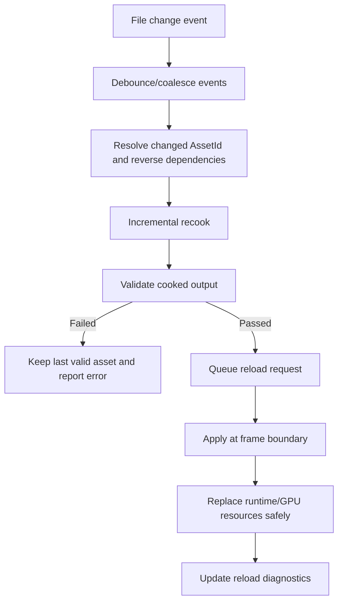
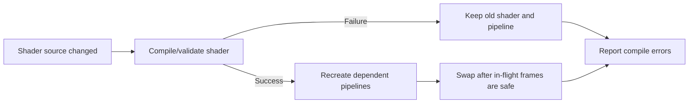

# Gate 6 Common Implementations And Best Practices

## Research Scope

Gate 6 covers hot reload, incremental recook, runtime resource replacement, editor diagnostics, and script build diagnostics.

## Mainstream Implementations

1. File watcher plus debounced import
   - Editors commonly watch source directories and batch noisy save events.
2. Dependency-driven incremental cook
   - Changed source assets recook themselves and reverse dependencies.
3. Frame-boundary reload queue
   - Runtime applies resource changes only at safe frame boundaries.
4. Last-known-good fallback
   - Broken shaders/materials/scenes keep the previous valid runtime resource active.

## Recommended Direction

- Use file watching for development mode and explicit reload commands for deterministic testing.
- Reuse the Gate 5 dependency graph.
- Apply reloads at frame boundaries.
- Make Vulkan replacement complete first; keep OpenGL/DX12 as compatible stubs.

## Best Practices

- Keep old GPU resources alive until in-flight frames finish.
- Show asset path, dependency chain, status, and error details in diagnostics.
- Separate watch, recook, registry update, and runtime replacement stages.
- Make auto-reload disableable.
- Stress test repeated reloads.

## Anti-Patterns

- Replacing descriptor-bound resources mid-frame.
- Destroying the last valid resource after a failed reload.
- Maintaining separate editor/runtime reload state.
- Recooking the whole project for every file change.

## Fetched Reference Summaries

- notify: The notify crate provides cross-platform file system events, but platform behavior differs. The engine should debounce and normalize events instead of assuming one save equals one event.
- Bevy asset hot reload: Bevy's asset system is a useful reference for stable handles and asset change events. Reload should update assets through registry events rather than direct caller-specific reload code.
- Unity AssetDatabase refresh: Unity separates scanning, importing, dependency tracking, and refreshing. This supports dividing our workflow into watch, recook, registry update, and runtime replacement stages.
- Unreal Live Coding: Unreal's live coding docs highlight object layout and reinstancing constraints. For this engine, script/code reload must define what can be safely replaced and what requires restart.
- Vulkan synchronization guide: Hot-reloaded GPU resources still require correct synchronization, barriers, image layouts, and deferred destruction to avoid use-after-free or layout hazards.
- shaderc and naga: per `FD-004` shader cook uses `shaderc` (GLSL → SPIR-V) and `spirv-reflect` (reflection / validation); per `FD-039` `naga` is used **only** at cook time to translate SPIR-V → GLSL (for `backend-opengl`) and SPIR-V → HLSL (for `backend-dx12`, then DXC compiles HLSL → DXIL). `naga` is **not** the reflection or validation source. Both compilers participate in shader recook diagnostics but in distinct stages.

## Design Reference Notes

### Hot Reload Pipeline

The fetched references imply that hot reload should be a staged pipeline, not a direct file-change callback that mutates runtime objects. The recommended path is:

1. Watch source/cooked paths.
2. Debounce and normalize file events.
3. Determine affected asset IDs through dependency graph.
4. Recook changed assets and reverse dependencies.
5. Validate cooked output.
6. Queue runtime reload request.
7. Apply at frame boundary.
8. Keep previous resource active on failure.

### GPU Resource Safety

Vulkan synchronization references make this gate particularly sensitive. Texture/shader/material reload must not destroy resources referenced by in-flight command buffers. Use delayed destruction and frame fences. Shader reload may require pipeline recreation and descriptor rebinding; failures should leave the old pipeline alive.

### Scene Reload And Editor State

Unity/Unreal reload references show that runtime state replacement needs clear ownership. If an editor scene has unsaved changes, auto scene reload should either pause, prompt, or apply a documented policy. Silent overwrite is unacceptable.

### Script And Build Diagnostics

Unreal live coding shows that runtime code reload has constraints around object layout and existing instances. Gate 6 should not attempt arbitrary C# hot reload yet unless object layout and instance reinstancing are clearly designed. Manual rebuild with diagnostics is acceptable.

### Design Checklist For Implementation

- Are watch, cook, validate, queue, and apply stages separate?
- Does every reloadable resource have a last-known-good fallback?
- Can reload status be observed by sandbox and editor from the same source of truth?
- Are GPU resource replacements deferred until safe?
- Is auto-reload disableable for deterministic debugging?

## Implementation Flowcharts

### Hot Reload Pipeline

### Shader Reload Failure Flow

## References To Review

- notify crate: https://github.com/notify-rs/notify
- Bevy Asset hot reload implementation area: https://github.com/bevyengine/bevy/tree/main/crates/bevy_asset
- Unity AssetDatabase refresh: https://docs.unity3d.com/Manual/AssetDatabaseRefreshing.html
- Unreal Live Coding: https://dev.epicgames.com/documentation/en-us/unreal-engine/using-live-coding-to-recompile-unreal-engine-applications-at-runtime
- Vulkan synchronization guidance: https://github.com/KhronosGroup/Vulkan-Guide/blob/main/chapters/synchronization.adoc
- shaderc: https://github.com/google/shaderc
- naga: https://github.com/gfx-rs/wgpu/tree/trunk/naga
