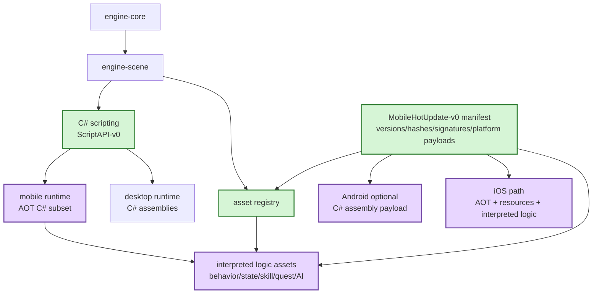

# Gate 7 Code Architecture

## Purpose

This diagram shows the whole engine structure at the end of Gate 7. The desktop scripting and asset systems remain in place, while mobile constraints introduce an AOT-safe split between C# gameplay code and interpreted hot-updatable logic assets.

## Whole-System Architecture At Gate Exit

## Gate 7 Additions

- Mobile runtime strategy for Android and iOS.
- Mobile-safe C# API subset.
- Interpreted logic asset model.
- `MobileHotUpdate-v0` manifest schema.

## Frozen Contracts

- Hot update manifest fields.
- Engine/script API compatibility versioning.
- Android optional assembly update is platform-specific.
- iOS relies on AOT C# plus resources and interpreted logic assets.

## Cross-Cutting Decisions Applied

| Decision | Applied as |
|---|---|
| `FD-001` .NET hosting strategy | Mobile script API subset is concretely the **NativeAOT-compilable** subset of `ScriptAPI-v0`: no `Type.MakeGenericType`, no runtime `Reflection.Emit`, no dynamic assembly load. The AOT trim profile per platform is tracked as `OFQ-004` and will be promoted to an `FD` when Gate 7 implementation pins it. |
| `FD-013` Platform layer scope | Gate 7 introduces the `PlatformAdapter` trait under the `platform` crate. Initial implementations: desktop (winit), Android (winit + GameActivity hooks), iOS (UIKit bridge). The trait surfaces suspend/resume, IME, safe-area insets, low-memory warnings, and touch event normalization. |
| `FD-020` Networking scope | Mobile hot update transport remains an open question for any future networking gate; this gate covers only the on-device manifest validation and the staged payload layout, not the download mechanism. |

## Architectural Notes

- C# remains the strong-typed primary gameplay language.
- Mobile hot update does not depend solely on downloaded C# DLLs.
- Package installer implementation waits until Gate 8.
- `PlatformAdapter` is the single mobile-lifecycle entry point; gameplay/UI/audio subsystems consume it instead of touching winit/UIKit/GameActivity directly (per `FD-013`).

## Open Design Questions

- Which interpreted logic asset type lands first.
- How mobile script API subset is tested on desktop.
- Store policy constraints for Android assembly updates.

## Detailed Design Proposal

### Mobile Runtime Profiles

Gate 7 should define platform profiles consumed by later packaging and update gates:

- `DesktopProfile`: full C# assembly loading during development.
- `AndroidProfile`: AOT/JIT capability flags, optional assembly payload policy, asset/logic update support.
- `IosProfile`: AOT-only C# gameplay, no downloaded executable code, resource and interpreted logic updates only.

Profiles should be queryable by tooling and update validation, not hardcoded in random platform checks.

### Mobile Script API Subset

The mobile-safe script API is the NativeAOT-compilable subset of `ScriptAPI-v0` (per `FD-001`), with explicit compatibility versioning. It avoids any feature that NativeAOT cannot trim or pre-link: no `Reflection.Emit`, no `Type.MakeGenericType` over open generics, no `Assembly.LoadFrom` of downloaded DLLs. C# gameplay remains strong-typed, but hot-updatable behavior on iOS uses interpreted logic assets. The subset is expressed as a `script_api_version_range` constraint on the `MobileHotUpdate-v0` manifest, not as a new `-v0` contract.

### Interpreted Logic Asset Model

The first interpreted logic asset type should be small enough to validate:

- behavior/state graph ID;
- node/state list;
- typed parameters;
- transition rules;
- asset references;
- schema version.

This data is hot-updatable and can be executed by a deterministic runtime. It should not become a general-purpose weakly typed scripting language.

### Manifest Contract

`MobileHotUpdate-v0` should include engine version, script API version, content schema version, platform payload entries, payload hashes/signatures, dependency lists, and rollback metadata.

### Implementation Order

1. Define platform profiles.
2. Define mobile-safe script API subset.
3. Define first interpreted logic asset schema.
4. Define update manifest schema.
5. Add desktop simulator for iOS-safe mode.
6. Add compatibility validation tests.

### Design Risks

- If shared gameplay depends on Android assembly updates, iOS support breaks.
- If interpreted logic is too broad, it becomes an unmanageable second scripting language.
- If compatibility fields are incomplete, Gate 8 cannot safely reject bad packages.
