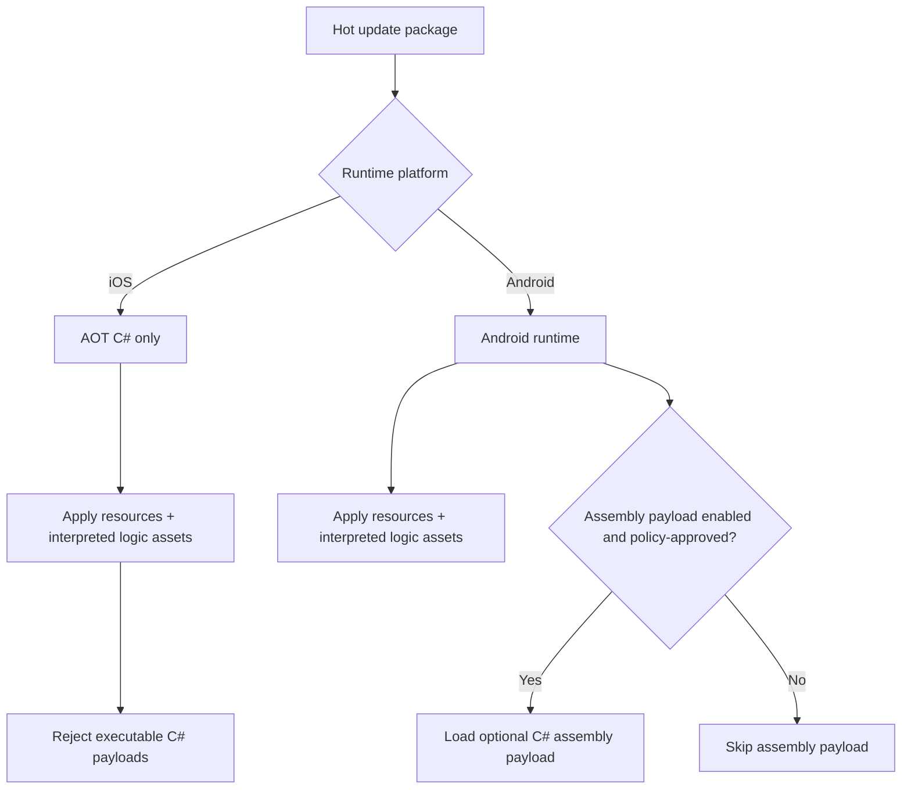
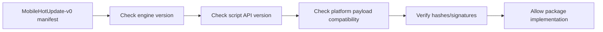

# Gate 7 Common Implementations And Best Practices

## Research Scope

Gate 7 defines mobile runtime constraints and hot update contracts. The central issue is that Android and iOS have different rules for dynamic code, JIT, and downloaded executable payloads.

## Mainstream Implementations

1. AOT static code plus data updates
   - Common mobile-safe strategy: code ships in the app, resources/config/data update later.
2. Android optional dynamic assembly/plugin update
   - Android can be more flexible than iOS, but store policy and runtime behavior still matter.
3. iOS AOT-safe interpreted logic
   - iOS generally requires avoiding downloaded executable code; behavior graphs, state machines, DSLs, and data-driven logic are safer.
4. Versioned manifest with signatures
   - Mobile update systems usually include engine version, API version, payload hashes, signatures, and rollback metadata.

## Recommended Direction

- Keep C# as the strong-typed main scripting language.
- Use iOS AOT C# plus interpreted logic assets for hot update.
- Allow Android optional C# assembly payloads only as a platform-specific extension.
- Freeze a cross-platform hot update manifest before implementing installers.

## Best Practices

- Separate resource updates from executable-code updates.
- Include engine version and script API version in every package.
- Sign update manifests and payloads.
- Keep interpreted logic deterministic and inspectable.
- Ensure Android-only features cannot become universal assumptions.

## Anti-Patterns

- Designing mobile hot update around iOS downloading new C# DLLs.
- Shipping unverified payloads.
- Treating Android and iOS as the same runtime policy environment.
- Letting interpreted logic become an untyped replacement for all C# gameplay code.

## Fetched Reference Summaries

- Apple App Store guidelines and developer terms: Apple policy constrains executable-code download and behavior changes that bypass review. The engine's iOS hot update path should stay in resources/config/interpreted logic rather than downloaded C# assemblies.
- .NET Native AOT: Native AOT has constraints around dynamic code generation, reflection, trimming, and runtime loading. Mobile scripting APIs must be designed around a stable AOT-compatible subset.
- .NET iOS deployment: iOS builds require signing, provisioning, and platform-specific packaging. Update architecture must preserve these requirements and avoid runtime executable payload assumptions.
- Android App Bundle: Android App Bundles separate compiled code/resources for store-managed delivery. Engine-managed updates should distinguish app-store module delivery from in-game downloadable content.
- Unity Addressables: The page did not fetch in this batch, but Addressables is a common model for remote asset catalogs and dependency-managed downloadable content.
- HybridCLR: HybridCLR demonstrates C# hot update in the Unity ecosystem. It is useful as an Android/flexible-platform reference, but the engine must still enforce platform policy and rollback constraints.

## Design Reference Notes

### Mobile Policy Split

The Apple references are not just implementation details; they are architecture constraints. The engine must assume iOS cannot use downloaded executable gameplay code as the primary hot update mechanism. Android can be more flexible, but the cross-platform design cannot depend on Android-only behavior.

Cross-platform hot update layers should be:

- Resources: textures, meshes, materials, scenes, UI layouts, audio, data tables.
- Interpreted logic assets: behavior graphs, state machines, skill graphs, quest/dialogue DSL, AI behavior trees.
- Static C# gameplay assemblies: shipped with app, AOT-compatible on iOS.
- Optional Android assembly payload: separate platform extension, never required by shared logic.

### AOT And C# API

.NET Native AOT references imply that reflection-heavy and dynamic-code patterns need explicit treatment. The mobile script API should avoid requiring runtime code generation, arbitrary reflection, or dynamic assembly loading on all platforms. The API version must be frozen enough for hot update package compatibility checks.

### Manifest Contracts

The manifest should not merely list files. It should define compatibility and safety:

- Engine version.
- Script API version.
- Content schema version.
- Platform payloads.
- Logic asset schema versions.
- Hashes/signatures.
- Rollback metadata.

### Design Checklist For Implementation

- Can the iOS path run without downloaded executable code?
- Can Android assembly updates be disabled completely?
- Can every package check engine/script/content compatibility before install?
- Is interpreted logic expressive enough for hot-updatable gameplay data without replacing C# entirely?

## Implementation Flowcharts

### Mobile Hot Update Decision Flow

### Manifest Compatibility Flow

## References To Review

- Apple App Store Review Guidelines: https://developer.apple.com/app-store/review/guidelines/
- Apple Developer Program License Agreement: https://developer.apple.com/support/terms/
- .NET Native AOT overview: https://learn.microsoft.com/en-us/dotnet/core/deploying/native-aot/
- .NET iOS/tvOS/Mac Catalyst deployment notes: https://learn.microsoft.com/en-us/dotnet/maui/ios/deployment/
- Android App Bundle documentation: https://developer.android.com/guide/app-bundle
- Unity Addressables, useful resource update reference: https://docs.unity3d.com/Packages/com.unity.addressables@latest
- HybridCLR, C# hot update reference for Unity ecosystem: https://github.com/focus-creative-games/hybridclr
