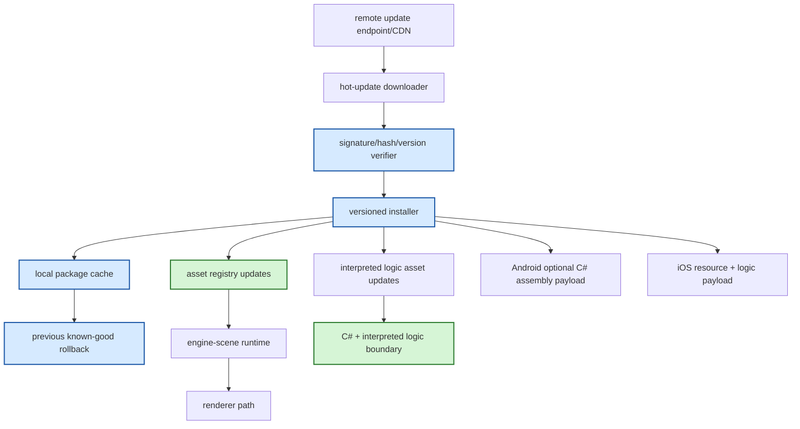

# Gate 8 Code Architecture

## Purpose

This diagram shows the whole engine structure at the end of Gate 8. The mobile/hot-update contracts from Gate 7 now have a concrete package system that can download, verify, install, update resources/logic, and roll back safely.

## Whole-System Architecture At Gate Exit



## Gate 8 Additions

- Package download and verification.
- Signature/hash compatibility rejection.
- Versioned local install and rollback.
- Resource and interpreted logic updates.
- Android-only optional assembly payload path.

## Frozen Contracts

- `MobileHotUpdate-v0` is consumed, not changed.
- `PackageInstallState-v0` state machine and previous-known-good pointer rules.
- Package install is atomic.
- iOS update path remains AOT-safe.

## Cross-Cutting Decisions Applied

| Decision | Applied as |
|---|---|
| `FD-002` Engine threading model | Download, verify, and stage steps run on the IO pool. The atomic activation pointer switch runs on the main thread at a frame boundary; the renderer/audio threads are never touched directly. |
| `FD-006` Cooked asset binary format | The verifier validates the `CookedAssetHeader` (magic, header version, schema version, content hash) of every payload entry before activation, in addition to the manifest's payload-level hash. |
| `FD-008` IO and async runtime model | The HTTP downloader is a **blocking** client (recommended: `ureq`); concurrent downloads come from spawning multiple jobs on the IO pool (`std::thread`), not from `tokio` tasks. No async runtime appears in `engine-hot-update`'s `Cargo.toml`. |
| `FD-020` Networking scope | Transport is on-device HTTP only (per `FD-020` networking is out of scope). The download endpoint is configured at app startup and is not part of a generic networking layer. |

## Architectural Notes

- Package installer does not own asset format; it delivers assets to the registry.
- Android assembly payload is isolated from the cross-platform update path.
- Rollback is part of the architecture, not an afterthought.
- All cross-thread communication uses std channels or `crossbeam-channel`; no async runtime is allowed (per `FD-008`).

## Open Design Questions

- Signature algorithm and key rotation model.
- Local package cache layout.
- Partial download recovery behavior.

## Detailed Design Proposal

### Hot Update Modules

`engine-hot-update` should separate trust, storage, and application concerns:

- `manifest`: parse `MobileHotUpdate-v0`.
- `verify`: signature, hash, version, and platform compatibility checks.
- `download`: remote/local payload retrieval into staging using a blocking HTTP client (per `FD-008`; recommended crate: `ureq`).
- `cache`: versioned local package storage.
- `install`: atomic activation of a staged package.
- `rollback`: previous known-good restoration.
- `apply`: bridge to asset registry and interpreted logic runtime.
- `android_assembly`: optional Android-only C# payload adapter.

### Package State Machine

Use explicit state to survive interruption:

```text
Discovered -> Downloading -> Downloaded -> Verified -> Staged -> Active
                                      \-> Rejected
Active -> FailedBoot -> RolledBack
```

State should be persisted enough that a crash during install can recover to the previous known-good package or resume safely.

### Verification Rules

Before activation, the installer verifies:

- manifest signature;
- payload hashes (manifest-level);
- `CookedAssetHeader` magic, header version, schema version, and content hash on every cooked payload (per `FD-006`);
- compatible engine version;
- compatible script API version;
- compatible content schema version;
- platform payload rules;
- iOS executable-payload exclusion.

### Atomic Activation

Activation should be a metadata switch from old active package to new active package. Avoid overwriting active files in place. The old package remains available until the new package is confirmed healthy.

### Implementation Order

1. Local package manifest parser.
2. Verification pipeline using local test payloads.
3. Versioned cache layout.
4. Atomic activation pointer.
5. Rollback flow.
6. Asset registry and interpreted logic apply hooks.
7. Optional Android assembly adapter.

### Design Risks

- Partial downloads can corrupt active content if staging and activation are not separated.
- Rollback is impossible if previous package metadata is discarded.
- Platform-specific payload mistakes can violate iOS policy or Android assumptions.

