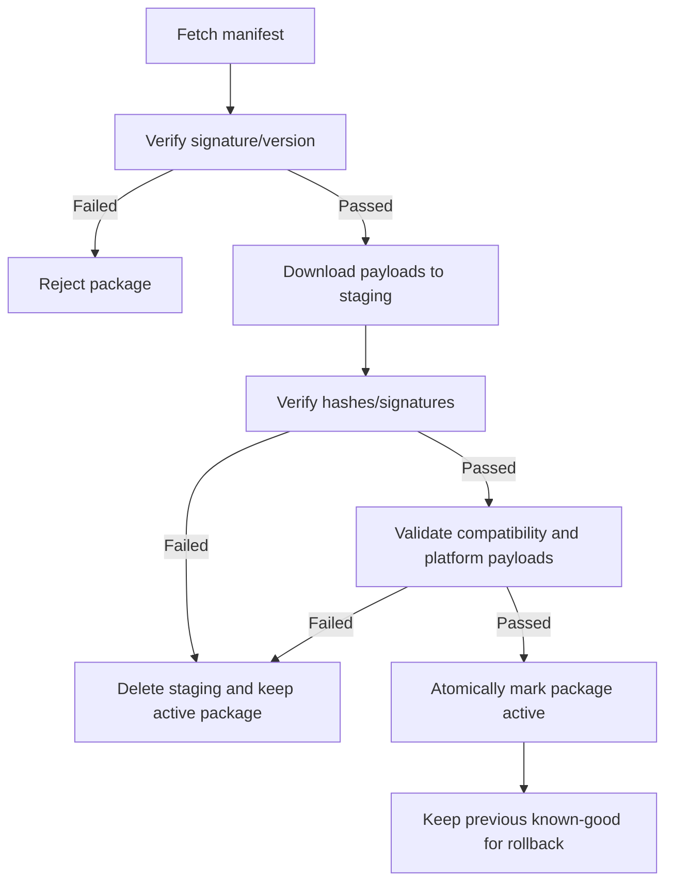
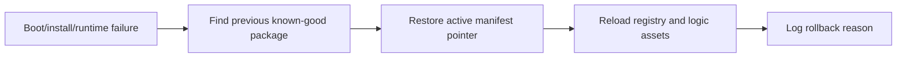

# Gate 8 Common Implementations And Best Practices

## Research Scope

Gate 8 implements hot update package download, verification, install, rollback, and platform payload handling.

## Mainstream Implementations

1. Manifest-driven patching
   - A manifest lists payloads, versions, hashes, signatures, and compatibility requirements.
2. Content-addressed payload cache
   - Payloads are stored by hash/version so rollback and deduplication are straightforward.
3. Atomic install with previous-known-good rollback
   - New package is staged, verified, then activated; previous package remains recoverable.
4. Platform-specific payload filtering
   - Installer selects payloads for current OS/architecture/API compatibility.

## Recommended Direction

- Use signed manifests and hash-verified payloads.
- Stage packages before activation.
- Keep previous known-good package until the new package boots successfully.
- Treat Android C# assembly payload as optional and isolated.

## Best Practices

- Verify before install, not after runtime use.
- Make install idempotent and recoverable after interruption.
- Store compatibility metadata in the manifest.
- Log every install/rollback decision.
- Never let corrupt payloads update the active registry.

## Anti-Patterns

- Overwriting active files directly during download.
- Allowing partial packages to become active.
- Mixing iOS and Android code payload assumptions.
- Trusting CDN metadata without local signature/hash verification.

## Fetched Reference Summaries

- TUF: TUF focuses on signed metadata, versioning, expiry, rollback protection, and resilience to key compromise. The engine should separate trusted manifest metadata from payload download and verify both before activation.
- Uptane: Uptane extends secure update ideas for distributed systems with stronger compromise assumptions. Useful patterns include metadata role separation, repository trust boundaries, and freeze/rollback attack prevention.
- Android app signing: Android's app signing flow reinforces that platform signing guarantees must not be weakened by custom update packages. Engine update signatures should be additional verification, not a replacement.
- Apple code signing: Apple code signing validates code identity and integrity. This supports avoiding unsigned executable hot updates on iOS.
- Unity remote content distribution: The page returned 404, but the relevant Addressables pattern is remote catalogs plus content bundles with versioned hashes and rollback-aware deployment.
- SteamPipe: SteamPipe organizes builds into depots and branches. It is useful for deterministic content layout, build manifests, staged release branches, and desktop patch distribution.

## Design Reference Notes

### Secure Update Flow

TUF and Uptane references emphasize that update systems fail through trust and rollback mistakes, not just download errors. Gate 8 should treat metadata verification as a first-class runtime system. The installer should never activate a package until all manifests, signatures, hashes, platform rules, and compatibility checks pass.

Recommended package activation path:

1. Download manifest.
2. Verify manifest signature and version.
3. Check engine/script/content compatibility.
4. Download payloads to staging cache.
5. Verify hashes/signatures for payloads.
6. Validate package contents.
7. Atomically mark new package active.
8. Keep previous known-good package for rollback.

### Platform Payloads

SteamPipe, Android signing, and Apple signing references show that platform packaging has its own trust mechanisms. The engine package system should complement platform signing, not bypass it. Android C# assembly payloads should be explicitly labeled Android-only; iOS payloads should be resources and interpreted logic only.

### Rollback And Recovery

Rollback should work after failed verification, failed install, failed boot, and partial download. If package installation can be interrupted, the cache layout must distinguish staged, active, and previous-known-good packages.

### Design Checklist For Implementation

- Can the installer reject corrupted data before touching active content?
- Is activation atomic?
- Can rollback happen without network access?
- Are platform-specific payloads filtered before install?
- Does every install decision produce a log useful for support/QA?

## Implementation Flowcharts

### Secure Package Install Flow

### Rollback Flow

## References To Review

- TUF, secure update framework: https://theupdateframework.io/
- Uptane, secure automotive update architecture: https://uptane.github.io/
- Android app signing: https://developer.android.com/studio/publish/app-signing
- Apple code signing documentation: https://developer.apple.com/documentation/security/code-signing-services
- Unity Addressables remote content workflow: https://docs.unity3d.com/Packages/com.unity.addressables@latest/manual/RemoteContentDistribution.html
- SteamPipe content system, useful desktop patching reference: https://partner.steamgames.com/doc/sdk/uploading
