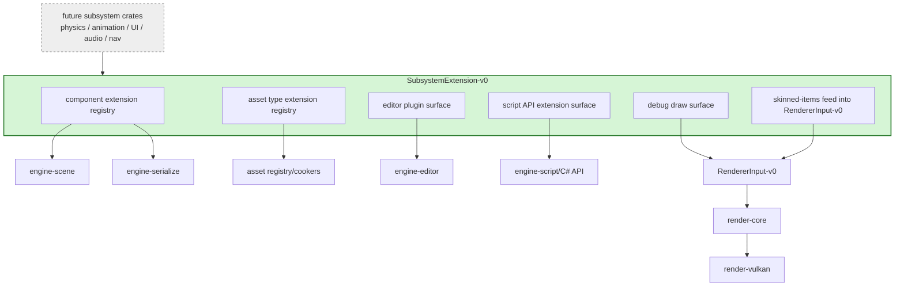

# Gate 9 Code Architecture

## Purpose

This diagram shows the whole engine structure at the end of Gate 9. It adds plugin-style extension surfaces so physics, animation, UI, audio, navigation, and future systems do not all edit central ECS, asset, editor, script, or renderer files.

## Whole-System Architecture At Gate Exit

## Gate 9 Additions

- Component extension registry.
- Asset type extension registry.
- Editor plugin surface.
- Script API extension surface.
- Renderer-independent debug draw surface.
- Skinned-items feed into `RendererInput-v0.skinned_items` for future animation (per `FD-007`; bumps `RendererInput-v0` to minor v0.2).

## Frozen Contracts

- `SubsystemExtension-v0`.
- Debug draw submission contract.
- `RendererInput-v0` minor bump to v0.2 adding `skinned_items: [SkinnedItem]` (the canonical contract is owned by Gate 3; Gate 9 only adds the field per the contract change workflow).

## Architectural Notes

- Future systems register through extension surfaces instead of editing central enums or parsers.
- Debug rendering does not call Vulkan directly.
- Animation skinning feeds renderer input as a `RendererInput-v0` field, not a separate contract (per `FD-007`).

## Open Design Questions

- Plugin registration lifetime and ordering.
- Whether extensions are static Rust registration or dynamic module descriptors.
- How editor plugins expose validation errors uniformly.

## Detailed Design Proposal

### Registry Set

Gate 9 should introduce several small registries instead of one catch-all plugin interface:

- `ComponentExtensionRegistry`: component type ID, storage factory, serialization hooks, editor metadata, script exposure metadata.
- `AssetTypeRegistry`: asset type ID, source extensions, cooker, validator, loader, hot update metadata.
- `EditorPluginRegistry`: panels, inspectors, menu commands, debug views.
- `ScriptApiExtensionRegistry`: C# binding providers and API version additions.
- `DebugDrawRegistry`: categories, providers, visibility flags, render-layer hints.
- `RenderExtensionRegistry`: producers that contribute `skinned_items` (and future specialized fields) into `RendererInput-v0`.

### Static Registration First

Use static Rust registration first. Dynamic plugins can come later, but this gate's purpose is to stop central file edits. A subsystem can expose a function like `register_physics_extensions(registry: &mut ExtensionRegistry)` and the integration owner wires it into startup.

### Extension Descriptor

Every subsystem should provide a descriptor with name, version, dependencies, and registered features. This makes ordering and missing dependency errors explicit.

### Validation Strategy

Add a dummy subsystem in tests. It should register one component, one asset type, one editor panel, one script API, and one debug draw provider. This proves the extension surfaces work before real physics/animation depend on them.

### Implementation Order

1. Component registry and serialization hooks.
2. Asset type registry and cooker/loader hooks.
3. Editor plugin surface.
4. Script API extension surface.
5. Debug draw surface.
6. Skinned-item producer registration into `RendererInput-v0`.
7. Dummy subsystem integration test.

### Design Risks

- Global mutable registries can become order-dependent and hard to test.
- Dynamic plugin loading creates ABI/version problems too early.
- If editor/script/asset metadata diverge, subsystem authoring becomes unreliable.

