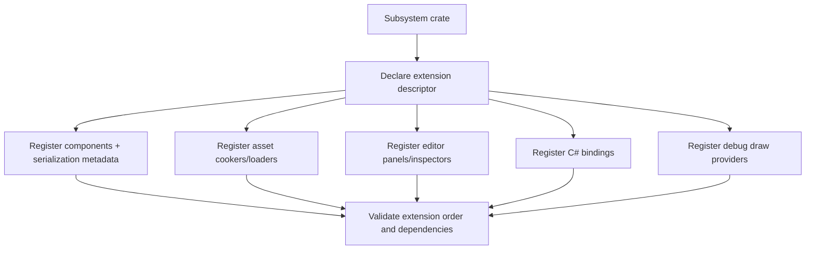
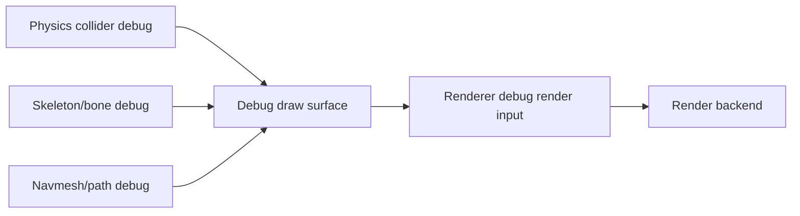

# Gate 9 Common Implementations And Best Practices

## Research Scope

Gate 9 creates extension surfaces so future subsystems can plug into ECS, serialization, assets, editor, scripting, and debug drawing without editing central code.

## Mainstream Implementations

1. Plugin registration systems
   - Bevy and many editor frameworks use plugins to register systems, resources, components, and tools.
2. Reflection/metadata registration
   - Engines expose component metadata to serialization and editor inspectors.
3. Asset type registration
   - Asset pipelines often use importer/cooker registries keyed by asset type or extension.
4. Debug draw abstraction
   - Tool rendering typically goes through a backend-independent debug renderer.

## Recommended Direction

- Define static Rust registration first; dynamic plugins can come later.
- Register components, asset types, editor panels, script bindings, and debug draw providers through versioned APIs.
- Keep extension points small and intentionally boring.

## Best Practices

- Keep extension registration deterministic.
- Avoid global mutable registries without ownership/lifetime rules.
- Make editor/script metadata explicit.
- Keep debug draw data-oriented and backend-neutral.
- Provide dummy subsystem tests for every extension point.

## Anti-Patterns

- Central enums that every subsystem edits.
- Reflection without versioning or validation.
- Editor hardcoding every component type.
- Subsystems directly adding Vulkan debug draw calls.

## Fetched Reference Summaries

- Bevy Plugin: Bevy plugins package systems/resources/configuration behind an initialization interface. This supports using explicit registration boundaries and deterministic plugin order.
- Bevy Reflect: Bevy reflection provides runtime type inspection and dynamic access while retaining Rust type structure. This supports editor/serialization metadata for subsystem components.
- Unreal Plugins: Unreal plugins define descriptors, folders, modules, content, dependencies, and loading phases. This supports adding extension metadata and compatibility rules to engine plugins.
- Godot GDExtension: GDExtension emphasizes native extension registration, ABI/version compatibility, and lifecycle boundaries. This supports keeping dynamic/native extensions isolated from engine core internals.
- Dear ImGui and egui: Both demonstrate immediate-mode tooling UI that can be generated from current state. This is useful for debug/editor extension panels without complex retained ownership inside every subsystem.

## Design Reference Notes

### Extension Registration Shape

Bevy plugins, Unreal plugins, and Godot GDExtension all show that extension systems need metadata and lifecycle, not just function callbacks. Gate 9 should define how a subsystem announces what it contributes and when those contributions are valid.

A subsystem extension descriptor should be able to register:

- Components and serialization metadata.
- Asset types, cookers, validators, and loaders.
- Editor panels and component inspectors.
- C# script API bindings.
- Debug draw providers.
- Runtime systems and scheduling stage requirements.

### Reflection And Metadata

Bevy Reflect suggests a practical approach: keep Rust types static, but provide metadata for inspection, serialization, and editor display. For this engine, full dynamic reflection can wait; the important part is a stable metadata path so every subsystem does not hand-edit editor and serializer code.

### Debug And Editor UI

Dear ImGui and egui show that tool UI can be generated from current state and does not need to own engine data. Editor plugin panels should submit commands to engine/editor APIs, not mutate internal subsystem state without validation.

### Design Checklist For Implementation

- Can a new subsystem add one component without editing the core scene parser?
- Can a new asset type add a cooker and validator without changing registry internals?
- Can a subsystem expose C# functions without changing the base `ScriptAPI-v0` surface?
- Can debug visualization be rendered without importing Vulkan?
- Is extension registration deterministic and testable?

## Implementation Flowcharts

### Subsystem Registration Flow

### Debug Draw Submission Flow

## References To Review

- Bevy plugin system: https://docs.rs/bevy/latest/bevy/app/trait.Plugin.html
- Bevy reflection: https://docs.rs/bevy_reflect/latest/bevy_reflect/
- Unreal module/plugin architecture: https://dev.epicgames.com/documentation/en-us/unreal-engine/plugins-in-unreal-engine
- Godot extension system: https://docs.godotengine.org/en/stable/tutorials/scripting/gdextension/index.html
- Dear ImGui debug tooling reference: https://github.com/ocornut/imgui
- egui plugin/tooling inspiration: https://github.com/emilk/egui
