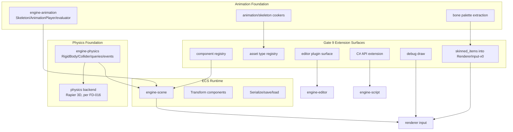

# Gate 10 Code Architecture

## Purpose

This diagram shows the whole engine structure at the end of Gate 10. Physics and animation are now first-class gameplay subsystems, connected through Gate 9 extension surfaces and still isolated from renderer/backend internals.

## Whole-System Architecture At Gate Exit

## Gate 10 Additions

- Physics foundation: rigid bodies, colliders, materials, collision layers/masks, fixed timestep, forces, queries, and collision events.
- Animation foundation: skeletons, animation clips, single-clip playback, linear keyframe interpolation, looping, speed, and bone palette extraction.
- Minimal editor and C# exposure for both systems.

## Frozen Contracts

- `Physics/Animation-v0` component schema, query/event surfaces, and fixed-step/animation-extract timing.
- Bone palette extraction feeds `RendererInput-v0.skinned_items` (per `FD-007`); no separate skinned contract.
- Basic script/editor/debug registration for both systems via `SubsystemExtension-v0`.

## Architectural Notes

- Physics and animation own separate crates.
- Neither subsystem edits renderer backends directly.
- Optional UI/audio foundations may start only if isolated.

## Open Design Questions

- CPU vs. GPU skinning boundary.
- Fixed timestep integration with script update ordering.
- **Advanced lighting ownership.** Per `FD-027` and `FD-028`, Forward+/clustered shading, CSM, and IBL prefiltering land in **Gate 10 or Gate 11**. The Gate 10 owner must record the split in writing in this gate's `01-code-architecture.md` before the lighting work starts; any feature that does not land here must be re-listed as a Gate 11 addition. See [lighting-system.md](../lighting-system.md).

Resolved cross-cutting items (do not re-debate at this gate):

- Physics backend is **Rapier 3D** (frozen by `FD-016`); Jolt or other adapters require a new `FD` decision before reopening.
- Shading model (PBR-MR), color pipeline, tone-mapping, and shadow algorithm are frozen by `FD-026` / `FD-027` / `FD-028`; this gate may **only** add the cluster build, CSM cascades, and IBL prefilter behind `subsystem-lighting-cluster` / `subsystem-lighting-csm` / `subsystem-lighting-ibl` features.

## Detailed Design Proposal

### Physics Module Design

`engine-physics` owns the engine-facing API; a backend crate owns physics library integration. Suggested modules:

- `components`: `RigidBody`, `Collider`, material/layer/mask data.
- `world`: engine physics world resource and simulation settings.
- `backend`: trait for backend implementation.
- `sync`: ECS-to-physics and physics-to-ECS synchronization.
- `queries`: raycast, overlap, sweep query snapshots.
- `events`: collision/trigger event stream.
- `debug`: collider/contact debug draw provider.

### Fixed Step Policy

Physics runs in a fixed update stage. Render delta is accumulated and consumed in fixed increments. C# scripts request forces, impulses, or body changes through a command queue; those commands apply before simulation, not mid-step.

### Animation Module Design

`engine-animation` owns animation runtime state. Asset cookers register through the asset extension surface. Suggested modules:

- `assets`: skeleton and animation clip runtime data.
- `components`: `Skeleton`, `AnimationPlayer`, `SkinnedMeshBinding`.
- `player`: playback time, speed, loop, pause/resume.
- `evaluator`: keyframe interpolation and hierarchy solve.
- `extract`: bone palette extraction into `RendererInput-v0.skinned_items` (per `FD-007`).
- `debug`: skeleton/bone debug draw provider.

### Cross-System Ordering

Recommended update order:

1. Apply queued script/editor commands.
2. Physics fixed step and event collection.
3. Animation playback/evaluation.
4. Renderer extraction including bone palettes.
5. Script callbacks for safe post-step events.

### Implementation Order

1. Register physics/animation components and asset types.
2. Implement physics backend wrapper and fixed-step sync.
3. Add physics queries/events.
4. Implement skeleton/clip loading.
5. Implement single-clip animation evaluation.
6. Feed skinned renderer input.
7. Add editor/C# integration and debug draw.

### Design Risks

- Physics and animation can both affect transforms; ownership rules must be explicit.
- Backend handles must never be serialized.
- Animation rendering must go through `RendererInput-v0.skinned_items` (per `FD-007`), not a separate contract or direct backend mutation.

