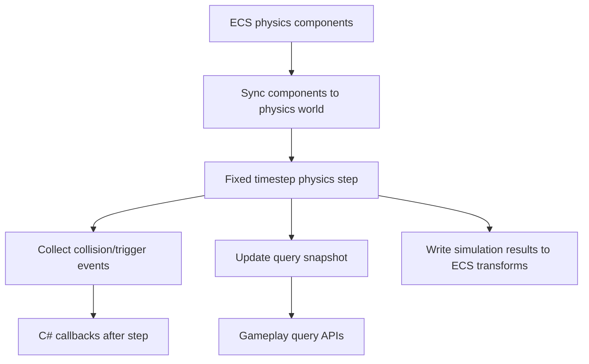
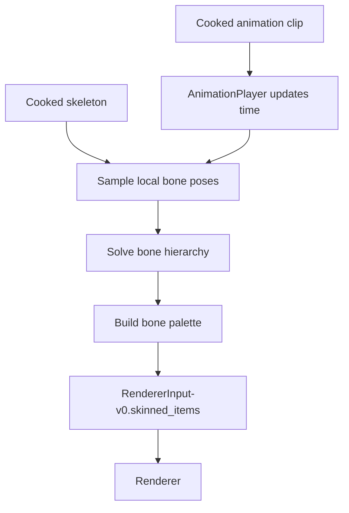

# Gate 10 Common Implementations And Best Practices

## Research Scope

Gate 10 adds physics and animation foundations. The relevant industry practices include physics engine wrappers, fixed timestep simulation, collision events, skeletal animation assets, and skinned mesh rendering.

## Mainstream Implementations

1. Physics backend wrapper
   - Engines commonly wrap PhysX, Jolt, Bullet, Havok, or Rapier behind engine-owned components and query APIs.
2. Fixed timestep physics
   - Physics simulation usually runs at fixed delta and synchronizes results to rendering.
3. Skeletal animation player
   - Runtime loads skeleton, animation clips, evaluates keyframes, solves hierarchy, and feeds bone palettes to the renderer.
4. Editor/debug visualization
   - Collider wireframes and skeleton debug views are standard early validation tools.

## Recommended Direction

- Start with Rapier 3D for Rust-native speed of integration.
- Keep `engine-physics` backend-neutral so Jolt can be added later.
- Start animation with one clip, linear interpolation, and bone palette extraction.
- Use Gate 9 debug draw and skinned render input instead of backend calls.

## Best Practices

- Queue physics mutations and apply them at simulation boundaries.
- Keep physics queries returning snapshots.
- Keep collision callbacks safe and recoverable in C#.
- Validate skeleton/clip compatibility during cook.
- Keep animation evaluation separate from renderer backend upload.

## Anti-Patterns

- Writing a custom physics solver before wrapping a proven backend.
- Running physics on variable render delta with no fixed-step policy.
- Letting C# mutate physics world mid-step.
- Animation code writing directly to Vulkan buffers.
- Adding blending/state machines before single-clip playback is stable.

## Fetched Reference Summaries

- Rapier: Rapier provides rigid bodies, collision detection, and simulation APIs suitable for a Rust-native first backend. It reinforces separating physics world ownership, stepping, queries, and ECS synchronization.
- Jolt, Bullet, and PhysX: These mature physics engines all expose worlds/scenes, collision shapes, constraints, and query APIs. They reinforce designing `engine-physics` as a backend-neutral wrapper rather than binding gameplay code to one engine.
- Unity Physics manual: Unity organizes authoring around rigidbodies, colliders, joints, queries, and simulation settings. This supports separating editor components, runtime simulation, queries, and debug tools.
- glTF skins: glTF defines joints, inverse bind matrices, and mesh-to-skeleton relationships. Animation asset cooking should preserve joint order, bind poses, and skeleton compatibility.
- Ozz Animation: Ozz separates offline animation processing from runtime sampling/blending structures. This supports building cook-time animation optimization instead of evaluating raw source data at runtime.
- Bevy Animation: Bevy provides an ECS-oriented reference for animation assets and playback systems. This supports keeping animation data-driven and integrated through ECS systems.

## Design Reference Notes

### Physics Architecture

Rapier, Jolt, Bullet, and PhysX all separate a physics world/scene from authoring components. The engine should follow that split: ECS components describe intended body/collider state, while `engine-physics` owns the runtime physics world and synchronizes at well-defined points.

Physics data flow should be:

1. ECS has `RigidBody`, `Collider`, and material/layer components.
2. Physics sync builds or updates backend bodies before simulation.
3. Physics world steps at fixed timestep.
4. Transform sync writes results back to ECS according to ownership rules.
5. Events/queries are exposed as snapshots after the step.

### Animation Architecture

glTF and Ozz both emphasize separating source/cooked assets from runtime animation state. The animation foundation should not sample directly from arbitrary source files. Cook skeleton and clip data into runtime-friendly arrays, validate skeleton compatibility, then evaluate per frame.

Animation data flow should be:

1. Asset pipeline cooks skeleton and clips.
2. ECS components reference skeleton/clip assets.
3. Animation player updates playback time.
4. Evaluator samples local poses and solves hierarchy.
5. Bone palette extraction feeds `RendererInput-v0.skinned_items` (per `FD-007`).

### C# And Editor Safety

Collision callbacks and animation commands are useful, but C# should not mutate the physics world mid-step or write animation buffers directly. Use queued commands and safe snapshots. Editor fields should configure components, not backend bodies.

### Design Checklist For Implementation

- Is physics timestep fixed and independent from render frame delta?
- Are physics mutations queued to safe points?
- Can collision events be replayed or logged deterministically enough for tests?
- Does animation cook validate skeleton/clip compatibility?
- Does animation feed renderer through skinned input, not backend APIs?

## Implementation Flowcharts

### Physics Step Flow

### Animation Evaluation Flow

## References To Review

- Rapier physics engine: https://rapier.rs/
- Jolt Physics: https://github.com/jrouwe/JoltPhysics
- Bullet Physics: https://github.com/bulletphysics/bullet3
- NVIDIA PhysX: https://github.com/NVIDIA-Omniverse/PhysX
- Unity physics manual: https://docs.unity3d.com/Manual/PhysicsSection.html
- glTF skins and animations: https://registry.khronos.org/glTF/specs/2.0/glTF-2.0.html#skins
- Ozz Animation: https://github.com/guillaumeblanc/ozz-animation
- Bevy animation crate: https://github.com/bevyengine/bevy/tree/main/crates/bevy_animation
