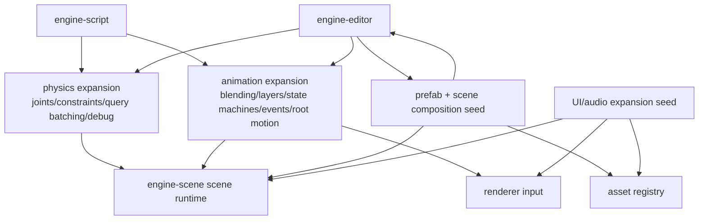

# Gate 11 Code Architecture

## Purpose

This diagram shows the whole engine structure at the end of Gate 11. The first gameplay subsystems have expanded enough to support higher-level character, AI, prefab, UI, and audio work in later gates.

## Whole-System Architecture At Gate Exit

## Gate 11 Additions

- Physics expansion: joints, constraints, controller prerequisites, batched scene queries, improved debug visualization.
- Animation expansion: blending, layers, state machines, events/notifies, root motion, and transitions.
- Prefab/scene composition seed.
- Optional richer UI/audio expansion if Gate 10 started those foundations.

## Frozen Contracts

- Public physics expansion APIs used by Gate 12 character controller.
- Public animation state APIs used by Gate 12 locomotion.
- Prefab seed model sufficient for later full prefab schema.

## Architectural Notes

- Gate 12 should consume physics/animation APIs rather than modifying them.
- Prefab schema changes are versioned from the beginning.
- UI/audio remain isolated from editor internals.

## Open Design Questions

- Which physics constraints are required before character controller.
- Scope of root motion in relation to physics movement.
- Whether prefab work should stay a seed or become full Gate 14 implementation.

## Detailed Design Proposal

### Physics Expansion Design

Physics expansion should expose engine-level descriptors, not backend handles:

- selected joint types such as fixed, hinge/revolute, prismatic, or spherical;
- limits, motors, target values, and break thresholds;
- connected body references using ECS entities or physics handles resolved internally;
- batched query requests and results;
- debug draw for constraints, contact points, and query shapes.

### Animation Expansion Design

Runtime animation should add data-driven state before editor graph tooling:

- animation parameter set;
- state machine asset;
- transition conditions;
- blend duration and blend mode;
- layers and layer weights;
- events/notifies;
- root motion policy.

### Root Motion Ownership

This gate must decide how root motion is represented, even if Gate 12 owns character movement. Options:

- animation emits root motion delta, controller consumes and resolves it through physics;
- animation root motion disabled for character controller until a later gate;
- special-case non-character props that can accept animation-authored transforms.

### Prefab Seed Scope

If prefab seed lands here, keep it limited to source asset ID, component defaults, hierarchy snapshot, and version field. Full override semantics belong to Gate 14 unless explicitly pulled forward.

### Implementation Order

1. Add selected physics constraints and batched queries.
2. Add animation state machine runtime structures.
3. Add animation notifies/events.
4. Define root motion policy.
5. Add prefab seed only if schema can remain stable.
6. Run combined physics/animation validation scene.

### Design Risks

- Root motion can conflict with physics and controller movement.
- Joint descriptors can accidentally leak backend-specific body handles.
- Partial prefab work can become permanent debt if not versioned.

