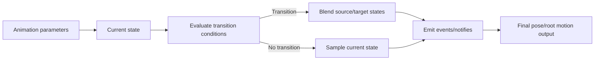
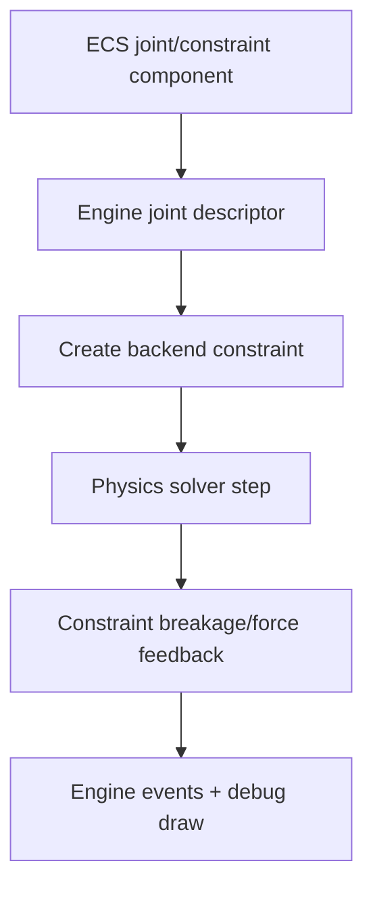

# Gate 11 Common Implementations And Best Practices

## Research Scope

Gate 11 expands physics and animation and starts composition-oriented systems. The focus is preparing stable APIs for character controller, prefab composition, and later UI/audio work.

## Mainstream Implementations

1. Physics constraints and character prerequisites
   - Engines typically add joints, constraints, query batching, and debug visualization before character controllers.
2. Animation blending and state machines
   - Standard animation runtime expands from single clips to blend trees, state machines, events, and root motion.
3. Prefab seed model
   - Prefabs often begin as reusable entity hierarchies with component overrides.
4. Runtime UI/audio seeds
   - UI/audio can begin as isolated runtime crates if they do not alter editor or renderer internals.

## Recommended Direction

- Expand only the physics/animation APIs required by Gate 12.
- Document transform ownership for root motion versus physics movement.
- Keep prefab schema versioned from the start.
- Keep UI/audio expansion optional and isolated.

## Best Practices

- Define transition APIs before building complex animation graphs.
- Treat animation notifies/events as data with stable timing semantics.
- Keep physics queries batched and measurable.
- Use debug views for constraints, contact points, animation state, and root motion.
- Keep prefab overrides explicit.

## Anti-Patterns

- Building a full animation editor before runtime blending works.
- Starting character controller by patching physics internals.
- Adding root motion without transform ownership rules.
- Letting optional UI/audio work change core editor or renderer files.

## Fetched Reference Summaries

- Unreal animation state machines: Unreal models animation logic as states, transitions, conduits, and debuggable graphs. This supports explicit transition conditions and state separation before editor authoring.
- Unity Animator Controllers: The page did not fetch cleanly, but Unity's Animator Controller model is a standard reference for parameters, layers, states, and transitions.
- Ozz Animation: Ozz emphasizes efficient runtime sampling and blending backed by offline tools. This supports adding blending/layers only after the foundation player is stable.
- Rapier joints and Jolt constraints: Physics expansion should expose joints/constraints as engine-level components with limits, motors, breakage, and solver interaction while hiding backend-specific details.
- Unity Prefabs and Unreal Character/Blueprint references: These reinforce reusable configured gameplay assets and data-driven authoring patterns as the next step after subsystem foundations.

## Design Reference Notes

### Animation Expansion

Unreal state machines and Unity Animator Controllers both organize animation around states, parameters, transitions, and layers. Gate 11 should not jump straight to editor graph authoring. The runtime should first define the data model: state IDs, transition conditions, blend durations, parameters, events/notifies, and layer weights.

Minimum runtime concepts:

- Animation parameter set.
- State machine asset.
- Transition condition model.
- Blend duration and interpolation mode.
- Event/notify timeline.
- Root motion ownership rules.

### Physics Expansion

Rapier and Jolt constraint docs imply that joints and constraints should be components/resources at the engine level, not backend object leaks. Define engine-owned joint descriptors with limits, motors, breakage, and target bodies. Backend-specific solver details stay hidden.

### Prefab And Composition Seed

Unity Prefabs and Unreal gameplay asset patterns suggest that reusable configured entities are the next major content multiplier. Gate 11 can seed prefab composition, but if it is not mature enough, Gate 14 should own full prefab semantics.

### Design Checklist For Implementation

- Are animation transitions data-driven and debuggable?
- Is root motion documented as animation-owned, controller-owned, or physics-owned?
- Can joints/constraints save/load without backend pointer data?
- Do expanded physics and animation APIs expose only engine-owned descriptors?
- Is prefab seed clearly versioned if it lands in this gate?

## Implementation Flowcharts

### Animation State Machine Flow

### Physics Constraint Flow

## References To Review

- Unreal animation state machines: https://dev.epicgames.com/documentation/en-us/unreal-engine/state-machines-in-unreal-engine
- Unity Animator Controllers: https://docs.unity3d.com/Manual/AnimatorControllers.html
- Ozz Animation blending samples: https://guillaumeblanc.github.io/ozz-animation/
- Rapier joints documentation: https://rapier.rs/docs/user_guides/rust/joints
- Jolt constraints documentation: https://jrouwe.github.io/JoltPhysics/
- Unity Prefabs overview: https://docs.unity3d.com/Manual/Prefabs.html
- Unreal Blueprint/Pawn/Character patterns for later reference: https://dev.epicgames.com/documentation/en-us/unreal-engine/characters-in-unreal-engine
