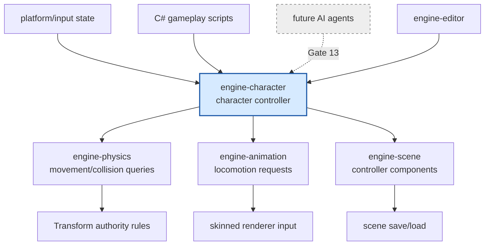

# Gate 12 Code Architecture

## Purpose

This diagram shows the whole engine structure at the end of Gate 12. Physics and animation are unified into a character controller layer that becomes the movement authority for player and AI agents.

## Whole-System Architecture At Gate Exit



## Gate 12 Additions

- Capsule-based character controller.
- Walk/jump/fall/land/slope/air-control state.
- Physics-animation synchronization.
- Locomotion animator layer.
- C# character APIs: `MoveCharacter`, `Jump`, `IsGrounded`, `GetMoveState`.

## Frozen Contracts

- `CharacterController-v0` component model, command/state surface, and C# character API.
- Movement authority rules: controller drives movement, physics resolves collision, animation follows state.

## Architectural Notes

- AI agents later drive this controller instead of writing transforms directly.
- Physics and animation cores are not patched here.
- Ragdoll and advanced IK remain deferred.

## Open Design Questions

- How root motion interacts with controller movement.
- Whether controller supports kinematic-only or dynamic-body modes first.
- How to reset controller state on scene reload.

## Detailed Design Proposal

### Character Controller Data

The controller should be represented by engine-owned ECS components rather than exposing physics backend objects directly. Minimum data:

- capsule radius and height;
- slope limit;
- step offset;
- skin/contact offset;
- walk/run speed;
- jump impulse or jump height;
- air control;
- gravity scale;
- grounded state;
- movement mode;
- current velocity.

### Command-Based Movement

Input and AI produce commands. The controller owns movement resolution:

```text
CharacterMoveCommand
    desired_direction
    desired_speed
    jump_requested
    mode_override
```

The controller consumes commands during update, performs collision queries/sweeps through physics public APIs, resolves slope/step/grounding, and writes final transform and movement state.

### Movement Modes

Initial movement modes should include:

- grounded idle;
- grounded locomotion;
- jump start;
- falling;
- landing.

Each mode emits animation parameters rather than directly selecting animation clips. The animation layer decides how to map state to clips/blends.

### Transform Ownership

The controller writes authoritative character movement. Physics provides collision correction, and animation provides visual pose/root motion only through a documented policy. If root motion is enabled, it should be converted into desired movement and passed through controller/physics resolution.

### C# API Design

C# should expose intent and state, not backend objects:

- `MoveCharacter(direction, speed)`
- `Jump()`
- `IsGrounded()`
- `GetMoveState()`
- `GetGroundNormal()`
- `GetVelocity()`

### Implementation Order

1. Controller component and command buffer.
2. Capsule sweep and grounding classification.
3. Basic walk/fall/jump/land modes.
4. Slope and step handling.
5. Animation parameter output.
6. C# facade and editor fields.
7. Debug draw for capsule, ground normal, and movement state.

### Design Risks

- AI and player movement must share the same API or behavior diverges.
- Root motion can create double movement if not routed through the controller.
- Ground detection must be deterministic enough for animation and scripts.
