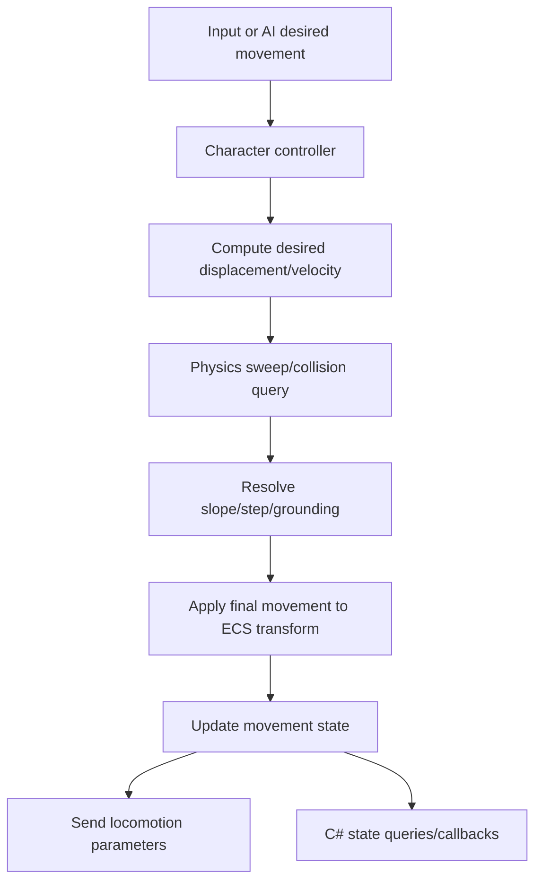
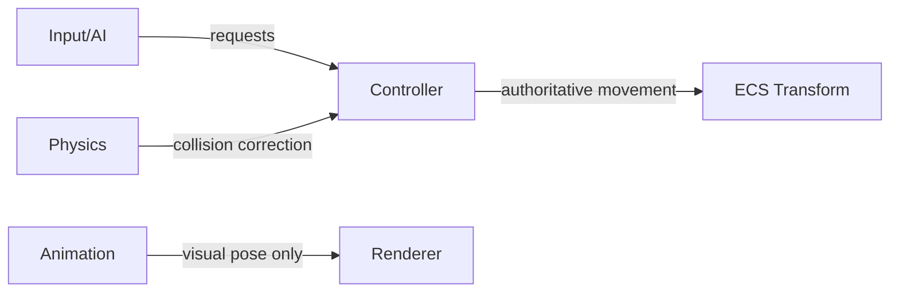

# Gate 12 Common Implementations And Best Practices

## Research Scope

Gate 12 integrates physics and animation through a character controller. The key challenge is transform ownership: controller, physics, animation, and scripts must not fight each other.

## Mainstream Implementations

1. Capsule controller
   - Most 3D engines use a capsule for humanoid movement because it handles slopes and steps predictably.
2. Kinematic character controller
   - Common approach: gameplay controls desired movement, physics resolves collision, controller owns final movement state.
3. State-driven locomotion
   - Movement state feeds animation parameters such as speed, grounded, jump, falling, and landing.
4. Controller API for gameplay and AI
   - Player input and AI agents call the same movement API.

## Recommended Direction

- Start with a capsule-based kinematic controller.
- Define fixed update ownership for movement.
- Feed animation from controller state, not from raw input.
- Expose C# movement APIs without exposing physics backend internals.

## Best Practices

- Separate desired movement from resolved movement.
- Define slope limit, step offset, grounding, and air control explicitly.
- Record controller state transitions for debugging.
- Keep AI and player input using the same controller surface.
- Keep root motion disabled or carefully scoped until ownership is solved.

## Anti-Patterns

- Letting input, AI, physics, and animation all write transform independently.
- Building advanced parkour mechanics before basic walking/jumping is stable.
- Tying controller behavior to a specific physics backend API.
- Hiding grounded/landing state from animation and scripts.

## Fetched Reference Summaries

- Unity CharacterController: Unity exposes a capsule-like movement component that performs collision-aware movement without behaving like a full rigidbody. This supports a kinematic controller as the first implementation.
- Unity Character Controller manual: Tuning parameters such as slope limit, step offset, skin width, radius, and height matter. The engine should expose these as explicit serialized fields.
- Unreal Character Movement: Unreal models walking, falling, acceleration, braking, and movement modes as a dedicated movement component. This supports explicit movement modes and future prediction/replication hooks.
- Rapier character controller: Rapier separates desired displacement from collision-corrected movement. This directly supports the engine rule that controller requests motion and physics resolves collisions.
- Godot CharacterBody3D: Godot's character body model emphasizes velocity-based movement, floor/wall/ceiling detection, and deterministic update order. This supports clear grounded/slope classification.
- Wicked Engine: The fetched result was broad, but it remains useful as an open-source engine reference for practical component-based gameplay architecture.

## Design Reference Notes

### Movement Authority

Unity CharacterController, Unreal Character Movement, Rapier's controller, and Godot CharacterBody all point to a key rule: character movement should have one authority. The controller receives desired movement, asks physics/collision for resolution, updates character state, and drives animation parameters. Input, AI, physics, and animation should not each write transforms independently.

Controller update flow:

1. Input or AI writes desired movement commands.
2. Controller computes desired displacement/velocity.
3. Physics query/sweep resolves collision, slopes, steps, and grounding.
4. Controller writes final movement/grounded state.
5. Animation receives locomotion parameters.
6. C# scripts observe state and request future commands.

### Controller Parameters

The references highlight important serialized tuning fields:

- Capsule radius and height.
- Slope limit.
- Step offset.
- Skin/contact offset.
- Gravity scale.
- Ground snap distance.
- Walk/run speed.
- Jump impulse/height.
- Air control.

### Design Checklist For Implementation

- Can AI and player input use the same movement API?
- Does animation consume controller state instead of raw input?
- Are floor/wall/ceiling contacts classified?
- Can the controller work without exposing a specific physics backend?
- Are root motion and physics movement conflicts explicitly blocked or resolved?

## Implementation Flowcharts

### Character Movement Flow

### Transform Ownership Flow

## References To Review

- Unity CharacterController: https://docs.unity3d.com/ScriptReference/CharacterController.html
- Unity Character Controller manual: https://docs.unity3d.com/Manual/class-CharacterController.html
- Unreal Character Movement Component: https://dev.epicgames.com/documentation/en-us/unreal-engine/character-movement-component
- Rapier character controller: https://rapier.rs/docs/user_guides/rust/character_controller
- Godot CharacterBody3D: https://docs.godotengine.org/en/stable/classes/class_characterbody3d.html
- Kinematic character controller design notes from Wicked Engine blog: https://wickedengine.net/
