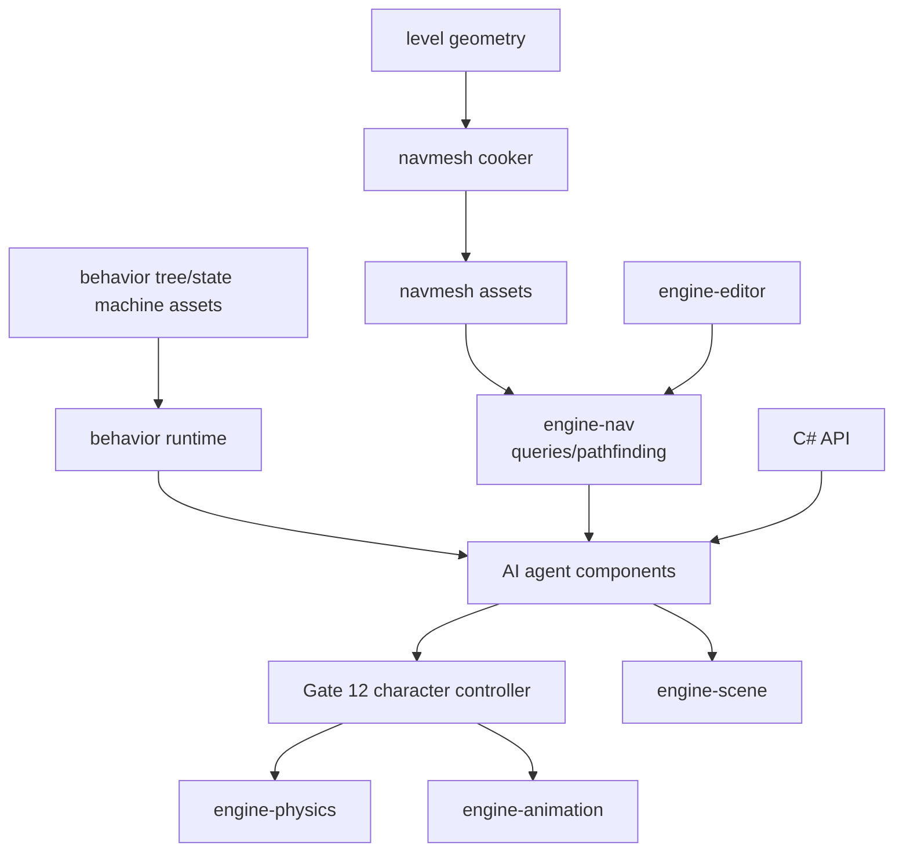

# Gate 13 Code Architecture

## Purpose

This diagram shows the whole engine structure at the end of Gate 13. Navigation and AI are added above the character controller, using cooked navmesh assets and behavior assets to drive agents safely.

## Whole-System Architecture At Gate Exit

## Gate 13 Additions

- `engine-nav` runtime and navmesh cooker.
- Pathfinding queries and path following.
- AI agent component.
- Minimal behavior tree or finite state machine runtime.
- Editor/C# support for navmesh and agent diagnostics.

## Frozen Contracts

- `NavAI-v0` navigation query APIs, agent component schema, and behavior asset binding shape.

## Architectural Notes

- Agents drive the character controller, not raw transforms.
- Navmesh assets are cooked and loaded through the asset registry.
- Behavior runtime is intentionally minimal; visual behavior authoring is deferred.

## Open Design Questions

- Tile-based vs. single-mesh navmesh strategy.
- Behavior tree vs. finite state machine as the first behavior asset type.
- Navmesh generation library vs. custom implementation \u2014 tracked as `OFQ-001` in [foundation-decisions.md](../foundation-decisions.md). Gate 13 must resolve this before cooker work begins; do not silently pick a library.

## Detailed Design Proposal

### Navigation Asset Pipeline

Navigation should treat navmesh as cooked data. Pipeline:

1. Source level geometry and navigation settings.
2. Navmesh cooker builds polygon/tile data.
3. Asset registry stores navmesh asset metadata.
4. Runtime loads navmesh query data from registry.

Gate 13 should start with static navmesh. Dynamic navmesh updates and streaming tiles can come later.

### Runtime Navigation Modules

Suggested `engine-nav` modules:

- `engine-asset`: cooked navmesh asset format and loader.
- `query`: nearest point, random point, walkability, path find.
- `path`: path corridor, smoothing, waypoint iteration.
- `agent`: AI agent component and runtime state.
- `debug`: navmesh, path, target, and agent radius debug draw.

### AI Agent Model

Agent components should contain:

- navmesh asset reference;
- agent radius/height;
- desired target;
- current path;
- path status;
- stopping distance;
- movement speed;
- controller entity reference or same-entity controller requirement.

Agents request movement from the Gate 12 character controller. They do not write transform positions directly.

### Behavior Runtime

The first behavior runtime should be small and deterministic. If using behavior trees, define node status values: `Success`, `Failure`, `Running`. If using FSM, define explicit state IDs and transitions. Both require a blackboard or shared local memory model.

### Implementation Order

1. Navmesh asset type and cooker.
2. Runtime navmesh loading and query API.
3. Pathfinding and path smoothing.
4. AI agent component and path following.
5. Behavior runtime for patrol/chase/idle.
6. C# and editor debug APIs.

### Design Risks

- Agent size must match character controller dimensions or paths will be invalid.
- Behavior runtime can become a second scripting language if scope grows.
- Dynamic navmesh should wait until static navigation is validated.
