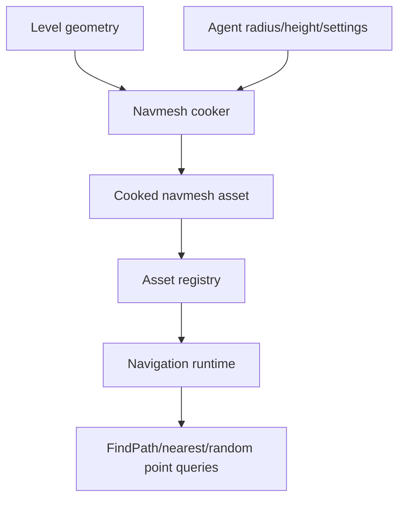
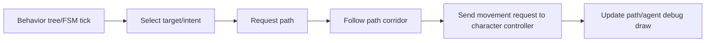

# Gate 13 Common Implementations And Best Practices

## Research Scope

Gate 13 adds navigation mesh cooking, pathfinding, AI agents, and simple behavior runtime. Agents should drive character controllers instead of bypassing movement rules.

## Mainstream Implementations

1. Recast/Detour navmesh
   - Industry-standard open-source navmesh generation and pathfinding library.
2. Tile-based navmesh
   - Common for large worlds and streaming, but a single navmesh is simpler for the first gate.
3. Agent path following
   - AI agents request paths, follow corridors, smooth corners, and request movement from the character controller.
4. Behavior tree or finite state machine
   - Behavior trees are common for game AI; finite state machines are simpler and easier to validate first.

## Recommended Direction

- Use Recast/Detour concepts as the reference model.
- Start with static navmesh assets and basic pathfinding.
- Implement patrol/chase/idle behavior with either a tiny behavior tree or FSM runtime.
- Route agent movement through Gate 12 character controller.

## Best Practices

- Validate navmesh generation visually.
- Keep agent radius/height consistent with controller dimensions.
- Keep path queries deterministic for tests.
- Avoid dynamic navmesh until static navigation is reliable.
- Expose path debugging in editor and C#.

## Anti-Patterns

- AI writing transforms directly.
- Adding crowd simulation before single-agent path following is stable.
- Runtime-generating navmesh every frame or on every small scene edit.
- Mixing behavior authoring UI into the first behavior runtime.

## Fetched Reference Summaries

- Recast Navigation: Recast/Detour provides navmesh generation and pathfinding concepts used widely in games. It supports separating build-time navmesh data from runtime query data and agent parameters.
- Unreal Navigation: Unreal's navigation system includes navmeshes, agent settings, path following, and editor/runtime generation controls. This supports agent-specific nav data and debug visualization.
- Unity NavMesh: Unity distinguishes baked walkable surfaces from runtime agents, obstacles, links, and queries. This supports keeping navmesh cooking separate from agent behavior.
- Godot NavigationServer3D: Godot separates navigation maps/regions/agents and exposes explicit synchronization/query APIs. This supports keeping navigation runtime separate from scene nodes.
- BehaviorTree.CPP: Behavior trees use nodes, blackboards, tick statuses, and composition. This supports defining node lifecycle, result states, and blackboard ownership before visual authoring.
- Game AI Pro: The site is a broad practical AI reference. Use it for design ideas around behavior trees, decision-making, navigation debugging, and AI architecture, not as a direct implementation template.

## Design Reference Notes

### Navigation Data Model

Recast/Detour, Unity NavMesh, Unreal navigation, and Godot NavigationServer all separate baked navigation data from runtime agents. Gate 13 should do the same. Navmesh cooking consumes level geometry and settings; runtime query systems consume cooked navmesh assets.

Navigation asset data should include:

- Walkable surface parameters.
- Agent radius/height settings used during bake.
- Polygon/tile data.
- Optional off-mesh links.
- Version/cook settings.

### Agent Movement

The AI agent should not move transforms directly. It should compute path intent and issue movement requests to the Gate 12 character controller. This keeps physics, slopes, collisions, and animation synchronization consistent for player and AI characters.

### Behavior Runtime

BehaviorTree.CPP references suggest defining node statuses and blackboard ownership before visual authoring. A minimal behavior runtime should establish tick order, `Success`/`Failure`/`Running` states, blackboard data ownership, and interruption rules.

### Design Checklist For Implementation

- Is navmesh generation separate from runtime path queries?
- Do agent dimensions match character controller dimensions?
- Can path queries run without mutating the scene?
- Does behavior runtime have deterministic tick semantics?
- Are path debug views available through debug draw/editor plugins?

## Implementation Flowcharts

### Navmesh Cook And Query Flow

### AI Agent Tick Flow

## References To Review

- Recast Navigation: https://github.com/recastnavigation/recastnavigation
- Unreal Navigation System: https://dev.epicgames.com/documentation/en-us/unreal-engine/navigation-system-in-unreal-engine
- Unity NavMesh: https://docs.unity3d.com/Manual/nav-NavigationSystem.html
- Godot NavigationServer3D: https://docs.godotengine.org/en/stable/classes/class_navigationserver3d.html
- BehaviorTree.CPP concepts: https://www.behaviortree.dev/
- AI Game Programming Wisdom series, useful as conceptual background: https://www.gameaipro.com/
