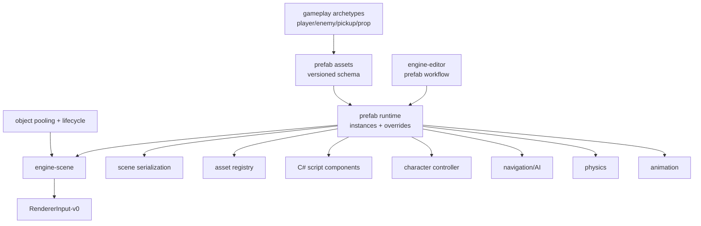

# Gate 14 Code Architecture

## Purpose

This diagram shows the whole engine structure at the end of Gate 14. Prefabs become the reusable composition layer over ECS scenes, assets, scripts, character/AI patterns, and editor authoring.

## Whole-System Architecture At Gate Exit



## Gate 14 Additions

- Prefab asset format with nested entity structures and versioning.
- Prefab instances, property overrides, component enablement overrides, and nested prefab references.
- Editor create/instantiate/apply/revert workflow.
- Gameplay archetypes.
- Object pooling and lifecycle callbacks.

## Frozen Contracts

- `Prefab-v0` schema and override semantics.
- Pooling lifecycle API.
- Archetype registration shape.

## Architectural Notes

- Prefab schema extends scene composition without breaking base scene schema.
- Prefabs can include C# script components and subsystem components.
- Object pooling uses public ECS lifecycle APIs.

## Open Design Questions

- Prefab identity and override diff representation.
- Missing source prefab recovery rules.
- How prefab variants interact with future hot update packages.

## Detailed Design Proposal

### Prefab Asset Schema

Prefab assets should be versioned content assets, not special scene files. Minimum schema:

- prefab asset ID;
- schema version;
- root entity list and hierarchy;
- component defaults;
- asset references;
- script component references;
- child prefab references;
- validation metadata.

### Instance And Override Model

Scene instances should reference a prefab source and store explicit override records. Override records should be keyed by stable path:

```text
prefab_instance_id
entity_path_or_id
component_type
property_path
override_value
```

This makes editor diff/apply/revert possible and avoids silent drift from prefab sources.

### Archetypes

Archetypes are curated prefabs with convention and optional script defaults: player, enemy, pickup, trigger, prop, camera rig. They should be data assets, not code generators.

### Object Pooling

Pooling should be a runtime service that works with prefab instances. It owns activation/deactivation and reset rules, while ECS still owns entity/component storage.

### Implementation Order

1. Prefab schema and validation.
2. Instantiate prefab into ECS.
3. Save/load prefab instance references.
4. Override diff/apply/revert.
5. Editor prefab workflow.
6. Archetype registry.
7. Object pooling and lifecycle hooks.

### Design Risks

- If overrides are implicit, editor and hot update cannot reason about changes.
- If prefabs break base scene schema, later serialization migrations become expensive.
- Pooling must reset script, physics, animation, audio, and UI state safely.

