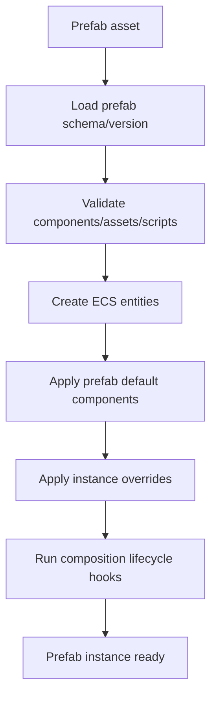
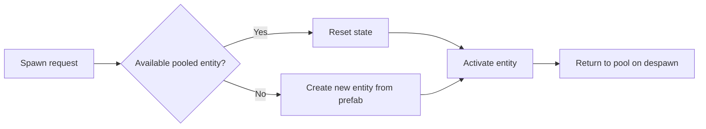

# Gate 14 Common Implementations And Best Practices

## Research Scope

Gate 14 adds prefab assets, instances, overrides, archetypes, and object pooling. The main risk is breaking base scene serialization or creating untraceable override behavior.

## Mainstream Implementations

1. Prefab asset with instances
   - Unity popularized prefab assets with scene instances and overrides.
2. Blueprint/class archetype model
   - Unreal uses Blueprint classes and component defaults as reusable composition patterns.
3. Nested prefabs and variants
   - Larger projects need hierarchy, variants, and override diff tooling.
4. Object pooling
   - Used for projectiles, effects, enemies, UI items, and frequently spawned objects.

## Recommended Direction

- Use versioned prefab assets separate from base scene schema.
- Track prefab source, instance ID, and explicit property overrides.
- Start with curated archetypes before procedural composition.
- Use ECS lifecycle APIs for pooling.

## Best Practices

- Store overrides as explicit diffs.
- Validate missing source prefabs and broken asset references.
- Keep apply/revert operations deterministic.
- Make prefab variants versioned and inspectable.
- Keep pooling callbacks separate from normal create/destroy callbacks.

## Anti-Patterns

- Baking prefab instances into scenes with no source link.
- Silent override loss during save/load.
- Object pooling bypassing ECS lifecycle rules.
- Using prefabs as a substitute for every asset or scene format.

## Fetched Reference Summaries

- Unity Prefabs: Prefabs are reusable configured object templates instantiated from assets rather than duplicated manually in scenes. This supports prefab source identity and instance tracking.
- Unity Prefab Variants: Variants model inheritance-like specialization of a base prefab. Keep common structure on the base prefab and store balance/art/config differences in variants.
- Unreal Blueprints: Blueprints are editor-authored gameplay classes and logic assets built over native systems. This supports data/behavior assets that expose tunable properties without recompiling native code.
- Godot PackedScene: PackedScene serializes a node tree and instantiates it as reusable scene content. This supports explicit scene composition and dependency tracking.
- Bevy scene system: Bevy scenes serialize ECS entities and components for spawning/loading. Components intended for prefab/scene workflows should be serialization/reflection friendly.
- Object Pool pattern: Object pools preallocate reusable objects to reduce allocation spikes and fragmentation. Pooled entities must be reset carefully before reuse.

## Design Reference Notes

### Prefab Identity And Overrides

Unity Prefabs, Prefab Variants, Unreal Blueprints, Godot PackedScene, and Bevy scenes all reinforce that reusable content needs identity and controlled override rules. A prefab instance should know which source prefab it came from and which properties differ from the source.

Minimum prefab data:

- Prefab asset ID and schema version.
- Source entity hierarchy.
- Component list and asset references.
- Instance ID in scene.
- Override records keyed by entity/component/property.
- Missing-source recovery metadata.

### Variants And Archetypes

Variants should not duplicate the entire base prefab. Store the base reference and only the differences. Gameplay archetypes are curated presets built from prefabs and scripts, not code generation machines. Start with player/enemy/pickup/prop/trigger patterns.

### Pooling

The Object Pool pattern highlights that reuse must reset state carefully. Pooled ECS entities need lifecycle hooks: create, activate, deactivate, reset, return. Do not bypass normal component initialization and destruction rules.

### Design Checklist For Implementation

- Can prefab override diffs be displayed in editor?
- Can a prefab instance survive source prefab update?
- Can broken source prefab references be diagnosed?
- Does pooling avoid stale component/script/audio/physics state?
- Can hot update update prefab assets safely?

## Implementation Flowcharts

### Prefab Instantiation Flow

### Object Pool Flow

## References To Review

- Unity Prefabs: https://docs.unity3d.com/Manual/Prefabs.html
- Unity Nested Prefabs and Prefab Variants: https://docs.unity3d.com/Manual/PrefabVariants.html
- Unreal Blueprints: https://dev.epicgames.com/documentation/en-us/unreal-engine/blueprints-visual-scripting-in-unreal-engine
- Godot PackedScene: https://docs.godotengine.org/en/stable/classes/class_packedscene.html
- Bevy scene system: https://github.com/bevyengine/bevy/tree/main/crates/bevy_scene
- Object Pool pattern overview: https://gameprogrammingpatterns.com/object-pool.html
