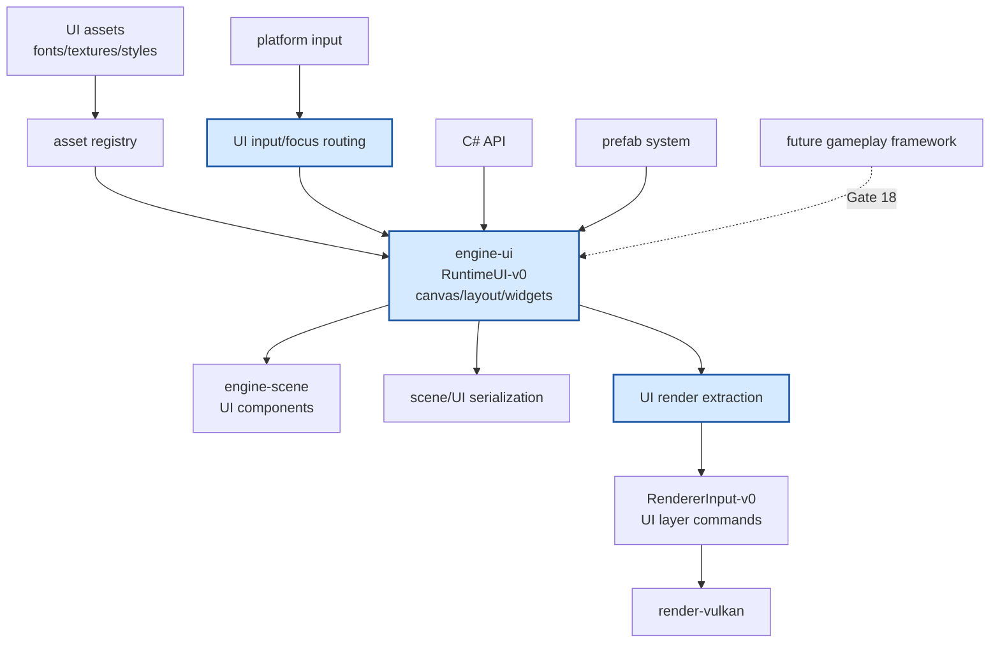

# Gate 15 Code Architecture

## Purpose

This diagram shows the whole engine structure at the end of Gate 15. Runtime UI is added as a gameplay system separate from editor UI, with its own canvas, layout, rendering extraction, input routing, serialization, and C# callbacks.

## Whole-System Architecture At Gate Exit

## Gate 15 Additions

- Runtime `engine-ui` crate.
- Canvas hierarchy, anchoring, sizing, constraints, screen-space transform model.
- UI rendering extraction for quads/images/text.
- Pointer, mouse, keyboard, touch routing, focus, hover, pressed states.
- Basic widgets and C# callbacks.

## Frozen Contracts

- `RuntimeUI-v0` canvas, node, and widget component model.
- UI render extraction contract into `RendererInput-v0` UI batches.
- UI input routing ownership.

## Architectural Notes

- Runtime UI is separate from editor UI.
- UI emits renderer commands; it does not call backend APIs.
- UI can use prefabs once Gate 14 is stable.

## Open Design Questions

- Text rendering and font atlas ownership.
- Immediate vs. retained widget implementation details.
- Localization and data binding deferral boundaries.

## Detailed Design Proposal

### UI Runtime Modules

`engine-ui` should be independent from `engine-editor`. Suggested modules:

- `canvas`: root canvas, coordinate spaces, scaling policy.
- `layout`: anchors, constraints, layout calculation.
- `widgets`: panel, image, text, button, toggle, slider, scroll view.
- `input`: hit testing, focus, capture, pointer and keyboard routing.
- `render`: UI render extraction into renderer input.
- `style`: colors, fonts, spacing, texture references.
- `script`: C# callbacks and field bindings.

### Retained Runtime UI

Runtime UI should be retained. Widget state persists in ECS/components or UI-specific storage. Immediate-mode UI remains more appropriate for editor/debug panels.

### Layout And Render Split

Layout computes rectangles and visibility. Render extraction turns the computed tree into draw commands. Text shaping/font atlas updates are separate from widget logic.

### Input Routing

UI receives platform input, performs hit testing, then decides whether to capture the input. Captured UI input should prevent gameplay input action handling for the same event.

### Implementation Order

1. Canvas root and coordinate conversion.
2. Rect transform and simple layout.
3. Image/panel rendering.
4. Text rendering path.
5. Button/toggle input and callbacks.
6. Serialization.
7. C# APIs.

### Design Risks

- Reusing editor UI would mix tooling state and runtime state.
- Text rendering complexity can surprise the gate; isolate it behind a text renderer module.
- Input capture rules must be clear before gameplay framework integrates action maps.

