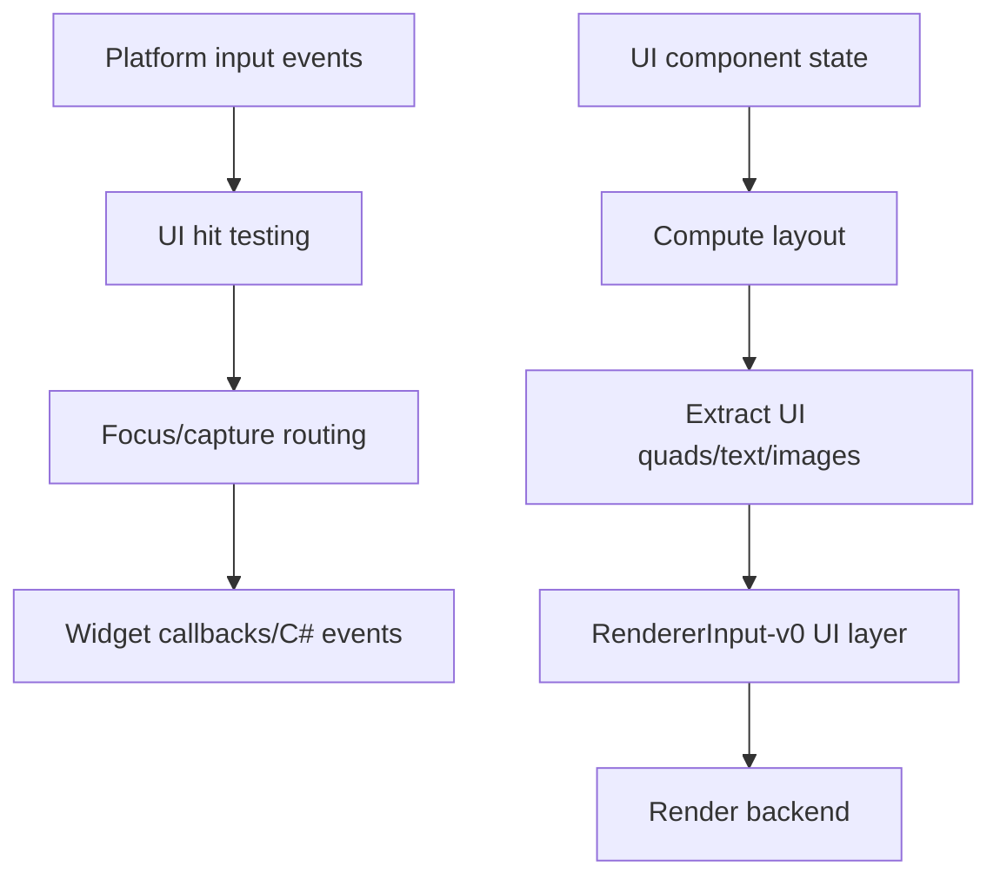
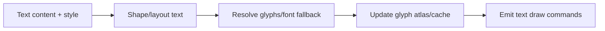

# Gate 15 Common Implementations And Best Practices

## Research Scope

Gate 15 adds runtime UI, separate from editor UI. The core topics are layout, canvas hierarchy, text/images, input routing, focus, serialization, and script callbacks.

## Mainstream Implementations

1. Retained-mode UI tree
   - Unity UI, Unreal UMG, and many game UIs keep a hierarchy of widgets/components.
2. Immediate-mode UI
   - Dear ImGui and egui are excellent for tools but less ideal as the main runtime UI model.
3. Flexbox-like layout
   - Common in modern UI frameworks; can be heavy for initial engine UI.
4. Canvas/layer rendering
   - Runtime UI usually extracts quads/text/images to a 2D/orthographic render layer.

## Recommended Direction

- Use retained runtime UI for game UI.
- Keep editor UI separate, likely immediate-mode.
- Start with canvas, anchors, simple constraints, text, image, panel, button, toggle, slider, and scroll view.
- Route input through platform input and UI focus/capture rules.

## Best Practices

- Separate layout calculation from rendering extraction.
- Keep UI coordinate spaces explicit.
- Make input capture rules deterministic.
- Use asset registry for fonts/textures/styles.
- Serialize UI components through ECS/scene systems.

## Anti-Patterns

- Reusing editor UI directly as runtime UI.
- Having widgets call renderer backend APIs directly.
- Mixing gameplay input and UI input without capture/focus policy.
- Implementing localization/data binding before basic layout is stable.

## Fetched Reference Summaries

- Unity UI Toolkit: UI Toolkit uses retained visual trees, styling, and markup-like assets. This supports separating UI structure, style, and behavior for runtime/editor tooling.
- Unity uGUI: Canvas/GameObject-based runtime UI is common for HUDs and menus. It highlights the need to organize canvases carefully to avoid rebuild/draw overhead.
- Unreal UMG: UMG composes widgets visually and binds behavior through Blueprint/game state. This supports widget hierarchy and event-driven updates over excessive per-frame bindings.
- Godot UI: Godot composes UI from Control nodes and containers. Anchors, containers, and themes are important for resolution-independent layout.
- Dear ImGui and egui: Immediate-mode UI is excellent for tools and debug panels, but runtime UI should keep persistent user-facing hierarchy and state separate.
- Cosmic Text and glyphon: Text rendering needs shaping, wrapping, bidirectional text, fallback, and efficient GPU rendering. Text should be treated as a first-class rendering concern, not simple ASCII quads.

## Design Reference Notes

### Runtime UI Model

Unity UI Toolkit, uGUI, Unreal UMG, and Godot Control nodes point toward a retained UI hierarchy for runtime UI. Dear ImGui and egui are better references for editor/debug tooling than player-facing UI. Runtime UI should have persistent widgets, layout state, input focus, and serialization.

Core runtime UI layers:

- Canvas root and coordinate space.
- Layout calculation.
- Widget state and hierarchy.
- Input hit testing/focus/capture.
- Render extraction for quads, images, text, and clipping.
- Script callbacks and gameplay event bridge.

### Text Rendering

Cosmic Text and glyphon highlight that text is not trivial. Even if Gate 15 starts simple, the system should plan for shaping, wrapping, font fallback, bidirectional text, and GPU-friendly glyph caching.

### Input Ownership

UI input should be routed before or alongside gameplay input through a defined capture policy. A focused text field, hovered button, or modal panel should be able to consume input without gameplay scripts also receiving it.

### Design Checklist For Implementation

- Is runtime UI separate from editor UI?
- Can UI render without calling backend APIs directly?
- Are layout and render extraction separate phases?
- Can input capture prevent gameplay actions?
- Can UI hierarchy serialize and instantiate from assets/prefabs?

## Implementation Flowcharts

### UI Frame Flow

### Text Rendering Flow

## References To Review

- Unity UI Toolkit: https://docs.unity3d.com/Manual/UIElements.html
- Unity UGUI: https://docs.unity3d.com/Packages/com.unity.ugui@latest
- Unreal UMG UI Designer: https://dev.epicgames.com/documentation/en-us/unreal-engine/umg-ui-designer-in-unreal-engine
- Godot Control nodes: https://docs.godotengine.org/en/stable/tutorials/ui/index.html
- Dear ImGui: https://github.com/ocornut/imgui
- egui: https://github.com/emilk/egui
- Cosmic Text for Rust text layout: https://github.com/pop-os/cosmic-text
- glyphon text rendering: https://github.com/grovesNL/glyphon
