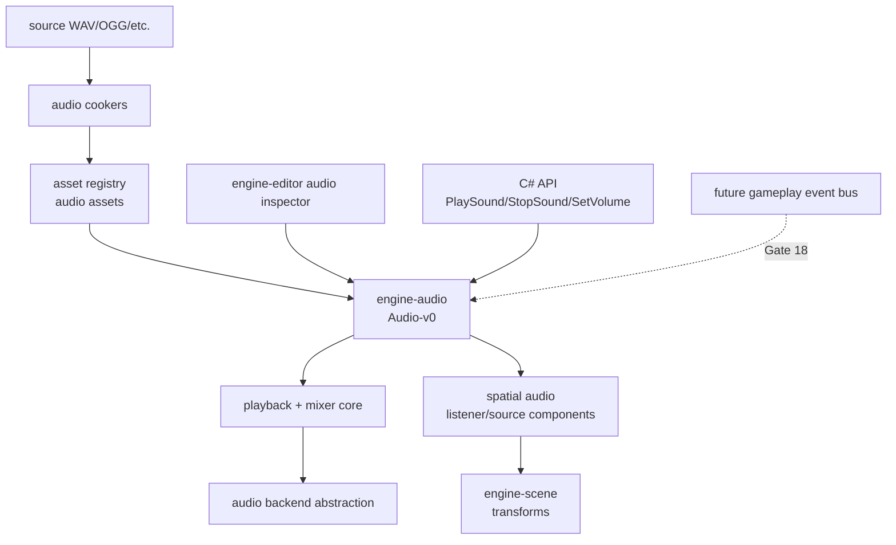

# Gate 16 Code Architecture

## Purpose

This diagram shows the whole engine structure at the end of Gate 16. Audio becomes a runtime subsystem with asset cooking, playback, mixing, spatial sources/listeners, editor fields, and C# controls.

## Whole-System Architecture At Gate Exit

## Gate 16 Additions

- Audio asset cookers and runtime audio metadata.
- Playback, pause, stop, volume, channel/group routing, and mixer abstraction.
- Listener and audio source components with distance attenuation.
- Editor preview and C# audio API.

## Frozen Contracts

- `Audio-v0` runtime API: playback control, mixer groups, listener/source components.
- Audio asset metadata shape.
- Listener/source component schema.

## Cross-Cutting Decisions Applied

| Decision | Applied as |
|---|---|
| `FD-002` Engine threading model | Audio runs on its own dedicated audio thread (the cpal output stream callback). The audio thread reads from a lock-free command queue produced by the main thread; it never calls into ECS storage, the renderer, scripts, or blocking IO. All buffers used inside the callback are pre-allocated. |
| `FD-017` Audio backend | The audio backend is `cpal` for device output and `symphonia` for source decode (gated by the `subsystem-audio-cpal` feature per `FD-010`). No FMOD, no Wwise, no OpenAL. |
| `FD-008` IO and async runtime model | Asset decode submission happens off the audio thread (on the IO pool). Streaming reads do not run inside the audio callback. |

## Architectural Notes

- Audio remains independent from renderer and UI internals.
- Audio components use ECS extension surfaces.
- Gameplay event integration waits for Gate 18.
- The cpal stream callback is the audio thread (per `FD-002`); no other thread may push samples to the device.

## Open Design Questions

- Streaming vs. fully loaded audio assets policy by asset size.
- Mixer group hierarchy and volume automation scope.
- DSP/effects library choice (tracked as `OFQ-005` in `foundation-decisions.md`).

Resolved cross-cutting items (do not re-debate at this gate):

- **Initial audio backend** is frozen by `FD-017` (cpal + symphonia).
- **Threading model** is frozen by `FD-002`.

## Detailed Design Proposal

### Audio Runtime Modules

`engine-audio` should own engine-facing audio APIs and backend abstraction:

- `assets`: cooked audio metadata and payload references.
- `backend`: cpal device/stream abstraction (per `FD-017`).
- `mixer`: groups/buses, volume, mute/solo, routing.
- `playback`: playback instance handles and state.
- `spatial`: listener/source components and attenuation.
- `script`: C# playback facade.
- `editor`: preview and component inspector integration.

### Asset And Instance Split

An audio asset is not a playing sound. The runtime should separate:

- `AudioAsset`: decoded or stream-ready data and metadata.
- `AudioSource`: ECS component describing playback intent.
- `PlaybackInstance`: runtime handle for a currently playing sound.

### Threading Boundary

Audio device callbacks (the cpal stream callback, per `FD-002`) must not block on asset loading, allocation-heavy operations, or locks that the main thread can hold. Main thread commands are pushed into a lock-free SPSC queue and consumed inside the callback. All scratch buffers used by the mixer are pre-allocated at startup; the callback path performs no heap allocation.

### Spatial Audio

Spatial audio uses ECS transforms for listener/source positions. The renderer is not involved. Attenuation and panning parameters are computed before mixing.

### Implementation Order

1. Audio asset cook/load.
2. Backend abstraction and simple playback.
3. Mixer groups.
4. Listener/source components.
5. Spatial attenuation.
6. Editor preview and C# APIs.

### Design Risks

- Blocking in audio callback can cause dropouts.
- If gameplay owns backend handles, audio backend swapping becomes impossible.
- Streaming should be planned but not required for first playback.

