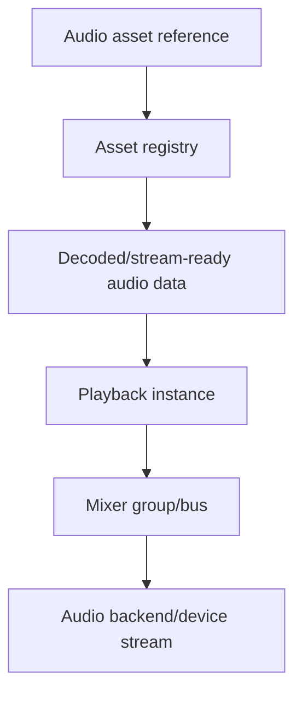
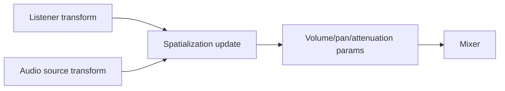

# Gate 16 Common Implementations And Best Practices

## Research Scope

Gate 16 adds audio assets, playback, mixing, spatial audio, editor preview, and C# control.

## Mainstream Implementations

1. Audio middleware integration
   - FMOD and Wwise are common in production engines, but add external tooling and licensing complexity.
2. Lightweight engine audio backend
   - Engines often start with a simple playback/mixer/spatial layer, then integrate middleware later if needed.
3. ECS listener/source components
   - Listener and audio source components follow transforms for spatialization.
4. Audio asset cooking
   - Source audio is converted into runtime format with metadata for looping, streaming, and compression.

## Recommended Direction

- Start with an engine-owned audio abstraction and simple backend.
- Keep audio assets in the asset registry.
- Support 2D playback, simple 3D attenuation, listener/source components, and C# calls.
- Defer advanced DSP, authoring timelines, and middleware integration.

## Best Practices

- Keep audio thread constraints explicit.
- Avoid blocking audio callbacks with asset loading.
- Separate sound asset metadata from playback instances.
- Use stable handles for playing sounds.
- Add simple mixer groups early.

## Anti-Patterns

- Tying audio playback to renderer frame timing.
- Loading large audio files synchronously on the audio callback.
- Letting UI or gameplay systems own audio backend objects.
- Adding advanced DSP before basic playback and spatialization are stable.

## Fetched Reference Summaries

- FMOD Studio: FMOD structures audio around events, parameters, banks, and mixer routing. This supports event-oriented playback and data-driven audio assets rather than raw sample control everywhere.
- Wwise: Wwise uses events, soundbanks, buses, RTPCs, states, and switches. This reinforces planning platform-specific generated banks and runtime parameter control.
- cpal and rodio: cpal provides low-level cross-platform audio I/O, while rodio provides simpler playback on top. Use cpal for custom mixer control or rodio for a simpler first playback path.
- kira: Kira offers Rust game-audio concepts such as sounds, tracks, effects, clocks, and parameter control. It is a useful reference for scheduling and runtime modulation.
- Unity Audio: Unity organizes audio around clips, sources, listeners, mixers, and spatial settings. This supports ECS listener/source components and mixer groups.
- Unreal Audio and Godot buses: Unreal emphasizes sound assets, spatialization, submixes, and effects; Godot routes through named buses with effects/volume. Both support category routing and runtime mixing.

## Design Reference Notes

### Audio Runtime Layers

FMOD, Wwise, Unity, Unreal, Godot, cpal, rodio, and kira all imply the same split: source audio assets, runtime playback instances, mixer/routing, listener/source spatialization, and backend audio device I/O are distinct layers.

Recommended layers:

- Audio asset metadata and cooked payload.
- Audio source component for scene playback.
- Listener component for spatial reference.
- Playback instance handle.
- Mixer groups or buses.
- Backend abstraction for device/stream output.

### Middleware Vs. Engine-Owned Backend

FMOD/Wwise show what production audio authoring can become, but this gate should not require middleware. A simple engine-owned layer can still adopt middleware-friendly concepts: events, buses, parameters, and bank-like asset grouping.

### Threading And Streaming

Audio callbacks must not block on asset loading or heavy locks. Even if streaming is deferred, the design should keep decode/load and audio device callbacks separated.

### Design Checklist For Implementation

- Are audio assets separate from active playback instances?
- Can the mixer route categories such as music, SFX, UI, ambience?
- Can listener/source transforms update spatial audio without renderer coupling?
- Can C# trigger playback without owning backend handles?
- Is the audio callback free of blocking asset operations?

## Implementation Flowcharts

### Audio Playback Flow

### Spatial Audio Update Flow

## References To Review

- FMOD Studio: https://www.fmod.com/docs/2.02/studio/welcome-to-fmod-studio.html
- Audiokinetic Wwise: https://www.audiokinetic.com/library/
- cpal Rust audio I/O: https://github.com/RustAudio/cpal
- rodio Rust audio playback: https://github.com/RustAudio/rodio
- kira Rust game audio library: https://github.com/tesselode/kira
- Unity Audio overview: https://docs.unity3d.com/Manual/Audio.html
- Unreal Audio Engine overview: https://dev.epicgames.com/documentation/en-us/unreal-engine/audio-engine-overview-in-unreal-engine
- Godot Audio buses: https://docs.godotengine.org/en/stable/tutorials/audio/audio_buses.html
