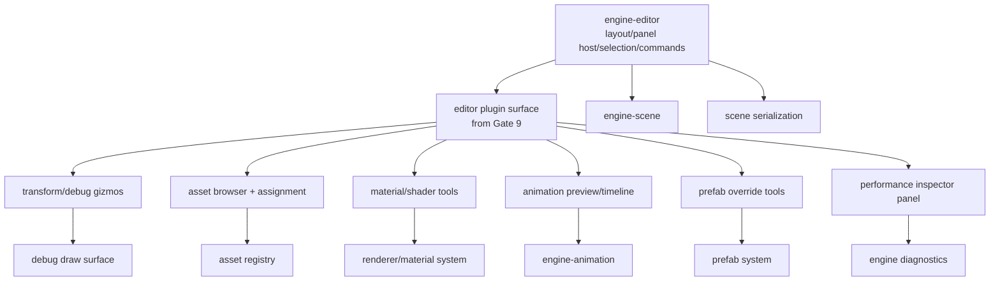

# Gate 17 Code Architecture

## Purpose

This diagram shows the whole engine structure at the end of Gate 17. The editor becomes production-capable by hosting subsystem editor plugins for assets, prefabs, materials, animation preview, debug gizmos, and performance inspection.

## Whole-System Architecture At Gate Exit

## Gate 17 Additions

- Production transform/debug gizmos.
- Asset browser and assignment workflows.
- Material/shader editing and preview tooling.
- Animation preview tooling.
- Prefab override tooling.
- Performance inspector panel.

## Frozen Contracts

- Editor plugin hosting expectations.
- Tool panels consume subsystem plugin APIs.
- Editor diagnostics display shape.

## Cross-Cutting Decisions Applied

| Decision | Applied as |
|---|---|
| `FD-011` Editor vs runtime crate split | All production tooling extends `engine-editor` (gated by `tooling-editor`). Runtime crates remain editor-free; mobile/release builds drop the editor entirely. |
| `FD-014` Logging and tracing | Editor performance inspector consumes `tracing` spans/events; no parallel ad-hoc instrumentation. |
| `FD-005` Mobile budget reporting timing | Gate 17 mobile column is intentionally N/A in `performance-budgets.md` because the editor is desktop-only (`FD-011`). The Gate 17 `04-performance-report.md` records `N/A` for the mobile row and explains why. |

## Architectural Notes

- Core editor hosts panels; subsystem details live in subsystem plugins.
- Editor tools must not mutate ECS, asset, script, or prefab schemas directly.
- Production profiler flamegraph UI remains deferred.
- Every production tool lives behind the `tooling-editor` feature; no production tool may leak symbols into runtime crates (per `FD-011`).

## Open Design Questions

- Docking/layout model.
- Asset thumbnail generation pipeline.
- Material graph vs. parameter-only material editor.

## Detailed Design Proposal

### Editor Core Responsibilities

The production editor should remain a host, not a monolith. Core editor owns:

- window/layout/panel hosting;
- selection state;
- command history and undo/redo;
- scene dirty state;
- shared property widgets;
- asset registry browser shell;
- validation and diagnostics display;
- plugin registration lifecycle.

Subsystems own their own panels and inspectors through Gate 9 plugin surfaces.

### Command System

Every mutation should become an editor command:

- target entity/asset/prefab;
- old value/new value;
- validation function;
- apply/revert functions;
- dirty-state update.

This is required for undo/redo, prefab diffs, and safe scene saves.

### Tooling Panels

Suggested panel groups:

- scene hierarchy;
- inspector;
- asset browser;
- material/shader tool;
- animation preview;
- prefab override view;
- debug/gizmo controls;
- performance inspector.

### Gizmo Integration

Gizmos should emit commands, not mutate transforms directly. Debug draw submits to the debug draw surface. Selection/highlight rendering should use renderer/editor debug layers rather than backend-specific calls.

### Implementation Order

1. Panel host and layout persistence.
2. Command history foundation.
3. Transform gizmos.
4. Asset browser.
5. Material/shader tools.
6. Animation and prefab tools.
7. Performance inspector.

### Design Risks

- If core editor imports every subsystem, parallel tool development becomes impossible.
- If commands are skipped, undo/redo and prefab override tracking break.
- Asset browser must consume registry metadata, not raw file system state alone.

