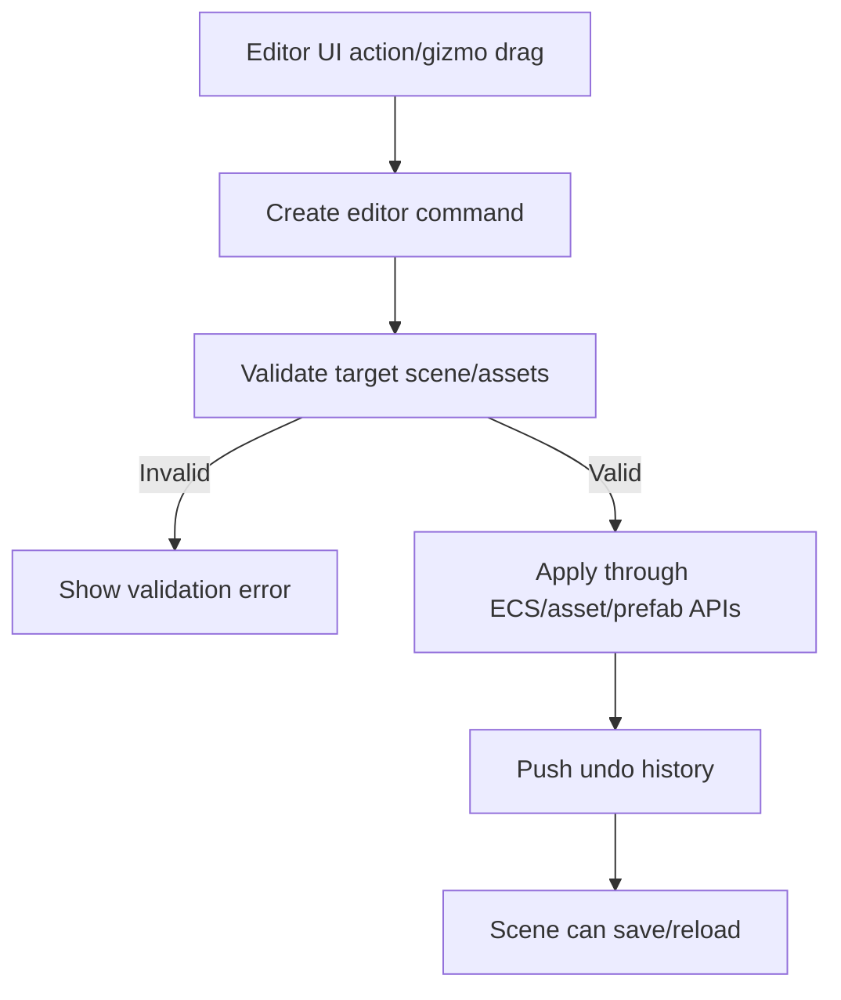
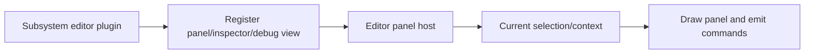

# Gate 17 Common Implementations And Best Practices

## Research Scope

Gate 17 evolves the editor into practical production tooling. The focus is tool composition through plugins rather than hardcoding every subsystem into the editor core.

## Mainstream Implementations

1. Dockable editor shell with panels
   - Unity, Unreal, Godot, and many custom editors use a central shell hosting subsystem panels.
2. Gizmo and debug visualization framework
   - Transform gizmos, collider editing, light icons, animation skeletons, navmesh overlays.
3. Asset browser and inspector
   - Searchable asset views and type-specific inspectors are core production tools.
4. Tool plugins
   - Subsystems provide their own panels and inspectors through editor extension surfaces.

## Recommended Direction

- Keep editor core responsible for layout, selection, command history, panel hosting, and persistence.
- Let subsystems register their own panels/tools.
- Build asset browser and prefab tools before advanced graph editors.
- Keep performance inspector lightweight here; full profiling is Gate 19.

## Best Practices

- All editor mutations should go through commands for undo/redo.
- Tool panels should use public subsystem APIs.
- Asset browser should operate on asset registry data.
- Debug gizmos should use debug draw surface.
- Editor should validate before saving.

## Anti-Patterns

- Core editor importing all subsystem internals.
- Editor tools modifying serialized data without validation.
- Asset browser scanning raw file system instead of registry where cooked/imported state matters.
- Building visual scripting or node shader editor before core production authoring works.

## Fetched Reference Summaries

- Unity editor scripting: Unity supports custom inspectors, editor windows, menus, and workflow tools. Keep editor-only code separate from runtime code.
- Unreal editor customization: Unreal encourages editor modules/plugins, UI extensions, and settings for integrated tooling. This supports plugin-based editor tools rather than core-editor hardcoding.
- Godot editor plugins: Godot plugins can add custom docks, inspectors, importers, and workflow extensions that can be enabled/disabled per project. This supports modular editor tool registration.
- Dear ImGui: Immediate-mode GUI is well suited for debug tools and editor overlays because UI is generated from current state each frame.
- egui_dock: Docking/tab layouts are useful for persistent editor workspace organization.
- ImGuizmo: Transform gizmos for translation, rotation, and scale are a practical reference for scene manipulation handles.

## Design Reference Notes

### Editor Plugin Architecture

Unity, Unreal, and Godot editor references all reinforce that production tools should be extensible. Core editor should provide layout, selection, command routing, undo/redo, asset registry access, and panel hosting. Subsystems should provide their own panels through plugin surfaces.

Core editor responsibilities:

- Window/panel layout.
- Selection and command history.
- Scene and asset context.
- Shared property editing widgets.
- Validation and diagnostics display.
- Plugin registration and panel lifecycle.

Subsystem plugin responsibilities:

- Component-specific inspectors.
- Debug visualizations.
- Asset-specific preview/edit tools.
- Validation messages for owned data.

### Gizmos And Tooling

ImGuizmo demonstrates that transform tools should be an editor layer over scene commands, not direct transform mutation without undo. Debug gizmos should submit to the debug draw surface and should be toggleable per subsystem.

### Design Checklist For Implementation

- Can the editor host a new subsystem panel without changing core editor code?
- Do all editor mutations go through commands?
- Can asset browser operate from asset registry metadata?
- Do gizmos produce undoable operations?
- Can plugin panels report validation problems uniformly?

## Implementation Flowcharts

### Editor Command Flow

### Editor Plugin Panel Flow

## References To Review

- Unity Editor scripting overview: https://docs.unity3d.com/Manual/ExtendingTheEditor.html
- Unreal Editor customization: https://dev.epicgames.com/documentation/en-us/unreal-engine/customizing-the-unreal-editor
- Godot editor plugins: https://docs.godotengine.org/en/stable/tutorials/plugins/editor/index.html
- Dear ImGui docking branch/tools: https://github.com/ocornut/imgui
- egui docking ecosystem reference: https://github.com/Adanos020/egui_dock
- ImGuizmo transform gizmo reference: https://github.com/CedricGuillemet/ImGuizmo
