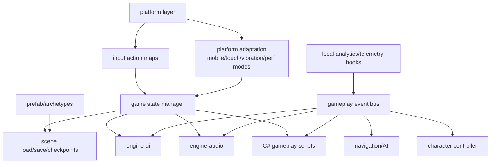

# Gate 18 Code Architecture

## Purpose

This diagram shows the whole engine structure at the end of Gate 18. The engine now has a gameplay framework that coordinates state, input, UI, audio, gameplay events, platform capabilities, and telemetry hooks.

## Whole-System Architecture At Gate Exit

## Gate 18 Additions

- Game state manager.
- Input action maps and rebinding.
- Gameplay event bus.
- Platform adaptation layer.
- Lightweight telemetry hooks.

## Frozen Contracts

Gate 18 freezes high-level gameplay framework APIs and behavior. No new serialized `-v0` data contract is introduced here; gameplay frameworks coordinate through existing contracts (`ECSScene-v0`, `Prefab-v0`, `RuntimeUI-v0`, `Audio-v0`, `ScriptAPI-v0`) plus the API-level freezes below.

- Game state transition API.
- Input action query API (definitions, bindings, resolution, serialization; rebinding *persistence format* remains open).
- Gameplay event bus publish/subscribe API (event dispatch semantics are frozen; lifetime, ordering, and replay rules remain open).
- Platform capability facade.

## Cross-Cutting Decisions Applied

| Decision | Applied as |
|---|---|
| `FD-013` Platform layer scope | The platform adaptation layer is the `PlatformAdapter` trait introduced in Gate 7. Gate 18 consumes its events (suspend/resume, IME, safe-area insets, low-memory warnings, normalized touch) and exposes them through the input action map and gameplay event bus; gameplay code does not touch winit/UIKit/GameActivity directly. |
| `FD-020` Networking scope | Networking and multiplayer are out of scope. The gameplay framework has no transport, replication, or matchmaking API in v0. Any future networking gate adds a new `-v0` contract; do not introduce one here. |
| `FD-014` Logging and tracing | Telemetry hooks are implemented as a `tracing` subscriber adapter; they do not bypass the workspace logging story. |

## Architectural Notes

- Gameplay framework coordinates systems through public APIs and events.
- Event bus is not for low-level engine scheduling.
- Backend analytics submission remains deferred.

## Open Design Questions

- Save/checkpoint data ownership.
- Input rebinding persistence format.
- Event bus lifetime, ordering, and replay rules.

## Detailed Design Proposal

### Gameplay Framework Modules

Suggested modules:

- `game_state`: state machine/stack for menu, loading, playing, paused, game-over.
- `input_actions`: action definitions, bindings, contexts, rebinding, serialization.
- `game_events`: gameplay-level event bus.
- `platform_caps`: touch, gamepad, vibration, performance mode, OS/device capability facade.
- `telemetry`: local event logging and stub submission.
- `checkpoint`: save/checkpoint hooks if included.

### Input Action Model

Gameplay reads logical actions, not devices. An action has:

- name;
- value type;
- binding list;
- active contexts;
- deadzone/modifier/trigger rules if included;
- serialization for rebinding.

UI capture is considered before gameplay action delivery.

### Event Bus Scope

The event bus is for gameplay coordination only: UI notifications, audio triggers, score/progression, quest/combat, and game state transitions. It must not replace engine scheduling, physics events, or renderer events.

### Platform Adaptation

Platform-specific behavior should be capability-driven. Gameplay scripts ask for capabilities and input actions; they do not call mobile SDKs or desktop APIs directly.

### Implementation Order

1. Game state manager.
2. Input action definitions and query API.
3. Event bus.
4. Platform capability facade.
5. UI/audio integration through events.
6. Telemetry hooks.
7. Complete gameplay loop validation.

### Design Risks

- Without action maps, platform-specific input will leak into scripts.
- If event bus is too low-level, it becomes a hidden global dependency graph.
- Game state transitions must be testable or pause/save/load bugs become hard to debug.

