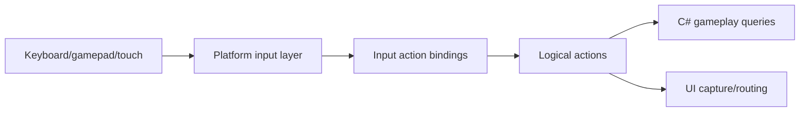
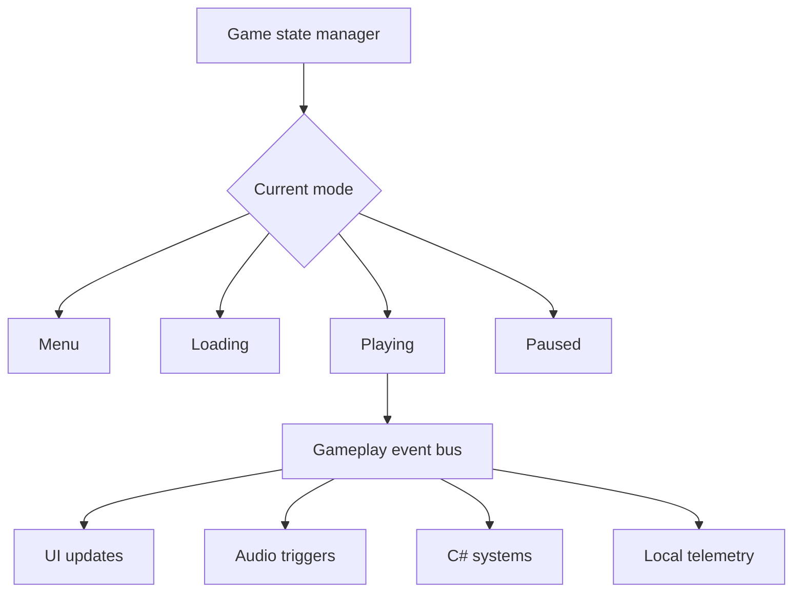

# Gate 18 Common Implementations And Best Practices

## Research Scope

Gate 18 adds high-level gameplay framework and platform adaptation: game states, input actions, gameplay events, mobile controls, and telemetry hooks.

## Mainstream Implementations

1. Game state manager
   - Most games organize menu/loading/playing/paused/game-over through explicit states or state stacks.
2. Input action maps
   - Unity Input System and Unreal Enhanced Input use action abstractions decoupled from device inputs.
3. Gameplay event bus
   - Event dispatch decouples UI, audio, gameplay, AI, and scripts at gameplay level.
4. Platform capability facade
   - Engines hide vibration, touch, performance modes, platform IDs, and device features behind capability APIs.

## Recommended Direction

- Build game state manager and input action maps before platform-specific gameplay code spreads.
- Keep gameplay event bus for high-level gameplay events only.
- Keep telemetry local/stubbed until backend integration is explicitly planned.
- Expose C# APIs for game state, input actions, and gameplay events.

## Best Practices

- Keep state transitions explicit and testable.
- Store input bindings in a serializable format.
- Separate UI input capture from gameplay action maps.
- Make platform capabilities queryable.
- Avoid hard dependencies on analytics services.

## Anti-Patterns

- Using global booleans instead of a state machine or state stack.
- Mixing engine-internal events with gameplay events.
- Hardcoding mobile input in gameplay scripts.
- Calling platform SDKs from arbitrary gameplay systems.

## Fetched Reference Summaries

- Unity Input System: Unity models input as actions and bindings instead of raw device polling. This supports rebinding, multiple device layouts, and gameplay-level action queries.
- Unreal Enhanced Input: Unreal uses input actions, mapping contexts, modifiers, and triggers. Mapping contexts are useful for gameplay modes, UI, vehicles, debug controls, and platform-specific layers.
- Godot InputMap: Godot centralizes named actions and maps multiple physical inputs to the same logical action. This supports device-independent gameplay code.
- Game Programming Patterns State: State machines organize behavior transitions and avoid sprawling condition-heavy update loops. This supports game state manager design.
- Game Programming Patterns Event Queue: Event queues decouple producers and consumers. This supports gameplay event bus design for UI/audio/gameplay communication.
- SDL GameController: SDL normalizes controller layouts. This supports using logical controller mappings instead of device-specific joystick handling.

## Design Reference Notes

### Game State And Input

Unity Input System, Unreal Enhanced Input, Godot InputMap, and SDL GameController all point to action-based input rather than raw device polling in gameplay code. The game should query logical actions, while platform/input layers translate devices into those actions.

Input model should include:

- Action names and value types.
- Binding sets per platform/device.
- Mapping contexts for game modes.
- Rebinding persistence.
- UI capture interaction.

### Gameplay State And Events

Game Programming Patterns supports using state machines for mode transitions and event queues for decoupling. Gate 18 should have explicit states such as menu, loading, playing, paused, game-over, and should use gameplay events for cross-system communication.

Event bus scope:

- UI notifications.
- Audio triggers.
- Score/progression events.
- Quest/combat/gameplay events.
- Not low-level render/physics scheduling.

### Platform Adaptation

Platform-specific features such as touch layout, vibration, performance mode, or controller availability should live behind platform capability APIs. Gameplay scripts should not call mobile/desktop APIs directly.

### Design Checklist For Implementation

- Can gameplay code run on keyboard, gamepad, and touch through the same action API?
- Are game states explicit and testable?
- Does event bus avoid direct crate-internal coupling?
- Are platform capabilities queryable and mockable?
- Can input mappings save/load?

## Implementation Flowcharts

### Input Action Flow

### Game State And Event Flow

## References To Review

- Unity Input System: https://docs.unity3d.com/Packages/com.unity.inputsystem@latest
- Unreal Enhanced Input: https://dev.epicgames.com/documentation/en-us/unreal-engine/enhanced-input-in-unreal-engine
- Godot InputMap: https://docs.godotengine.org/en/stable/classes/class_inputmap.html
- Game Programming Patterns, State: https://gameprogrammingpatterns.com/state.html
- Game Programming Patterns, Event Queue: https://gameprogrammingpatterns.com/event-queue.html
- SDL game controller APIs, useful platform input reference: https://wiki.libsdl.org/SDL2/CategoryGameController
