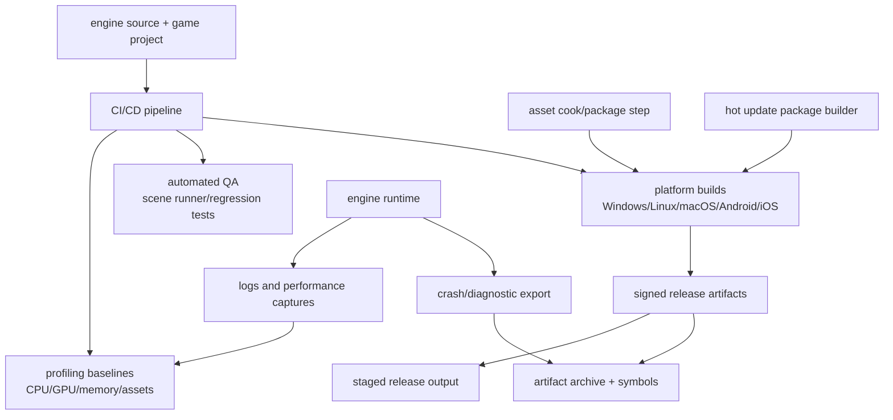

# Gate 19 Code Architecture

## Purpose

This diagram shows the whole engine structure at the end of Gate 19. The engine now has production packaging, profiling, QA automation, CI/CD, and crash diagnostics around the runtime/editor/tooling stack.

## Whole-System Architecture At Gate Exit



## Gate 19 Additions

- Desktop and mobile packaging.
- Asset bundling and release metadata.
- CPU/GPU/memory profiling and per-platform baselines.
- Automated QA and scene runner.
- CI/CD release artifact generation.
- Crash dumps, symbol packaging, and diagnostics export.

## Frozen Contracts

- `ReleaseMetadata-v0` artifact layout, build metadata/versioning rules, and diagnostic bundle format.
- QA pass/fail thresholds.

## Cross-Cutting Decisions Applied

| Decision | Applied as |
|---|---|
| `FD-001` .NET hosting strategy | iOS player build publishes via NativeAOT; reflection trimming warnings are treated as build errors. Desktop player build uses CoreCLR; the editor image (when shipped to internal users) carries CoreCLR. |
| `FD-003` iOS graphics backend | iOS packaging includes the MoltenVK library and its license attribution. Whether MoltenVK ships as static lib or dynamic is a Gate 19 implementation choice (recorded in this gate's `04-performance-report.md`). |
| `FD-004` Shader toolchain | CI installs the LunarG SDK (or builds shaderc/glslang from source) on every runner that compiles shader assets. The C++ build dependency is documented in the CI matrix file. Per `FD-039`, runners enabling `backend-dx12` additionally need DXC (via `hassle-rs` FFI); `naga` is a pure-Rust Cargo dependency and needs no extra system tooling. Per `FD-042`, release packaging never ships the per-machine PSO cache (`<user_cache_dir>/<engine>/pso_cache/*.bin`) — only the cooked SPIR-V / GLSL / DXIL blobs inside `CookedShader-v0` artifacts. |
| `FD-010` Cargo feature flag taxonomy | The CI matrix is generated by crossing `target-*` (desktop/mobile) with `backend-*` (vulkan first); `tooling-editor` is dropped in release builds. CI lints for any leftover `#[cfg(feature = "tooling-editor")]` in runtime crates per `FD-011`. |
| `FD-014` Logging and tracing | Release builds attach a JSON-file `tracing` subscriber that writes structured logs into the diagnostic bundle. |
| `FD-021` CI/CD provider | Primary CI/CD is **GitHub Actions**; workflow YAML lives under `.github/workflows/`. Mobile runners may be self-hosted but the workflow definitions stay in the repo. |
| `FD-022` Image and texture importer | `basis-universal` adds a C++ build dependency; CI runners include the necessary toolchain. |
| `FD-025` Source license | Release artifacts include a `NOTICES.txt` generated by `cargo-about` (or equivalent) listing every dependency and its license. |

## Architectural Notes

- Cooked/generated assets are build outputs, not hand-edited source files.
- Profiling and QA can prototype earlier, but release gating happens here.
- Packaging consumes frozen manifests and runtime contracts.
- iOS packaging must verify the absence of any downloaded executable payload, including any `target-mobile` build that accidentally pulls in `tooling-editor` (per `FD-011`).

## Open Design Questions

- Signing/notarization strategy per platform.
- Baseline mobile device hardware classes (specific Android/iOS device tiers).
- Build cache strategy (sccache vs cargo-build-cache).
- Whether MoltenVK ships as static or dynamic library on iOS.

Resolved cross-cutting items (do not re-debate at this gate):

- **CI provider** is frozen by `FD-021` (GitHub Actions).
- **Artifact license bundling** is frozen by `FD-025` (`NOTICES.txt` per artifact).

## Detailed Design Proposal

### Release Pipeline Modules

Gate 19 should create the systems around the engine, not new runtime gameplay features. Suggested areas:

- `build`: reproducible platform build scripts.
- `package`: desktop/mobile packaging and asset bundling.
- `profile`: CPU/GPU/memory/asset metric capture.
- `qa`: automated scene runner and regression checks.
- `ci`: workflow definitions and artifact upload — GitHub Actions reusable workflows under `.github/workflows/` (per `FD-021`).
- `diagnostics`: crash dumps, logs, symbols, and diagnostic bundle export.
- `release_metadata`: version, commit, manifest, checksums, signing data.

### Artifact Layout

Release artifacts should have a predictable layout:

```text
release/<version>/<platform>/
    binaries/
    assets/
    manifests/
    symbols/
    logs/
    checksums/
```

The exact layout can change, but it must be versioned and generated, not manually assembled.

### QA Automation

Automated QA should run before packaging is considered successful:

- unit/integration tests;
- scene runner;
- asset cook validation;
- script error recovery tests;
- hot reload stress where applicable;
- performance threshold checks.

### Profiling And Diagnostics

Profiling needs stable labels from earlier renderer/runtime systems. Crash diagnostics need release IDs and symbol archives. Without symbol mapping, crash dumps are much less useful.

### Implementation Order

1. Reproducible build scripts.
2. Automated test/scene runner.
3. Asset packaging and manifest generation.
4. Profiling metric capture.
5. Platform signing/checksum paths.
6. Symbol and diagnostics archive.
7. CI/CD workflow.
8. Release candidate dry run.

### Design Risks

- Manual release steps will drift and become unrepeatable.
- If symbols are not archived with release IDs, crash reports are hard to act on.
- Performance thresholds must be realistic and platform-specific.
