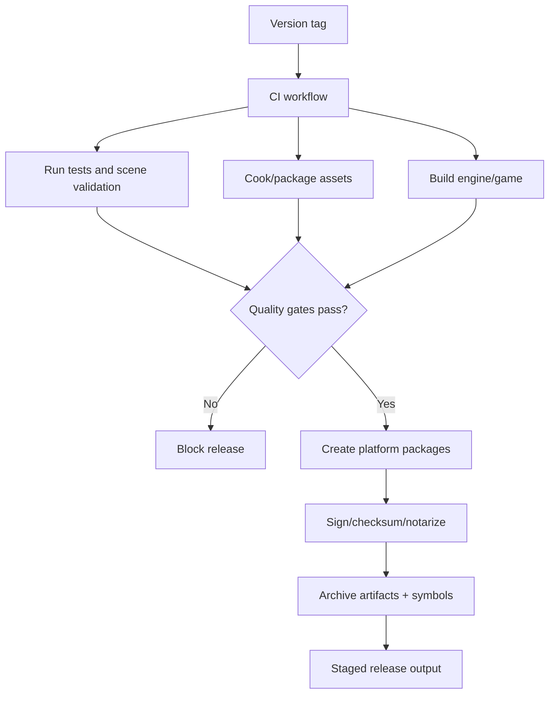
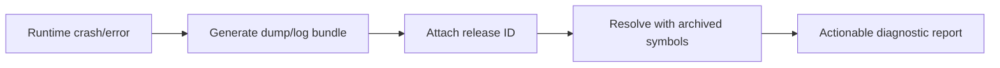

# Gate 19 Common Implementations And Best Practices

## Research Scope

Gate 19 adds packaging, profiling, QA automation, CI/CD, release artifacts, crash diagnostics, and rollback-ready release metadata.

## Mainstream Implementations

1. CI-driven builds
   - Build, test, package, and artifact upload run from tagged commits or release branches.
2. Platform packaging pipelines
   - Desktop and mobile packaging usually handle asset bundles, symbols, signing, notarization, and metadata.
3. Automated scene runner
   - Engines often run validation scenes/headless tests in CI to catch asset, script, and serialization regressions.
4. Profiling baselines
   - CPU/GPU/memory baselines are tracked per platform to catch regressions.
5. Crash diagnostics
   - Symbols and diagnostic bundles are archived with release artifacts.

## Recommended Direction

- Make release builds reproducible from tags.
- Treat cooked assets as build outputs.
- Add automated scene runner before broad release automation.
- Capture CPU, GPU, memory, asset, and script metrics.
- Keep crash/diagnostic export simple and reliable first.

## Best Practices

- Use checksums/signatures for release artifacts.
- Archive debug symbols separately from release binaries.
- Fail builds on broken asset cook, script errors, or performance threshold breaches.
- Store release metadata and manifest versions with artifacts.
- Keep rollback instructions tested.

## Anti-Patterns

- Manual packaging steps that cannot be reproduced.
- Editing cooked/generated assets by hand.
- Shipping without symbol files or diagnostic logs.
- Treating performance profiling as optional after release.
- Letting CI skip platform-specific smoke tests.

## Fetched Reference Summaries

- GitHub Actions: Workflows can automate build, test, packaging, artifact upload, and release tasks from versioned YAML. This supports reproducible release gates from tags/branches.
- cargo-release and cargo-nextest: cargo-release automates Rust version/tag/publish flows, while nextest provides faster structured test execution. These support repeatable Rust release and CI testing workflows.
- SteamPipe, Android App Bundle, and Apple notarization: Platform packaging has platform-specific artifact, signing, and distribution requirements. The release pipeline should keep platform package metadata and signing steps explicit.
- Tracy, Superluminal, and RenderDoc: Tracy provides CPU/GPU profiling instrumentation, Superluminal is a sampling profiler for performance investigation, and RenderDoc captures graphics frames. Use both in-engine and external tools for performance validation.
- Sentry Native: Native crash reporting can collect minidumps and diagnostics. Release artifacts should archive symbols and release identifiers so crash reports are actionable.

## Design Reference Notes

### Release Pipeline Shape

GitHub Actions, cargo-release, cargo-nextest, SteamPipe, Android App Bundles, and Apple notarization references imply a release pipeline that is versioned, repeatable, and platform-specific. Manual packaging steps should be treated as defects.

Release flow should include:

1. Tagged source revision.
2. Dependency and toolchain resolution.
3. Build and test.
4. Asset cook/package.
5. Platform packaging/signing/notarization.
6. QA scene runner and regression checks.
7. Artifact upload with symbols/checksums.
8. Release notes and rollback metadata.

### Profiling And Diagnostics

Tracy, Superluminal, and RenderDoc cover complementary areas. Tracy is good for in-engine CPU/GPU instrumentation, Superluminal for external CPU sampling, and RenderDoc for graphics frame captures. Gate 19 should not rely on just one profiler.

### Crash Reporting

Sentry Native shows that crash reports are useful only if release IDs and symbols are archived. The release pipeline must package debug symbols and map them to artifacts.

### Design Checklist For Implementation

- Can a release artifact be reproduced from a tag?
- Are cooked assets generated, not hand-edited?
- Does CI run tests, scene validation, asset validation, and performance thresholds?
- Are platform artifacts signed or checksumed?
- Are symbols and diagnostics tied to release IDs?

## Implementation Flowcharts

### Release Pipeline Flow

### Crash Diagnostics Flow

## References To Review

- GitHub Actions documentation: https://docs.github.com/en/actions
- cargo-release: https://github.com/crate-ci/cargo-release
- cargo-nextest: https://nexte.st/
- SteamPipe upload documentation: https://partner.steamgames.com/doc/sdk/uploading
- Android App Bundle: https://developer.android.com/guide/app-bundle
- Apple notarization: https://developer.apple.com/documentation/security/notarizing_macos_software_before_distribution
- Tracy profiler: https://github.com/wolfpld/tracy
- Superluminal profiler: https://superluminal.eu/
- RenderDoc capture tooling: https://renderdoc.org/
- Sentry native crash reporting: https://docs.sentry.io/platforms/native/
