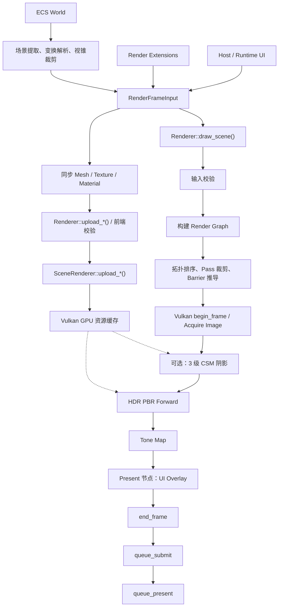

# 当前引擎渲染流水线

> 本页顶部使用已经渲染好的 PNG，因此不依赖 Markdown 查看器是否支持 Mermaid。

矢量版本：[rendering-pipeline.svg](./rendering-pipeline.svg)

## 关键调用链

1. `EngineRuntime::render_frame_with_ui()` 从 ECS `World` 提取当前帧。
2. `extract_renderer_input_from_world()` 解析层级变换、相机和灯光，并完成视锥裁剪及绘制项排序。
3. 数据被汇总为 `RenderFrameInput`，随后注入渲染扩展和 UI；`sync_render_assets()` 只能通过 `Renderer::upload_*()` 校验资源，再委托 `SceneRenderer::upload_*()` 创建和缓存 Vulkan 资源。
4. 帧绘制走另一条同样经过渲染前端的路径：`Renderer::draw_scene()` 校验输入、构建 Render Graph，并通过唯一的 `compile()` 完成拓扑排序、无用 Pass 剔除和 Barrier 推导。
5. Vulkan `SceneRenderer` 按编译顺序执行可选的 CSM 阴影、HDR PBR Forward、Tone Map 和 UI Overlay。
6. `end_frame()` 结束命令缓冲区，随后执行 `queue_submit()` 与 `queue_present()`。

所有 `BackendRenderer` 现在都强制执行 Render Graph 生命周期；`LegacySinglePass` 和整帧 `render_frame()` 后端兼容入口已经删除。

## 可编辑 Mermaid 源码

