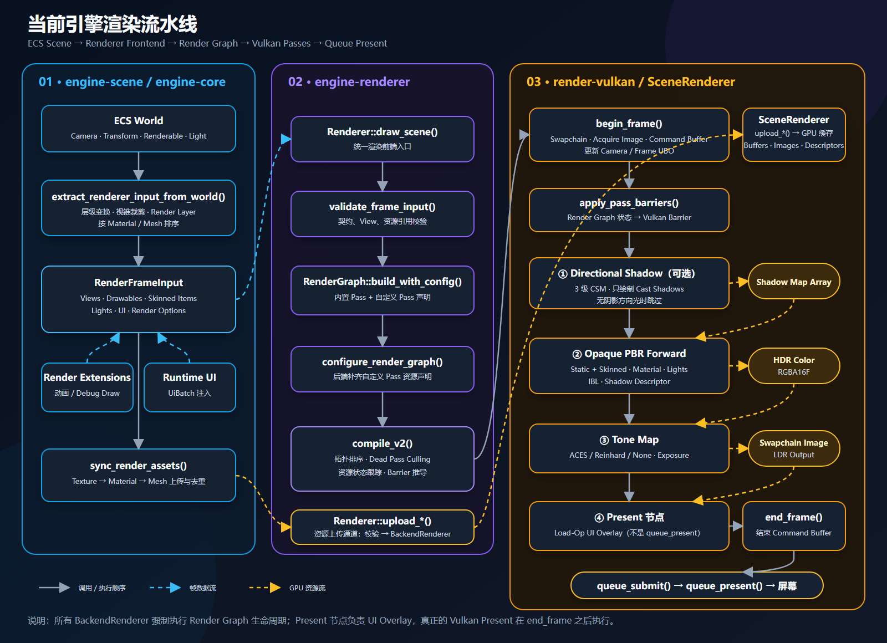
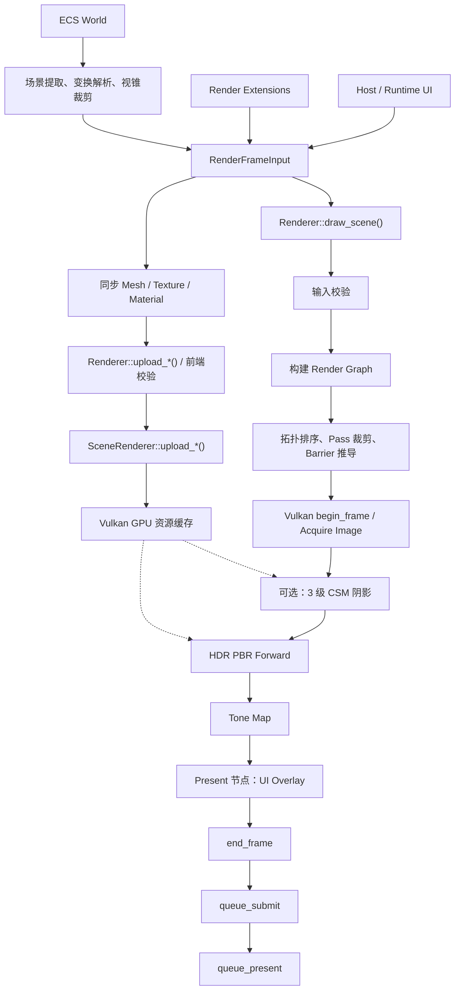

# 当前引擎渲染流水线

> 本页顶部使用已经渲染好的 PNG，因此不依赖 Markdown 查看器是否支持 Mermaid。

矢量版本：[rendering-pipeline.svg](./rendering-pipeline.svg)

## 关键调用链

1. `EngineRuntime::render_frame_with_ui()` 从 ECS `World` 提取当前帧。
2. `extract_renderer_input_from_world()` 解析层级变换、相机和灯光，选择 `LodGroup` 资源，并完成视锥裁剪及绘制项排序。
3. 数据被汇总为 `RenderFrameInput`，随后注入渲染扩展和 UI；`sync_render_assets()` 以 `AssetRegistry` 为唯一所有权来源，通过 `Renderer::upload_*()` 创建或更新资源，并在已同步的 typed entry 被注销或改型时通过同一同步阶段移除后端资源。Mesh、Texture、Material、Environment Map 和 Morph Target Set 的生产者都不直接维护 GPU 删除队列。
4. 帧绘制走另一条同样经过渲染前端的路径：`Renderer::draw_scene()` 校验输入、构建 Render Graph，并通过唯一的 `compile()` 完成拓扑排序、无用 Pass 剔除和 Barrier 推导。
5. Vulkan `SceneRenderer` 构建 clustered-light 列表，合并可实例化的静态/粒子批次，并按编译顺序执行可选的 CSM 阴影、HDR PBR Forward+、环境 IBL、后处理/Tone Map 和 UI Overlay。
6. `end_frame()` 结束命令缓冲区，随后执行 `queue_submit()` 与 `queue_present()`。

所有 `BackendRenderer` 现在都强制执行 Render Graph 生命周期；`LegacySinglePass` 和整帧 `render_frame()` 后端兼容入口已经删除。

新增材质、环境、后处理、morph target、实例批次和后端能力边界详见
[RENDERING_ARCHITECTURE.md](./RENDERING_ARCHITECTURE.md)。

## 帧时间剖析（ENG-04）

`GameLoop::update` 与 `EngineRuntime::render_frame_submission` 按命名阶段记录 CPU 时间（`update`、`script_tick`、`extraction`、`sync_render_assets`、`render_submit`）；Vulkan 后端用时间戳查询按 Render Graph Pass 记录 GPU 时间，按 in-flight 帧数延迟异步回读，不支持时降级为 `unavailable`。滚动统计（最近 120 帧，avg/p95/max）经 `EngineRuntime::frame_timing_summary()` 暴露，并写入无头运行报告的 `frame_timing` 段。详见 [PROFILING.md](./PROFILING.md)。

## 相机相对渲染（Camera-Relative Rendering，ENG-01）

场景设置 `SceneSettings::camera_relative_rendering`（默认 `false`，旧场景文件反序列化时自动取默认值）控制是否在提取阶段启用相机相对渲染。变换在引擎中始终是 f32：距离世界原点 100 km 时，存储位置被量化到约 8 mm 的网格上，而 `proj * view * model` 矩阵链的浮点舍入会按坐标量级放大误差，实测在最坏取向下会给 2 m 的相机相对偏移带来约 1.1e-2 m 的视空间误差（相对误差约 5.5e-3）和约 7.8e-3 的 NDC 误差（像素级可见抖动）。

开启该开关后，`extract_renderer_input_from_world*()` 以基准（Base）相机的解析后世界位置 `C` 为渲染原点：

- 基准视图的 `view_matrix` 平移分量被移除（精确为零）；每个绘制项的 `world_transform` 变为 `T(-C) * world`；`LightItem.position` 减去 `C`（方向不受平移影响）；提取路径上的 debug primitive 同样平移。发出的包围盒随变换一起平移。
- 视锥裁剪仍在绝对世界空间进行，因此开关不会改变任何剔除结果；`RenderView.frustum` 与发出的 `proj * view` 保持一致。
- 相机位置 UBO 由后端从 `view.inverse()` 推导，自动落在相机相对原点，高光计算保持正确；CSM 级联使用同一个 view 矩阵，因此阴影随平移免费保持一致（有测试锁定）。
- 实测开启后 100 km 处最坏视空间误差从 5.5e-3 相对值收敛到约 1e-7（验收阈值 ≤ 1e-4）。

**蒙皮网格的特殊路径**：蒙皮项不经过 `resolve_world_transforms`，而是由 `engine-animation` 的 `bridge_skinned_items` 自行计算世界矩阵。该路径通过公开的 `engine_scene::camera_relative_render_origin(world)` 查询同一个渲染原点（与提取使用完全相同的 active camera / priority 排序），并施加相同的 `T(-C)` 平移。任何在提取之后经 `RenderExtensionProducer` 注入世界空间内容的系统都必须做同样处理，否则这些内容会整体偏移一个原点的量级。

**多视图近似（v1）**：所有视图统一按基准相机原点平移。基准视图精确消除平移；Overlay 视图保留其相对基准相机的偏移量，因此远离基准相机的 Overlay 相机精度仍以该相对偏移为限。

**边界与限制**：

- 仅影响渲染精度。场景文件、序列化、物理、脚本 ABI 中的世界坐标仍是绝对 f32——存储位置的量化（数据层下限）不会被恢复，远离原点的物理模拟精度也不会改善（属于 ENG-01 Phase 2 的范畴）。
- 开关默认关闭，现有测试与场景行为完全不变；建议在相机远离原点的场景中开启。

## 可编辑 Mermaid 源码

